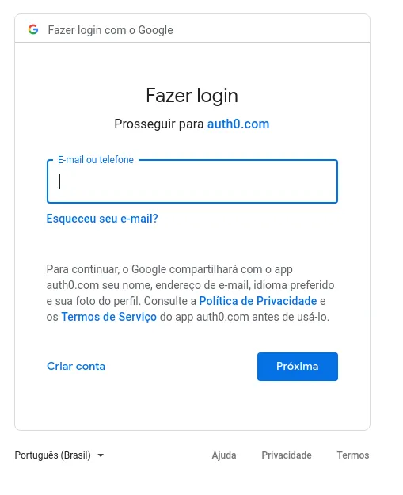
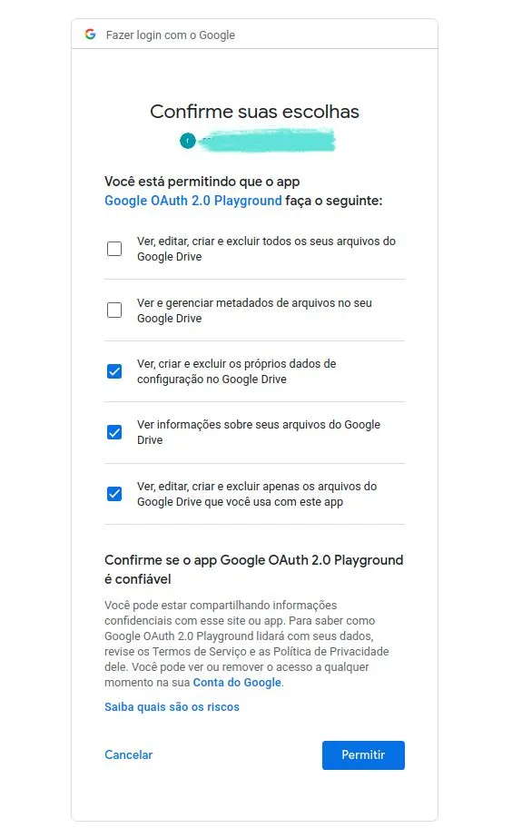
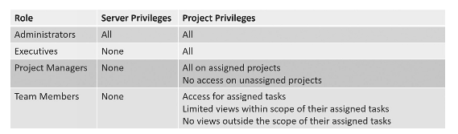
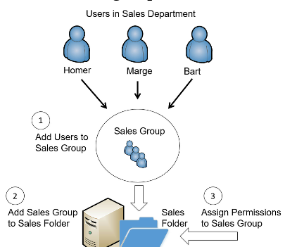
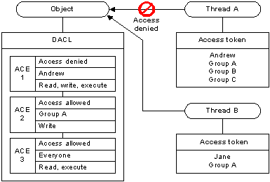
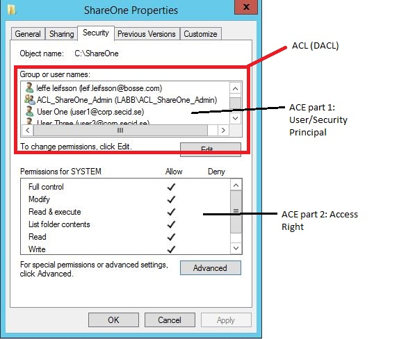
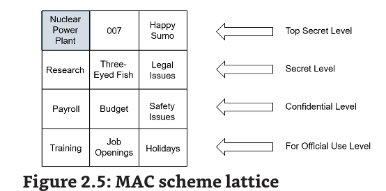

Chapter 2 - Identity and Access Management

# Exploring Authentication Management

## Comparing Identification and AAA

Authentication, authorization, and accounting (AAA)

servidores pedem **auth** para provar a identidade da pessoa, por meio de access controls assim providenciado **authorization**, permitindo somente os recursos essenciais do firewall, e por fim **accounting** (logs, auditoria) providenciando **audit trail**

## Comparando Authentication Factors:

**fatores:**

### algo que vc sabe (password ou PIN)

também chamado de static codes, melhores prraticas é da NIST SP 800-63b, "Digital Identity Guidelines" (easy to remember hard to guess passwords)

1.  Hash all passwords.
2.  Require multifactor authentication.
3.  Don’t require mandatory password resets.
4.  Require passwords to be at least eight characters.
5.  Check for common passwo••••••••••••••••••••••••••rds and prevent their use.
6.  Tell users not to use the same work password anywhere else.
7.  Allow all special characters, including spaces, but don’t require them.

tem algo conflitante nos padroes de senha PCI DSS requer 7 caracteres, já o HITRUST CSF providencia uma compliance com a ISO IEC 27000 e HIPAA com 15 caracteres para admin e que sejam mudadas em 90d.

password keys -> são geralemnte usadas por admin para resetar senhas (boot disc or USB flash)

**Knowledge-based Authentication (KBA):**

- static: usado quando vc esquece a senha, questionario de vc mesmo
- dynamic: identifica usuarios sem conta, usados em organizacoes que tem alto risco em transacoes. (perguntas de banco)

eh interessante trocar a senha de adm tb e deixar a adm como uma conta dummy

### algo que vc tem (smart card, cell, token usb)

RSA secure id, smart cards -> isso é interesante ser usado junto com passwd

HMAC-based One-Time Password (HOTP) -> usado para criar one time passwords, é uma hash que te da um valor de 6 a 8 digitos

Time-based One-time Password (TOTP) -> similar ao hotp (ambos são padroes open source) mas esse usa um timestamp ao invez de um counter

Authentication Applications ->usa uma credencial e entra no app que te mostra um token (2fa)

SMS -> possui varias vulnerabilidades a NIST SP-800-63B descreve varias

### algo que é (fingerprint, biometric)

tem que ter um enroll system para cadastrar um novo user e depois autentica-lo com a nova id.

fingerprints, palm veins, retina scans, iris scans, voice recognition, facial recognition, and gait analysis.

iris e retina são as mais potentes. Porem retina é meio intrusivo e pode revelar problemas medicos da pessoa. Facial and Gait podem bypassar o processo de enroll.

## Authentication Attributes

### Somewhere you are

geolocalizaao

### Something you can do

parecido com o captcha

### Something you exhibit

Common Access Cards (CACs) ou Personal Identity Verification (PIV) -- lembra das badges de metal militares

### Someone you Know

pensa em como a CA funciona

# Authentication Log Files

O que aconteceu -> auth failed or sucess

Quem fez -> user tal

quando -> timestamp

aonde -> IP, MAC, DNS

# Managing Accounts

responsavel por criar, gerenciar, terminar e desabilitar contas.

## Credential Policies and Account Types

- Personnel or end-user: usuarios regulares
- Admin Account: admin
- Service: SQL server, servers que usam algum tipo de serviço sempre tem um user atrelado a eles
- Device: computers
- Third-party account: entidades externas
- Guest:
- Shared and generic: a organizacao cria usuarios padroes temporarios, pessima pratica

## Privileged Access Management

PAM -> aplica controles de segurança sobre admin e roots, ele usa o conceito de just-in-time, eles nao tem acesso adm até precisarem. Há um tmepo de request.

1.  Allow users to access the privileged account without knowing the password
2.  Automatically change privileged account passwords periodically
3.  Limit the time users can use the privileged account
4.  Allow users to check out credentials
5.  Log all access of credentials

## Require Admins to use two accounts

previnir privilege escalation

## Disablement

corta geral

terminated employee, leave of absense, delete acc

## Tipos de Auth

### SSO

### Kerberos:

O **Key Distribution Center** (KDC) manda tickets ( ou TGT server) com as credenciais do usario e providencia auth quando eles precisam acessar um recurso do AD,

possui **sincronização de tempo**, todos os pc devem estart sincronizados e estar 5 minutos de distancia. possui **BD de users**

### **SSO Federation**

se duas organizações compartilham recursos eh possivel usar um SSO com uma federated identity management system que faz a auth de ambas.

## SAML

Security Assertion Markup Language é uma XML usada para fazer SSO em browsers. Apesar de garantir auth ainda é necessario fazer authorization, mas ainda é possivel usar o SAML para os dois.
**Principal**: geralemnte é um usuario
**identity provider**: cria mantem e gerencia a identidade dos principals
**service provider**: providencia servicos aos principals

## OAuth

é um open standard para autorização, vc consegue providenciar acesso a recursos protegidos usando apenas uma conta Google por ex. RFC 6749

## OpenID and OpenID Connection

http://openidexplained.com/use

OIDC (openid connection) usa JSON web tokens (JWT) ou Id Token. Logar com a conta do Google, o app desenvolve esse token para liberar recursos ao user.

Geralmente esse cara lida com a Auth e o OAuth lida com a autorização.

Tanto o Google quanto o Facebook podem agir como *Resource Server* e *Authentication Server*. Suponhamos que você escolha o Google como *Resource Server* e assim consequentemente como *Authentication Server*, você cairá na imagem abaixo:

authorization:

artigo legal do medium explicando:

https://medium.com/semantixbr/oauth-2-openid-connect-c2429db6e996

# Comparing Access Control Schemes

RBAC (Role Based Access Control)

da uma role ao usuario e essa role garante permissoes a certas coisas

um exemplo de roles: Admins, executivos, project managers, team members

dar uma olhada em microsoft project server

antes de criar as roles com acessos é interessante ter documentado isso em uma matriz

da pra configurar em modo hierarquia (maior hierarquia maior liberacao), ou function job based (acesso liberado a somente recursos da role)

## rbac por grupo:

### Rbac por rule

mais comuns em firewalls e routers, permitindo acesso a um http etc. E pode ser dinamico com por ex um IPS barrando a ACL estatica.

## Discretionary Access Control (DAC)

o NTFS usa o dac, providencia seguranca aos usuarios

### Flisystem Permissions

Write: pode mudar mas n pode deletar

Read: ler conteudo

Read & Execute: ler e executar arquivos, incluindo scripts

Modify: modifica e pode excluir e adicionar arquivos em uma pasta

Full Control: faz tudo

### SIDs and DACLs

https://learn.microsoft.com/pt-br/windows/win32/secauthz/dacls-and-aces

https://book.hacktricks.xyz/windows-hardening/windows-local-privilege-escalation/acls-dacls-sacls-aces

exemplo

**Remember:**

The DAC scheme specifies that every object has an owner, and the owner has full, explicit control of the object. Microsoft NTFS uses the DAC scheme.

## Mandatory Access Control (MAC)

SELinux (security-enhanced linux -> lembra de um militar acessando um arquivo top secret, ele possui credenciais e um need to know para acessar aquele arquivo

SElinux faz um override de permissoes padroes. Existem tres modos:

**Enforcing mode**: ignora permissoes e so vai acessar se estiver em compliance com a SELinux

**Permissive**: usa a permissao do sistema, o sustema log qualquer coisa que seria normalmente bloqueada

**Disable**: nada

### Labels and Lattice

lembra, nao eh pq o user tem um TOP SECRET access em Nuclear power plant que ele vai ter acesso ao 007, ele é need to know

## Attribute-Based Access Control (ABAC)

NIST SP 800-162

ABAC scheme usa atributos definidos em politicas para garantir acesso a recursos. Usado em software-defined networks (SDNs)

https://www.vmware.com/topics/glossary/content/software-defined-networking.html

## Conditional Access

Pensa na Azure -> os users precisam de MFA para acessar os recursos. O sistema checa se ele usou o MFA, é bem similar ao ABAC

- User or group membership -> caso pertenca ao grupo, garante autorizacao
- IP location -> uma determinada regiao ou pais pode ter acesso
- Device -> um dispositivo pode receber bind do user ao mac para ter acesso.

# Remember

## FRR, FAR, CER

false acceptance rate (FAR) or false match rate -> identifica a porcentagem de falsa ocorrencias de aceitacao

false rejection rate (FRR) -> identifica a porcentagem de falsas rejeições

crossover errror rate (CER) -> identifica a efecacia do systema biometrico, quanto menor melhor

HOTP -> padrao open-source que cria uma one-time-pass que nunca expira ate ser usada

TOTP -> a unica diferenca é que ela expira apos 30 s