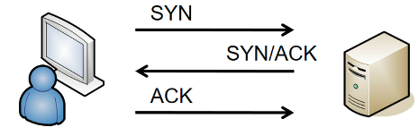
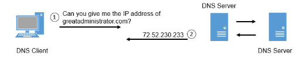
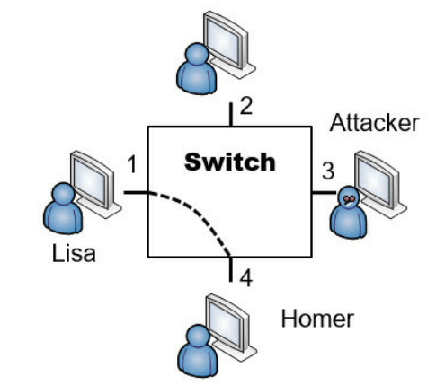
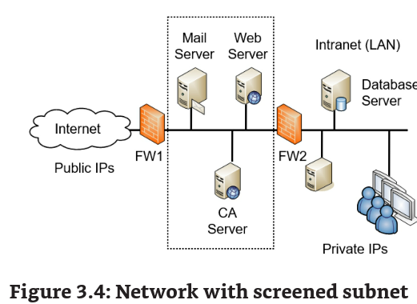
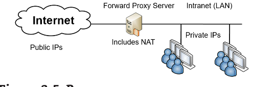
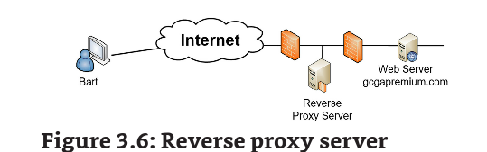

Chapter 3 - Exploring Network Technologies and Tools

# Reviewing basic networking concepts

attacks

- sniffing attack
- DoS or DDoS
- Poisoning attck -> muitos protocolos (arp por ex) usam caches, esse attack tenta corromper esses caches com dados diferentes

veja o appendix C para conhecer as portas mais conhecidas

TCP -> providencia connection-oriented traffic (guaranteed delivery) three-way handshake

UDP -> conectionless sem o 3w-handshake icmp usa udp e dos tb

IP -> 32bit para IPv4 e 128b para IPv6

ICMP -> verifica conectividade, muito usado em DoS tb

ARP -> resolve IP em media access control address (MAC), dentro da subnet eh esse cara que faz o papel de ter os enderecos para o tcp entregar os pacotes ao destino correto

# Implementing Protocols for Use Cases

eh interessante liberar somente os protocos usados dentro da organizacao

## Voice and video

Real-time transport protocol (RTP) -> o cara que entrega audio e video para redes IP. VoIP, da pra usar tb o \*\*Secure Real-Time Transport Protocol (SRTP) \*\*esse providencia encryptacao, autenticacao de mensagem e integridade ao RTP

**replay attacks** -\> o atacante captura o dado modifica e tenta impersonate uma das pessoas. SRTP pode ser usado pelas duas unicast (sender e receiver) e multicast (sender para multiples receivers)

Session Initiation Protocol (SIP) -> inicia, mantem e termina as sessoes de vidio e audio. Cleartext (possui metadados da secao como equipamento, software e o IP). depois vem o RTP. Existe SIP logging

## File Transfer

FTP -> active mode usa a porta 21 para controle de sinais e a porta 20 para dados.

FTP passivo ou PASV usa 21 para control signals e random TCP port para data.

TFTP (trivial file transfer proto) -> UDP 69 transfere partes pequenas de dados. Nao essencial melhor desabilitar

SSH -> porta 22, encripta dados em transito e pode ser usado para encriptar outros protocolos como ftp. SCP é baseado em SSH para transferir arquivos.

SSL -> foi o metodo primario de encriptar dados em http (https). SSL tamb;em pode encriptar SMTP e LDAP. Não é mais seguro

TLS -> upgrade do ssl. STARTTLS eh um comando para fazer o upgrade de uma comunicacao sem encriptacao.

IPsec -> ipsec encapsula e encrypta os payloads dos pactoes e usa o Tunnel mode para proteger o trafego das redes privadas (VPN). Possui dois componentes o Authentication Header (AH) proto ID 51 e o Encapsulating Security Payload (ESP) ID 50. Usa o Key Exchange (IKE) em UDP 500 para criar uma associacao segura a vpn.

SFTP (secure file transfer protocol) -> eh uma implementacao segura do FTP. Eh uma extencao de um SSH. Transmitido na porta 22

FTPS (file transfer protocol secure) -> extencao do ftp que usa TLS para encriptar FTP e usa o FTPS na porta 989 e 990. Porem ainda pode encruptar na porta 20 e 21.

## Email e Web

SMTP (Simple Mail Transfer Protocol) -> transfere email entre clientes TCP 25 unencrypted, 587 encrypted with STARTTLS

POP3 (post office proto) -> transfere email de servers para clientes tcp 110 un e 995 encript

esse cara que transfere os emails pro gmail (pop)

IMAP4 (internet message access protocol) -> store email on email server (gmail) 143 un e 993 enc

HTTP -> 80

HTTPS - 443

## Directory Services and LDAPS

Geral usa AD-DS banco de dados do AD

Kerberus-> port UDP 88

LDAP (lightweight Directory Access proto) -> especifica os formatos e metodos para dar query nos diretorios, como o AD DS. extesao do X.500 standard. TCP port 389

LDAPS na 636, windows domains use LDAP nos dirs, e no linux para identificar objetos.

## Remote Access

RDP (remote desktop proto) -> port 3389

OpenSSH -> 22

ssh-keygen -t rsa (cria uma pub e private key) com certificados.

id_rsa.pub

id_rsa.

ssh-copy-id host (copia a chave) e assim temos passwordless

## Time Synchronization

NTP -> 123 sincroniza geral

## Network Address Allocation

Dynamic Host Configuration Proto (DHCP) port 67, 68

IPv4

so coloque rede privadas nesses caras:

• 10.x.y.z. 10.0.0.0 through 10.255.255.255

• 172.16.y.z–172.31.y.z. 172.16.0.0 through 172.31.255.255

• 192.168.y.z. 192.168.0.0 through 192.168.255.255

ipv6

Unique local addresses start with prefix of fc00

**DHCP snooping** -\> previne DHCP servers nao autorizados. Enable em layer 2 switch

https://brainwork.com.br/2015/04/29/dhcp-snooping-protegendo-sua-rede-contra-servidores-dhcp-falsos/

• DHCP Discover. A DHCP client broadcasts a message asking a DHCP server for a lease.

• DHCP Offer. A DHCP server answers, offering a lease. This includes an IP address, a subnet mask, a default gateway, and more, depending on the DHCP server configuration.

• DHCP Request. The DHCP client responds by requesting the offered lease.

• DHCP Acknowledge. The DHCP allocates the offered IP address to the DHCP client, and sends back an acknowledge packet. The DHCP server will not offer the same IP address to other clients after sending the acknowledge packet.

normalmente o DHCP vai mandar todo o tráfego broadcast que recebe para todas as portas. Mas quando o snooping eh habilitado, ele so manda o DHCP para portas confiaveis

## Domain Name Resolution (DNS)

• A. Also called a host record. This record holds the hostname and IPv4 address and is the most commonly used record in a DNS server. A DNS client queries DNS with the name using a forward lookup request, and DNS responds with the IPv4 address from this record.

• AAAA. This record holds the hostname and IPv6 address. It’s similar to an A record except that it is for IPv6.

• PTR. Also called a pointer record. It is the opposite of an A record. Instead of a DNS client querying DNS with the name, the DNS client queries DNS with the IP address. When configured to do so, the DNS server responds with the name. PTR records are optional, so these reverse lookups do not always work. -> o PTR é opcional e por isso reverse nao funciona as x

• MX. Also called mail exchange or mail exchanger. An MX record identifies a mail server used for email. The MX record is linked to the A record or AAAA record of a mail server. When there is more than one mail server, the one with the lowest preference number in the MX record is the primary mail server.

• CNAME. A canonical name, or alias, allows a single system to have multiple names associated with a single IP address. For example, a server named Server1 in the domain getcertifiedgetahead.com might have an alias of FileServer1 in the same domain.

• SOA. The start of authority (SOA) record includes information about the DNS zone and some of its settings. For example, it includes the TTL (Time to Live) settings for DNS records. DNS clients use the TTL setting to determine how long to cache DNS results. TTL times are in seconds, and lower times cause clients to renew the records more often.

Geral usa BIND mas os Windows n. Porta 53 UDP (query de clientes) e 53 TCP para zone transfers. Quando DNS compartilham info com os outros esse processo eh chamado de zone transfer.

## DNSSEC

DNS poisoning -> modifica o cache de dns apontando o dns para um ip malicioso.

DNSSEC (Domain name system security externsions) é uma suite que providencia validacao das respostas dns. Ele adiciona uma RRSIG (resource record signature) para cada record -- providenciando integridade e authenticacao para os replies de DNS.

### NSLOOKUP and DIG

nslookup -querytype=mx gcgapremium.com

Non-authoritative answer:

**gcgapremium.com MX preference = 1, mail exchanger = aspmx.l.google.com -> menor preferencia (principal)**

gcgapremium.com MX preference = 10, mail exchanger = alt3.aspmx.l.google.com

gcgapremium.com MX preference = 10, mail exchanger = alt4.aspmx.l.google.com

gcgapremium.com MX preference = 5, mail exchanger = alt1.aspmx.l.google.com

gcgapremium.com MX preference = 5, mail exchanger = alt2.aspmx.l.google.com

axfr and any switch

## Subscription Services

pensa no Office 365, o protocolo usado aqui eh https e smtp para avisar que a licenca ta acabando

## Quality of Service

Priorizacao de trafego (QoS)

# Understanding Basic Network Devices

Unicast -> 1 to 1

broadcast-> 1 to all (stich passa broadcast roteador n)

## Switches

ao realizar a primeira conexao entre lisa e homer o switch envia o pacote para todos, pq ele n sabe quem eh quem

após a troca do primeiro pacote, dai vira unicast e somente a porta 1 e 4 serao usadas.

O interessante de ter switch eh que se o atacante ligar o sniffer na porta 3 ele n vai conseguir capturar o trafego entre os dois.

## Port Security

limitar o uso de portas do switch para que nao seja possivel qualquer um se conctar a rede.

Mac filtering -> o switch se lembra de um ou dois mac address que se conectaram a porta, isso limita cada porta a se conectar a um dispositivo especifico usando esse mac.

## Broadcast Storm and Loop Prevention

Imagina se vc ligar 2 cabos de um switch a outro, da um loop infinito de unicast. Por isso que a galera usa o \*\*Spanning Tree proto (STP) ou o novo Rapid STP (RSTP) \*\* eles providenciam protecao contra storm e loop.

## Bridge Protocol Data Unit Guard (BPDU)

STP envia BPDU messages para detectar loops. QUando são detectados o STP da shutdown ou bloqueia traffego do switch redundante. Eles mandam de suas portas n edge (n conectadas a um endpoint) se sim indicam um ator malicioso.

## Routers

pelo o roteador n transmitir broadcast, ele é usado (junto de vlans) para diminuir o trafego de broadcast qeu gargala a rede. Então interessante usa-lo para conectar redes, principalmente redes extensas.

## Routers and ACLs

Access control lists sao regras para gerar autorizacao de trafegos na rede.

da pra fazer acl baseado em IP, subnet, networks, porta ou protocolos

## Deny Implicit Deny

famosa block all other, do fw

## The Route Commnad and Route Security

route print

route add

# Firewalls

melhor amigo do admin de redes

host-based firewall

famoso windows firewall

network based firewalls hardware vs software

stateless -> deny no final, preciso expecificar o trafego liberado | pensa numa maquina de venda. Um pergunta uma resposta.

statefull -> inspeciona o trafego e toma decisoes baseado no contexto ou state | tem um cache ou estado de onde ficou a requisção

WAF -> web app firewall

NGFW (next generation firewall) primeira geracao era filtrador de pacotes stateless, segunda statefull trafego baseado em secao. ja na GFW ele faz um deep inspection na camada de aplicacao e por isso tem filtro de conteudo e URL filtering

# Implementing Network Designs

intranet -> rede interna

extranet -> rede compartilhada com algumas entidades

## Screened Subnet (DMZ)

## Network Address Translation Gateway (NAT)

ja sbae PAT SNAT DNAT essas merdas

tem nat estatico e dinamico tb

## Physical Isolation and Air Gaps

Supervisory control and data acquisition (SCADA) systems -> e por isso eh necessario providenciar isolamento de rede, principalmente em redes industriais como powerplants. Muitas organizacoes usam Air Gaps (literalmente um gap de ar fisico entre sistemas e cabos) algo para isolar os sistemas.

Usando classified (red) and unclassified (black) networks onde muitas x sao separadas fisicamente.

## Logical separation and segmentation

VLAN (virtual local area network) faz a segrecacao de redes logicamente usando um switch com vlan.

otimo para melhorar o voip segregar seu trafego em uma unica vlan. Usa-se layer 3 switchs para fazer multiplas vlans

## East-West Traffic

refere-se ao trafego entre servidores. (lembra de um diagrama de rede de servers)

## Zero Trust

modelo de segurança baseado em sempre validar, acesso somente necessario e auth multifactor

# Network Appliances

sao sistemas dedicados que fulfill numa necessidade especifica. TU so usa o deregejonson

# Proxy Servers

proxy http/s para barrar users etc

Caching Content for performance

o proxy aumenta a performance de request da net pegando cada resultado da internet.

se vc digita o google.com o proxy vai armazenar o resultado num cache e depoi quando vc realizar outra requisição ele vai simplesmente subir o cache (sera que o fw faz isso?)

FAZ: só que so funciona em http, https detona esse web cache

https://support.sophos.com/support/s/article/KB-000038951?language=en_US

https://developer.mozilla.org/en-US/docs/Web/HTTP/Headers/Cache-Control

## Transparent Proxy Versus Non-transparent proxy

o transparente faz o cache dos sites e repassa pro user final sem modificar o trafego, já o não-transparente não -- ele modificar e filtra requests

## Reverse proxy

imagina que vc queira acessar o site gogapremium.com, o proxy recebe a requisicao pede para o webserver e envia o cache do site para o bart. Ele pode agir como um **load balancer** servindo a diversos servidores web.

https://community.sophos.com/utm-firewall/f/web-server-security/90829/web-application-firewall-reverse-proxy-support-multiple-domain-or-wildcard-domain

# Unified Threat Management (UTM)

todos os recursos de segurança em um.

- URL filtering
- Malware inspection
- Content inspection
- DDoS mitigator

## Jump Server

é comum a galera usar um servidor para acessar a screened network (DMZ). É interessante que o jump server seja hardened. Ele garante acesso protegido a certas areas da rede interna. Muito usado em SCADA

ssh -J maggie@jump maggie@ca1 (conecta no jump e tcp forwarding no CA)

## IPV6 security implications

RFC 7123, “Security Implications of IPv6 on IPv4 Networks,” discusses some of the risks of using IPv6 on internal networks. One of the biggest challenges is when all devices on an internal network don’t support IPv6 natively. While IPv6 may still work, there are many vulnerabilities that attackers may be able to exploit.

# Summarizing Routing and Switching use cases

- Prevent switching loops. You do this by implementing STP or RSTP on switches.
- Prevent BPDU attacks. A BPDU Guard enabled on edge ports of a switch will prevent BPDU attacks.
- Prevent unauthorized users from connecting to unused ports. Port security methods, such as disabling unused ports, and using MAC address filtering, prevent these unauthorized connections.
- Provide increased segmentation of user computers. Layer 3 switches support VLANs, and VLANs provide increased segmentation.

## SNMPv3

(simple network management proto) port 162 and 161 (UDP) o v3 encripta as mensagens já as primeiras n.