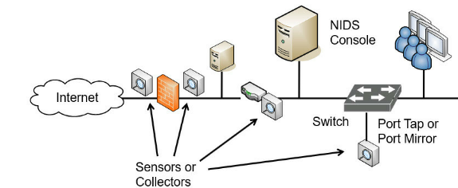
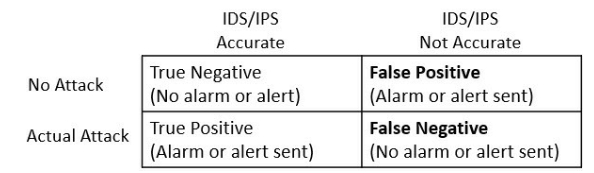
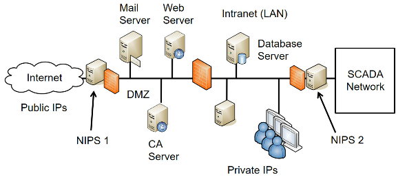
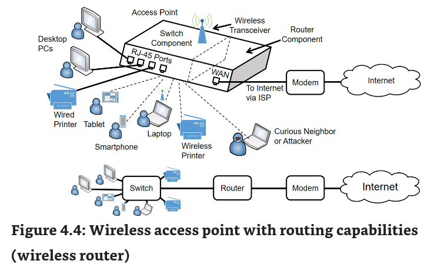
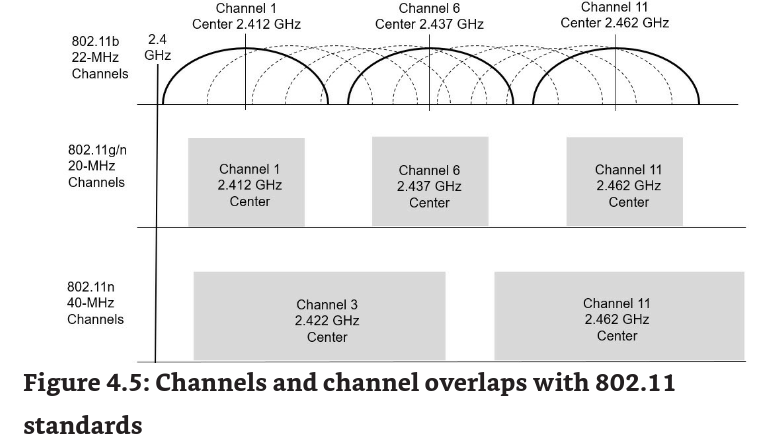
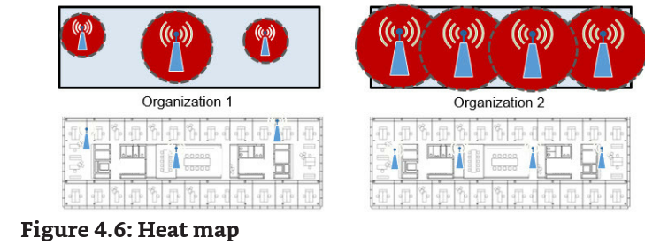
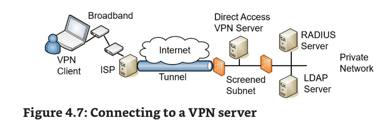
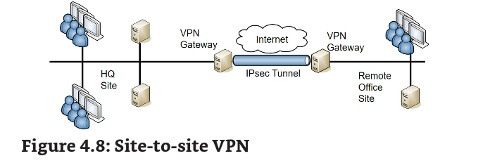
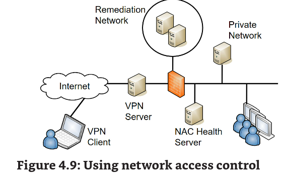
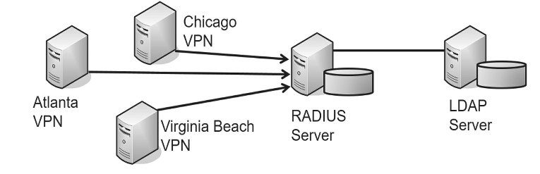

Chapter 4 - Securing your Network

# Exploring Advanced Security devices

Understanding IDS and IPSs

simples um detecta e o outro reage

HIDS

host-based detection system, usado em apenas um workstation ou server, geralmente eh usado para proteger srvs que necessitam de um layer a mais de segurança. Ele pode detectar coisas a mais que um AV. Ele monitora trafego na NIC

NIDS

Network based intrusion detection system -> monitora a atividade na rede. Trabalha por sensores, eles captam info e mandam para um central de gerenciamento. Ele não detecta anomalias no host (apenas se causar um grande estresse na rede) e também eh incapaz de encriptar trafego (plaintext).

olha que louco esse controle fica inutil pq ele não consegue analizar tráfego encriptado. Por isso muita gente colocar IPS/IDS em firewalls, pois eles agem com um MITM conseguindo fazer deep inspection.

https://securityboulevard.com/2022/10/boosting-suricata-with-next-gen-deep-packet-inspection/

****

eh interessante usar o NIDS com um switch com port mirror assim todo o trafego capturado eh empurrado pra uma porta.

Sensor and Collector Placement

Onde vc coloca o sensor faz toda a diferenca então tente sempre colocar do lado da net para ele capturar tudo, ou deixe dentro para ele capturar somente os ataques que passam.

Detection methods

signature-based, heuristic/behavioral (tambem chamado de anomaly)

### Signature

usam um banco de vulnerabilidade e patterns -> depende diretamente do vendedor de fazer o update do DB

### Heuristic/behavioral

ele checa constantemente a rede buscando um padrao ate formar uma baseline, assim que ficar fora do padrao ele torna aquilo uma anomalia e gera um alerta. **Interessante para pegar 0days**

**Lembra de Syn Flood**

**Data sources and trends**

pode pegar dados de varios sources, logs de applicacao, server, etc. Ele fica checando periodicamente vendo itens de interesse.

### Reporting based on rules

os admins que fazem as regras para determinar alertas

### False positives vs False negatives

- False positive. A false positive occurs when an IDS or IPS sends an alarm or alert when there is no actual attack.
- False negative. A false negative occurs when an IDS or IPS fails to send an alarm or alert even though an attack is active.
- True negative. A true negative occurs when an IDS or IPS does not send an alarm or alert, and there is no actual attack.
- True positive. A true positive occurs when an IDS or IPS sends an alarm or alert after recognizing an attack.

# IPS Versus IDS—Inline Versus Passive

No IPS todo o tráfego eh passado (INLINE) por ele (lembra de fw) já o IDS ele monitora trafego externamente. O IPS geralmente eh chamado de ativo por isso, já o IDS é passivo (out of band)

Resumindo IPS detecta, reage e previne. IDS so detecta mas pode também reagir depois

Eh possivel usar um NIPS para proteger certas areas como uma em SCADA limitando ainda mais o acesso a rede. Parece overkill ter dois NIPS porém muitos APTs (advanced persistent threats) conseguem instalar RATs (remote access trojans) em sistemas usando phishing.

Honeypot

endpoint criado propositalmente para atrair atacantes. Isso permite obter informacoes de metodologias de ataques, descobrimento de 0-days, divergir atacantes da rede principal etc.

## Honeynets

sao um grupo de honeypots com uma zona ou rede separada. Elas simulam a funcionalidade de uma rede real. Sun tsu, know your enemy e war is based on deception.

## Honeyfile

algo para chamar a atencao, password.txt por ex

## Fake Telemetry

telemetria eh usada em diversos sistemas como oleo, e gas natural, entrega etc. (SCADA). Falsa telemetria corrompe dados enviados aos sistemas de monitoramento derrubando o sistema.

Muita gente usa telemetria para identificar a pressao do gas natural nas linhas, se o uso aumenta a pressao diminui e o systema automaticamente aumenta a pressao para garantir que os consumidores recebam gas. Imagina o kabum (.5 psi to 75psi)

# Securing Wireless Networks

## Wireless basics

### all wireless routers are APs

muitos vendedores fazem APs com capacidade de roteamento

### Not all APs are wireless routers

a maioria dos APs so funcionam como bridge

## Band selection and channel overlaps

• 801.11b, 2.4 GHz

• 801.11g, 2.4 GHz

• 801.11n, 2.4 GHz, and 5 GHz

• 801.11ac, 5 GHz

1 6 e 11, o resto da overlap

## SSID (service set identifier) -> nome da rede wifi

## Enable MAC Filtering

pode soar seguro mas um atacante pode usar um sniffer de rede para saber qual mac esta permitido, e assim mudar o seu para adentrar na rede.

## Mac Cloning

mudar o mac

## Site Surveys and Footprinting

o site survey examina o ambiente wireless para identificar problemas como deadspot overlap etc. o heatmap mostra tudo

## Where to place

geralmente eh omdirecional

## Criptographic protocols

### WPA2 and CCMP

usa AES e Counter-mode/CBC-MAC (CCMP)

pode agir tanto no modo PSK quanto enterprise (RADIUS AAA)

### WPA3 and Simultaneous Authentication of Equals

uses SAE (variant of the dragonfly key exchange) ao invez de PSK e tambem aceita enterprise

meu ja descobriram CVE no WPA3 -- compatibilidade eh uma bosta:

https://wpa3.mathyvanhoef.com/

https://eprint.iacr.org/2019/383.pdf

# Authentication Protocols

EAP -> providencia dois sistemas as criar uma chave de seguranca PMK (paiwise master key)

PEAP -> providencia um layer a mais de protecao ao EAP usando TLS, requer um certificado no server porem nao nos clientes. Bastante usado com o Challenge Handshake Authentication Protocol (MS-CHAPv2)

EAP-FAST -> cisco

EAP-TLS -> um dos mais seguros, requer certificado tanto no cliente quanto no server

EAP-TTLS -> extensao do PEAP para sistemas antigos usarem o PAP

RADIUS Federation -> SSO entre companias

# IEEE 802.1x Security

a port-based authentication protocol. Requer users or devices a se autenticar quando conectados a um AP ou fisico (VPN).

Da pra usar um 802.1x server para previnir wall jacks.

RFC 3580, “IEEE 802.1X Remote Authentication Dial In User Service (RADIUS) Usage Guidelines,” describes IEEE 802.1X in much greater detail in case you want to dig deeper.

# Controller and Access point security

## Captive Portal

usado para usuarios logarem na rede via browser para terem wifi (hotspot)

Free wifi -> requer que usuario aceitei via a AUP (acceptable use policy)

Paid wifi -> payasyougo usase uma conta precriada ou infos do cartao para acessar.

Alternative to IEEE 802.1.X -> esses servers custam e por isso a galera usa captive.

# Understanding Wireless Attacks

## Disassociation Attacks

efetivamente remove um client wireless da rede. Quando um client autentica no AP os dispositivos trocam frames de associação. Em um momento o client pode mandar um frame de disassociacao. Esse frame inclui o MAC address, e assim que o AP recebe ele desaloca memoria do dispositivo.

Atacantes se aproveitam desse recurso e mandam o mac da vitima. Hoteis fazem esse ataque para previnir que usuarios criassem seu hotspot (roteador do smartphone) para fazerem com que as pessoas pagassem pelo wifi do hotel.

## Wifi Protected Setup (WPS)

botao do AP para ter wifi sem senha, eh possivel também usar um PIN. Atacantes tentam fazer brute force no PIN (Reaver talvez aircrack-ng)

## Rogue Access Point

eh um AP que não foi autorizado na rede, o atacante usa isso para dar sniff na rede e exfiltrate data

## Evil Twin

eh um rogue AP com o mesmo SSID, ou parecido, de um legitimo -> facilimo de fazer

## Jamming Attacks

da pra transmitir radio no mesmo sinal do wifi para dar interferencia. Da pra usar outros canais, mas o atacante faz a mesma coisa.

## IV Attacks

o initialization vector (IV) eh um nomero usado para encriptar sistemas. Atacantes tentam descobrir o IV primeiro para assim descobrir a PSK. Pois alguns protocolos usam o IV+PSK para encriptar dados em transito. WEP facil, por ter um IV pequeno (24-bit) eles acabam sendo reutilizados por sistemas.

Nesse ataque o atacante usa packet injection para adicionar pacotes adicionais na data stream. O AP responde com mais pacotes aumentando a probabilidade de reutilizar a IV.

## Near Field Communication Attacks

NFC eh um grupo de standards usados no dispositivos mobiles para permitir que eles se comuniquem com outros quando estao perto. Por ex da pra compartilhar fotos de contatos e outros dados, lembra de cartao de credito tb.

Nesse ataque eh usado um NFC reader para capturar dados de outro NFC device. Um metodo eh o eavesdropping, o NFC reader usa uma antenna para dar boost no seu range e interceptar dados entre dispositivos.

## RFID Attacks

radio-frequency identification systems incluem um RFID reader e tags deixados nos objetos.Usados para trackear objetos. O legal disso eh que os TAGS n possuem bateria, eletronicos sao usados para coletar e transmitir energia do dispositvo ao tag.

- Sniffing or eavesdropping -> o atacante pega a frequencia ao qual o RFID esta sendo transmitido, eh tambem necessario saber qual protocolo esta sendo usado no RFID para interpretar dados.
- Replay -> eavesdropping successful permite ao atacante fazer um replay. Ele configura um bogus tag para mimicar o tag do objeto que ele pretende atacar. E assim receber infos dele.
- DoS -> se o atacante sabe a frequencia ele pode fazer um jamming na onda.

## Bluetooth Attacks

eh um sistema wireless usado em personal area networks (PANs). Pessoa para pessoa.

- Bluejacking -> pratica de mandar mensagens nao solicitadas a dispositivos proximos. Tipicamente texto mas pode ser imagens ou sons. Relativamente harmless
- Bluesnarfing -> unauthorized access to, ou roubo de informacao de, um dispositivo bluetooth.
- Bluebugging -> eh tipo bluesnarfing, mas vai alem. O cara usa um backdoor para ter acesso total ao dispositivo.

Quando dispositivos bluetooth sao configurados, eles entram em discovery mode. E assim um broadcast com o MAC eh enviado.

Quase n se da pra fazer ataques bluetooth atualmente.

## Wireless Replay Attacks

atacante captura dados enviados por dois dispositivos e muda-os. WPA2 e 3 são protegidos contra isso -- quer se proteger não use criptografia antiga.

## War Driving and War Flying

war driving eh o ato de vc passear de carro descobrindo redes WiFi vulneraveis. Eh interessante admins fazerem essa pratica para descobrir wifis com criptografia fraca ou rogue APs

war flying eh a mesma coisa so que com aviao ou drones

# Using VPNs for Remote Access

virtual private networks eh usada para remote access

## VPNs and VPN Appliances

Da para habilitar vpn em servicos no server. Windows -> Direct Access VPN role, o server precisa de duas NICs.

Organizacoes maiores usam appliances que so fazem vpn. Tipicamente vc coloca a apliance na dmz -- o firewall entre a internet e a dmz vai passar o trafego da vpn para a vpn aplicance. E a apliance vai rotear todo o trafego privado para o firewall entre a dmz e a intranet. Pensa num setup de dois firewalls.

## Remote Access VPN

ja ta ligado aqui geralmente a galera usa um AAA para autenticar geral

## IPSEC as a Tunneling Protocol

Tunnel mode encripta o pacote inteiro, incluindo o header e o payload.

Transport mode so encripta o payload, e eh geralmente usado em redes privadas mas n VPNs. Aqui não ha necessidade de esconder o IP como o Tunnel.

Ipsec providencia duas coisas:

- **Authentication**: ele inclui um Authentication Header (AH) para permitir hosts IPsec a conversarem entre si antes de enviar daddos. (AH proto 51)
- **Encryption**: Usa-se o Encapsulating Securitu Payload (ESP) para encriptar dados e providenciar confidencialidade. O ESP inclui o AH e por isso da a triade completa de seguranca. ESP proto 50

Ipsec também usa o internet Key Exchange (IKE) na porta 500 para autenticar clientes durante uma conversacao. O IKE criar security Associations (SAs) para a VPN e asssim criar um canal seguro entre o client e o server.

## SSL/TLS as a Tunneling Protocol

alguns proto de tunel usam TLS. Como por ex o Secure Socket Tunneling proto (SSTP) encriptando a VPN na porta 443. Util para quando existe NAT na rede.

OpenVPN e OpenConnect sao aplicacoes opensource que podem fazer um tunel TLS

## Split Tunnel VS Full Tunnel

um passa tudo pelo fw e outro vai ser usado apenas para acessar a rede interna.

## Site-to-Site VPNs

## Always On VPN

podem ser usado com site-to-site and direct access vpns. Assim que user liga o pc ela a vpn ja conecta

## L2TP as a tunnel

funfa como tunell o v2 n possui encript ja a nova v3 sim

## HTML5 VPN portal

usa-se html para fazer vpn legal n sabia

# Network Access Control

NAC providenciam controle e segurança continuos sobre a rede.

## Host Health Checks

o NAC isola client caso ele nao passe no health check.

comon health checks:

- client firewall is enabled
- client update
- antivirus ok

However, if a client doesn’t meet the health conditions mandated by the NAC server, the VPN server redirects the client to a remediation network (also called a quarantine network). The remediation network includes resources the client can use to get healthy. For example, it would include currently approved patches, antivirus software, and updated virus signatures. The client can use these resources to improve its health and then try to access the network again. While NAC can inspect the health of VPN clients, you can also use it to inspect the health of internal clients. For example, internal computers may occasionally miss patches and be vulnerable. NAC will detect the unpatched system and quarantine it. If you use this feature, it’s important that the detection is accurate. A false positive by the NAC system can quarantine a healthy client and prevent it from accessing the network. Similarly, your organization may allow visitors or employees to plug in their mobile computers to live wall jacks for connectivity or connect to a wireless network. NAC inspects the clients, and if they don’t meet health conditions, they may be granted Internet access through the network but remain isolated from any other network activity.

## Agent Vs Agentless NAC

da pra usar tanto ele instalado como sem instalar (agentless funciona como um scanner de vuln)

## Authentication and Authorization Methods

### PAP

Passwork Authentication Protocol (PAP) usa-se PPP (point to point proto) para se autenticar com clients. usa-se PIN or password (cleartext)

### CHAP

Challenge Handshake Authentication Proto (CHAP) usasse PPP mas e mais seguro que pap. Uma PSK eh usada para fazer auth entre o client e server (encript)

## RADIUS

bastente usado para autenticar vpn pode ser usado como um 802.1x com wpa2 enterprise.

EAP. RFC 3579 “RADIUS Support for EAP” -> usado para encriptar todas as secoes.

## TACACS+

Terminal Access Controller Access-Control System Plus -> uma alternativa ao radius, e eh melhor que ele. Ele encripta todo o processo de auth enquanto o radius so faz na senha. E também usa multiplos challenges e responses entre client e server.

Cisco que criou, pode interagir com Kerberos.

## AAA Protos

Radius TACACS+ e Diameter sao AAA. O kerberos eh referenciado como AAA porem nao providencia accounting