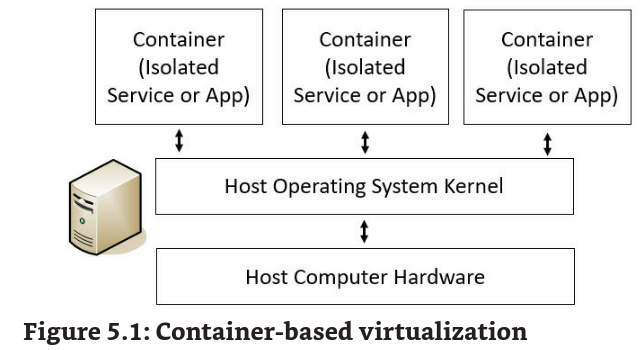
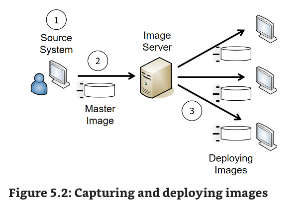
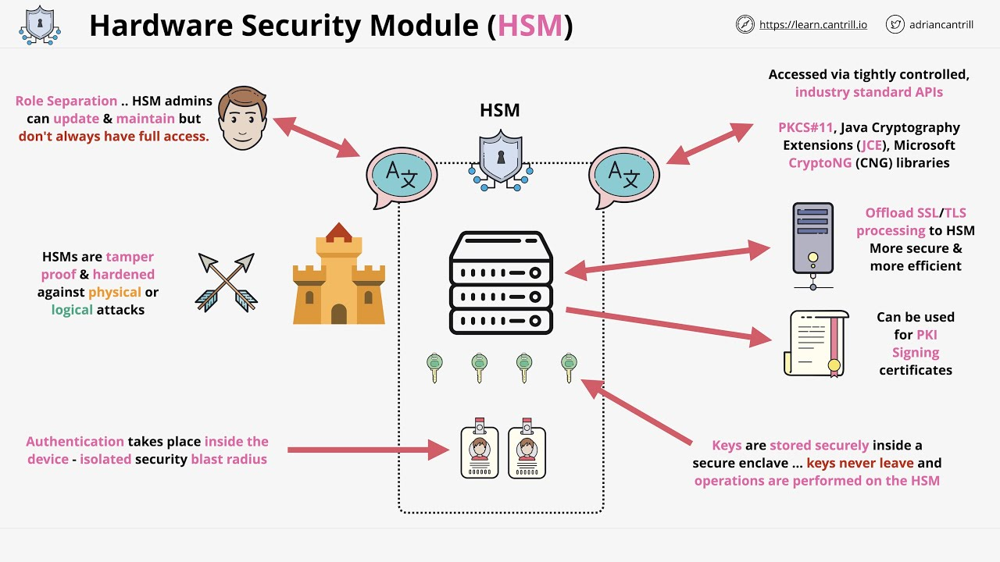
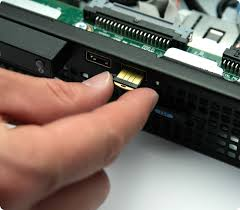
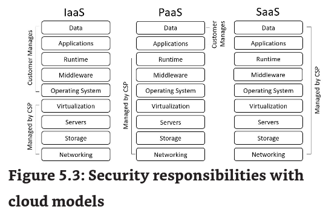

18/07/2023 10:08Chapter 5 - Securing Hosts and Data

# Summarize Virtualization Concepts

Hypervisor -> cria vm

host -> onde ta o hypervisor

guest -> vms

escalabilidade -> escalar manualmente

elasticidades -> escalar dinamicamente

TCO -> total cost of ownership (custo total do produto)

Thin Clients and Virtual Desktop Infrastructure

thin clients eh um computador com recursos necessarios para bootar e se conectar a um server.

VDI hosts a user's desktop em um server.

Containers

serviços são isolados, um drawback eh que se o host for linux, geral deve rodar linux tb

VM Escape Protection

um ataque quer permite que o cara sai do guest e acesse o host. Quando sai uma vuln assim eh interessante att tanto o host como o guest

VM Sprawl avoidance

eh quando um cara cria uma vm e nao avisa a ninguem, assim ela nao atualiza, e fica consumindo recurso sem outros saberem

Replication

como sao arquivos, vc consegue copiar, e assim replicar a vm se necessario

Snapshots

providencia uma copia da vm num determinado momento, usado para backup

Non-persistence

da ter persistence, onde o user vai ter seus dados salvos, e um non-persistence, onde vai reverter para um estagio no snapshot quando a secao acaba.

# Implementing Secure Systems

Endpoint security

qualquer dispositivo conectado a rede. Usa-se Endpoint detection and response (EDR) tambem chamado com threat (ETDR) providenciando monitoramento constante dos end -- a maioria tem Anti-malware, HIDS, app blocklists.

Hardening Systems

ele deixa o OS mais seguro que o default, tirando vulnerabilidades, misconfigurations e weak confs. Lembre-se se n ta aberto n tem como entrar. Muito admin agora muda o registro da maquina por exemplo para permitir que o powershell seja logavel. Disk encryption tb entra aqui.

Configuration Management

ajuda os admins a fazer deploy com configs seguras.

RFC 3139 “Requirements for Configuration Management of IP-based Networks”

Secure Baseline and Integrity Measurements

baseline eh como um ponto de start. Um dos melhores pontos ao usar uma, eh que a seg dos systemas sao melhorados no geral.

1.  Initial Baseline Configuration: usa-se tools para isso
2.  Integrity Measurements for Baseline Deviation: tools monitoram se a baseline mudou, o que eh um problema de seg. Scanners de vuln fazem report, e group policy reconfiguram o sistemas baseados na baseline se achar alguma mudança.
3.  Remediation: NAC (network access control) podem detectar mudancas e isolar ou quarentenar sistemas.

Using Master Images For Baseline Configurations

comeca com um snapshot seguro do bagulho.

1.  comeca com o SO raw, colocando somente apps essenciais
2.  admins capturam imagens, Symantec Ghost
3.  admin fazem deploy disso para diversas vms

Fazer dessa forma, da dois beneficios

secure starting point

Reduced Costs

Patch Managements

Microsoft Endpoint configuration. Geralmente os admins testam a applicacao em um sandbox para ver se o patch n veio com problema. Da pra combinar com um NAC tb.

Change Management Policy

famoso estagiario que tem acesso a tudo e acaba trocando o IP da impressora pro IP do DNS da rede. Self-inflicted disasters.

change management garante 2 coisas:

- To ensure changes to IT systems do not result in unintended outages
- To provide an accounting structure or method to document all changes

quando um programa desse está on, admin são desencorajados a mudar configs sem enviar para review. Com isso experts podem dar sugestões do que está sendo feito, podendo aprovar ou n a mudança.

Application Approved Lists and Block Lists

consegue bloquear ou liberar apps, lembra de um mobile device managemen (MDM) ou appcontrol do fw

Aplication Programming interfaces (API)

APIs sao suscetiveis a ataques e por isso eh necessario garantir que elas tenham as seguintes protecoes:

1.  Authentication: impede que pessoas n autorizadas usem a api
2.  Authorization: providenciam acesso seguro a API (OAuth)
3.  Transport level security: TLS encripta o trafego. No sniffing here.

Microservices and APIs

Ex: a amazon usa APIs de web services diferentes de cada transportadora. Em contraste um unico modulo de codigo de microservices poderia ser usado por qualquer transportadora. Consumidores iriam digitar o tracking ID e a API de micro iria determinar a transportadora.

FDE and SED

Full disk encryption -> veraCrypt

Self-ecrypting drives (SED) -> hardware-based FDE drives, incluem um circuito built in que encripta tudo e desencripta tudo sem o usuario fazer nada.

Opal Storage Specification -> precisa de credenciais pra desencriptar o drive (compliance)

Boot Integrity

verifica a integridade do bootloader. Um \*\*measured boot \*\*vai até um certo ponto do boot e performa checks, se detecta algo o sistema n boota

Boot Security and UEFI

BIOS (basic input/output system) inclui um software para inicializar o pc. Uma combinacao de hardware e software = firmware

Unified Extensible Firmware Interface (UEFI) -> mesma coisa de bios porem com uns chans a mais, CPU-Independent.

Trusted Platform Module (TPM)

eh um chip que armazena chaves criptograficas para encrypt. Quando habilitado tpm providencia FDE.

TPM suporta **boot attestation**. Captura assinaturas de arquivos de boot, e quando ele boota checa a integridade dos hashes. Pode bloquear o boot.

Remote attestation -> manda para um systema remoto

smepre vem com um unique Rivest, Shamir, Adleman (RSA) private key burned into it,

Hardware root of trust

da pra usar bitlockert com tpm

Hardware Security Module (HSM)

eh um dispositivo que vc coloca em um systema para gerenciar, gerar e armazenar chaves criptograficas

tem umas das yubico (microSD) tb

YubiHSM 2 and YubiHSM 2 FIPS

a unica diferença entre o TPM e o HSMs eh que o TPM eh inbutido dentro do chip, não precisa ser necessariamente uma caixa, acredito que um USB já proteja o server de app.

# Protecting Data

Dados sao o que atacantes estao a procura. Lembra de ransonware.

Data Loss Prevention

DLP techniques, da pra bloquear uso de USB, e controlar o uso de media removivel. Consegue examinar dados de fora, e detectar transferencia de dados nao autorizado.

O DLP procura por keywords, da pra fazer com que labels como confidential e outros nao poderem serem printados ou impressos etc. E ainda logar quem tentou.

Escanear email, e arquivos, documentos, spreadsheets, e arquivos comprimidos.

Algumas organizacoes rotineiramente scaneiam email procurando por Personally Identifiable Information (PII) - ex Social Security number (CPF). O DLP consegue mascarar essas infos

Rights Management

Protecao contra copyright

Removable Media

qualquer dispositivo storage que vc consegue attachar em um host e copiar dados.

Data Exfiltration

a galera quer dados, eh o que da money o UTM geralemnte eh usado para bloquear codigo malicioso, e impedir que o user baixe algo da net.

Protecting Confidentiality with Encryption

tenha em mente por ex um NTFS que permite vc configurar permissoes com ACLs. Da pra usar permicoes para restringir acesso a pastas e arquivos. Agora se um cara roubar um note e pegar o drive e jogar em outro pc ele consegue acesso aos dados. Com encript ja nao eh tao facil assim.

Database Security

da pra encriptar data at rest do BD, mas dnv nao eh tao performatico assim, e por isso a galera costuma encriptar somente uma parte de dados. Alguns BDs armazenam, senhas como hashes or melhor salted hashes.

# Summarizing Cloud Concepts

SaaS -> software as a service (GMAIL)

PaaS -> provedor de hosts, plataforma como serviço como self-managed Gcloud, Azure

IaaS -> infraestrutura como serviço, ver diferenca entre PaaS e IaaS

XaaS -> Anything as a Service -> qualquer coisa alem de Paas e Iaas. Comunicacao, BD, storage, sec, e mais.

Cloud Deployment Models

public cloud -> amazon, google, microsoft, apple

private -> openstack vmware

community cloud -> duas organizacoes providenciando recursos.

Hybrid -> tanto cloud quanto privado.

Managed Security Service Provider

MSSP aim7, o que elas providenciam:

1.  Patch management
2.  Vulnerability scan
3.  Spam and Virus Filtering
4.  DLP
5.  VPN
6.  Proxy
7.  IPS e IDS
8.  UTM
9.  NGFWs

diferenca de MSP eh que elas fazem de tudo em TI

Cloud Service Provider (CSP) Responsabilities

Cloud security Controls

- High availability and HA across zones -> zero downtime
- resource policies -> qualquer recurso
- secrets management -> algo que armazene chaves e senhas
- integration and auditing -> a CSP integra controles de sec em cloud, e a auditoria ajuda consumidores a identificar a efetividade na seg

Storage -> buckets S2

- Permissions
- Encryption
- replication

cloud based networks

- virtual networks
- public and privatre subnets
- segmentation

CSP  compute engine

- security groups -> DAC RBAC
- dynamic resource allocation
- instance awareness -> report nos recursos, previne VM spraw
- VPC (virtual private cloud endpoint) -> eh um endpoint virtual com uma rede virtual
- transit gateway -> conecta VPCs as redes on-premisses (azure gateway)
- Container security -> roda servicos ou apps em containers

On-Premises Versus Off-premises

on -> melhor  gerencia, da pra implementar SSO de boa.

off -> menos gerencia, menos responsabilidade pois a CSP que vai ter que fazer updates etc. pode ter questoes legais, pois os dados podem ser armazenados em outros paises

Cloud Access Security Broker (CASB)

esse software providencia seg por monitorar o trafego e dar enforce nas politicas de seg.

Qualquer coisa acessivel pela net eh um vetor de ataque

https://www.microsoft.com/en-us/security/business/security-101/what-is-a-cloud-access-security-broker-casb

Cloud-Based DLP

usa-se isso para permitir que a organizacao implemente politicas para dados armazenados na cloud. Pensa em PII e PHI (protected health information) enforce ecriptados.

Next-Generation Secure Web Gateway

eh uma fusao de um proxy com um stateless fw o SWG eh geralemente um servico cloud mas pode ser usado em appliances on-site. Clientes são configurados para acessar recursos da internet via SWG e filtram trafego previnindo ameacas de infiltrar a rede. Alguns serviços do SWG:

1.  URL filtering
2.  Stateless packet filtering -> detecta e bloqueia trafego malicioso
3.  Malware detection and Filtering to block malware
4.  DLP
5.  Sandboxing

Firewall Considerations

uma rede virtual tb precisa de fw, geralemnte dois para criar a screnned ou DMZ

Infrastructure as Code

gerenciamento e provisionamento de data centers com codigo para definir VMs e virtual networks. Puppet e Ansible?

Software-defined Network (SDN)

usa virtualizacao para virtualizar sistemas de rede como switches e routers

attribute-based access control (ABAC) eh bastente utilizado aqui.

Software-Defined Visibility (SDV)

sao tecs usadas para ver todo o trafego da rede. Como organizacoes usam mais cloud alguns trafegos podem bypassar dispositivos de seg. Ao usar esse software garante que todo o trafego seja visivel e que pode ser analisado.

# Edge and Fog Computing

pratica de store e processar dados em dispositivos que geram data de user.

Pensa em carros, se vc coloca no modo cruise ele detecta o transito e acelera ou diminui conforme ta na cloud tem lentidao. Os dados sao enviados pela cloud. Agora se fosse onboard o processo de dados seu carro vai diminuir com quase 0 latencia.

isso eh edge

agora fog:

usa uma rede perto do dispositivo e pode ter multiplos nodes sensing and processing data.

Cloud Security Alliance

CSA sao organizacoes sem profit que promovem melhores praticas relacionadas a cloud. Eles criaram o Certificate of Cloud Security Knowledge (CCSK) certification. Eles trambém criaram o CSA Cloud Controls Matrix (CCM) -- um framework de sec.

SP-800-53 Revision 5, “Security and Privacy Controls for Information Systems and Organizations."

# Deploying Mobile Devices Securely

NIST SP 800-124, “Guidelines for Managing the Security of Mobile Devices in the Enterprise,” mentions that mobile devices have additional characteristics, such as at least one wireless network interface, local data storage, an operating system, and the ability to install additional applications.

NIST SP 800-124 excludes laptop and desktop computers because they don’t contain features in many mobile devices, such as a GPS and sensors that monitor the device’s movement, such as accelerometers and a gyroscope. A GPS can pinpoint the location of a device, even if it moves. NIST also excludes basic cell phones, digital cameras, and Internet of Things (IoT) devices. These don’t have an OS or a limited functioning OS.

Deployment Models

- Corporate-owned -> da empresa
- COPE (corporate-owned, personally enable) -> dado pela empresa, mas funcs podem usar como pessoal
- BYOD (bring your own device) -> bring your own disaster
- CYOD (choose your own device) -> uma lista de dispositivos podem ser usados pelos funcionarios

Connection Mehods and Receivers

- cellular
- wifi
- blue
- nfc -> da pra criar p2p net com NFC
- RFID -> transmite dados por radiofrequencia entre dispositivos
- infrared ->alguns smartphones ainda possuem essa tec, eh possivel transferirr dados
- USB (uviversal serial bus) ->mini-usb da pra conectar com PCs (smartphones)
- point-to-point -> wireless conection entre dispositivos
- point-to-multipoint -> cria uma rede ad hoc (latim as needed). nessa rede os dispositivos se conectam entre si sem um AP.
- payment methods ->da pra restringir uso de methodos de pagamento em dispositivos COPE.

Mobile Device Management

MDM ->  faz com que dispositivos se adequem a um controle de seguranca.

existe tambem unified endpoint management (UEM), eh um cara que garante que o dispositivo esteja em compliance com a politica de seg tipo antivirus updated. Server pra todos os endpoints incluindo smartphones. Conceitos de mdm

- application management
- full device encryption
- storage segmentation -> em alguns dispositivos da
- content management -> alem do store da pra forcar auth para acessar etc
- containerization -> da pra rodar container num smartphone? bom em BYOD https://www.manageengine.com/mobile-device-management/how-to/mdm-creating-container.html
- password and pins
- biometrics
- screen locks
- remote wipe
- geolocation
- geofencing -> apps so respondem quando num determinado local
- GPS tagging -> pensa na informacao geografica das fotos, atacantes usam isso para saber sua localizacao.
- context-aware authentication -> usa multiplos negocios para auth
- push notifications -> manda mensagens dos apps

Mobile Device Enforcement and Monitoring

o mdm faz diversar coisas, se o for CO ele vai baixar os apps no dispositivos, se for BYOD ele valida alguma compliance e block na rede. Funciona como um NAC

Unauthorized Software

lembra de jailbreaking or rooting e dispositivos third-party assim como dispositivos nao recomendados

por o smarphone OS ser considerado uma firmware (flash) o update eh feito por over-the-air (OTA) updates

da pra colocar um custon firmware tb. Sideloading (APK)

Messaging Services

short message service (SMS) e multimedia Messag Service (MMS), a segunda eh uma extensao da pra mandar audio, video e os crl, da pra fazer RCE por aqui kkkkkk.

Rick communication services (RCS) eh um novo para substituir o SMS e MMS.

Hardware Control

mdm pode desabilitar uma camera por ex. Pode previnir Universal Serial Bus On-The-Go (USB OTG)

Unauthorized Connections

most support tethering -> share internet with others. Da pra bypassar firewall com isso assim como o hotspot

Lembra do SIM card, se a pessoa comprou o smart num contrato de 2 anos, apos o contrato ela pode desbloquear o smart tambem chamado de carrier unlocking

https://support.apple.com/en-us/HT201328

n sei se isso existe no brasil, aqui a gente coloca qualquer SIM

SEAndroid

mesma coisa que SELinux

enforcing mode -> tudo recebe deny e eh logado

permisse mode -> so eh logado

# Exploring Embedded Systems

tem 3 na security+

**field programmable gate array (FPGA)** -\> eh um circuito integrado (IC) programavel. Ele comeca sem qualquer config ou programa. Quando ligado ele transfere a config do programa para um processador externo.

da pra programar ele desligado, e o processador tb pode mandar outras configs -- tornando algo versatil

**Arduino** -\> um microcontrolador, possui ram e cpu. n precisa de SO, usado para tarefas repetitivas

**Raspberry Pi** -\> eh um microprocessador baseado em um mini computador. Usa-se o Rasp Pi OS. Tem mais capacidades que o arduino

Entendendo IOT

The National Institute of Standards and Technology Internal Report (NISTIR) 8228 “Considerations for Managing Internet of Things (IoT) Cybersecurity and Privacy Risks” states that the full scope of IoT is not precisely defined. This is because the technologies are in a wide assortment of sectors such as health care, transportation, and home security.

## ICS and SCADA Systems

industrial control system (ICS) refere-se a sistemas dentro de grandes organizacoes como power plants e tratamento de agua. Já o supervisory control and data acquisition (SCADA) system tipcamente controla o ICS por monitorar e enviar comandos. Tipicamente esses sistemas estão apartados da rede (AIR GAP)  e n possuem conexao com a net. Alguns usos:

**Manufacturing and Industrial** -\> monitora o processamento e reporta anomalias em tempo real

**Facilities** -\> monitoramento da temperatura e humidade, e mantem o ambiente estavel.

**Energy** -\> gas processing, power generation.

**logistics** -\> shipping

geralmente estao em VLANS com uma NIPS (linha)

# IoT and Embedded Systems

existem diversos sistemas embedded na prova.

SmartTV, Wearables (implanted or wear), smartphone, microchips em pets, home automation, camera, **System on a chip** (SoC) ROM e EEPROM (eletric  erasable). Real-time operating system (RTOS) , eh um SO que responde a inputs num tempo especifico (pensa num maquinario de produzir pizzas, o tempo precisa estar cordenado, se nao gera um erro e para o comando). HVAC (ar condicionado de rico)

## Security implications of Embedded Systems

o patch de vulnerabilidade eh mais complicado, geralmente se usa config default, e os admin nao verificam IOTs com frequencia.

## Embedded System Constraints

- compute -> recursos limitados
- crypto -> n da pra usar criptografia wtffffff
- power -> n possuem suas proprias energias.
- range -> limited power limited range (wifi)
- authentication -> designers skip auth
- network -> n existe interface de config, o default eh aplicado
- cost -> o custo eh minimizado por sacrificar a seg
- inability to patch -> vendedores n fazem patch
- implied trust -> usuarios confiam que eles sejam seguros
- weak default -> possuem configs default fracas em relacao a seg

## Communication Considerations

- 5G -> tem um range menor que o 4G de 1000f para 10 miles. por isso eh preciso mais infra.
- narrow-band -> frequencia estreita. Pensa num walkie talkie
- baseband radio -> frequencias perto de 0. Geralmente usadas via cabo, do que ar.
- subscriber identity module (SIM) cards -> tem que ver se o IOT suporta o SIM.
- zigbee -> uma suite de comunicacao para redes menores. Mais simples e barata que o wifi e bluet. Suporta boa encript