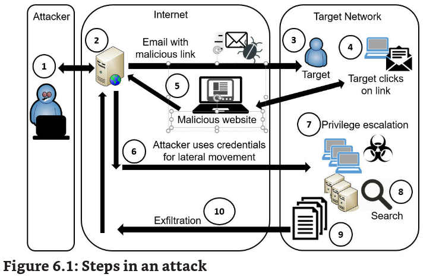

Chapter 6 - Comparing Threats, Vulnerabilities, and Common Attacks

# Understanding Threat Actors

qualquer um que tente realizar um ataque eh chamado disso

alguns são altamente organizados e dedicados, esses são chamados de APT (advanced persistent threat) -- fazem ataques sofisticados e targeted.

Eles podem ser patrocinados por governos -- state actors.

- China. Some reported names are PLA Unit 61398, Buckeye, and Double Dragon.
- Iran. Some reported names are Elfin Team, Helix Kitten, and Charming Kitten.
- North Korea. Some reported names are Ricochet Chollima and Lazarus Group.
- Russia. Some reported names are Fancy Bear, Cozy Bear, Voodoo Bear, and Venomous Bear.

Criminal Syndicates -> grupos de individuos que fazem atividades criminais juntos.

Um exemplo a Crowdstrike (sec company) documentou um syndicate conhecido como WIZARD SPIDER (russo) esses caras operavam o Ryuk (ransonware).

hacker -> individuo com alta profissiecia em computacao. Agora a media colocou outro significado bosta

script kiddie-> bostinha

hacktivist -> fazem ataques com cunho ativista

black hat -> atacante

white hat -> good guy

gray hat -> boas intencoes mas pode fugir do etico

insider threat -> tem acesso legitimo a organizacao, e ferra de dentro (DLP NELES)

competitor -> empresas que competem, elas podem usar de black hats para ferrar outros

## Attack Vectors

sao os meios que os atacantes usam para ganhar acesso a rede e pcs. Quando suscessful eles usam esses vectors para realizar exploit nas vulns

email, social media

## Shadow IT

qualquer sistema ou app nao autorizado dentro da empresa

# Determining Malware Types

software que tenha intencao maliciosa

## Viruses

codigo malicioso que se liga a alguma aplicacao, ele executa quando o app executa, o virus tenta se replicar, achando outros hosts de app. Em algum ponto o virus ativa e entrega seu payload.

Pode deletar arquivos, random reboot, c2 na botnet, backdoors. Geralemnte n executa na hora, ele se replica primeiro.

## Worms

self-replicating malware que atravessa rede sem assistencia de um app ou interessacao de user. Ele reside em me memória e usa diferentes protocolos para atravessar a rede. Pode causar lentidao na rede, e espalhar por diversos sistemas.

## Logic Bombs

scripts que ativam conforme o tempo, funcionarios que sao demitidos geralemnte fazem isso. Sempre depende de um evento

## Backdoors

providencia outra maneira de adentrar num sistema

## Trojans

famoso cavalin do capeta. Desconfie de qualquer coisa que pareca boa d+. Bastante usado o dive-by (acessa o site e ja eh baixado) download para ser baixado

- Attackers compromise a website to gain control of it.
- Attackers install a Trojan embedded in the website’s code.
- Attackers attempt to trick users into visiting the site. Sometimes, they simply send the link to thousands of users via email, hoping that some of them click the link.
- When users visit, the website attempts to download the Trojan onto the users’ systems.

Outro metodo eh o rogueware ou scareware -> se mascara de um antivirus, assim que o user entra em um site um popup aparece, e o usuario eh encorajado a baixar o av. A cisco tem um **CRXcavator.**, que faz assess risks em extensoes do chrome.

## RAT (remote Access Trojan)

permite que atacante acesse e controle sistemas remotamente. Geralemnte pego por email, em PE (32 e 64) comprimidor via tarball. Pode coletar automaticamente keystrokes, usernames, passwords e outros dados.

## Keyloggers

captura o que o user esta digitando. Pode ser tanto software quanto hardware.

## Spyware

geralemnte instalado sem o concentimento ou atencao do user, monitora a atiivdade e pc do user. Rouba info. Podem mudar a pagina do user, redirecionar web browsers, instalar software adicional e ate causar lentidao. Geralemnte vem com bonus de outros malwares.

## Rootkit

um grupo de programas (raro ser somente um) que esconde que o sistema foi infectado por malware. Ele muda o servicos no SO e ate registros. Geralemnte tem root-level access ou kernel. Usam tecnicas de hooked processes que interceptam syscalls -- os hooks sao usado em memoria para controlar o systema. AVs podem falar que tudo ta ok pq ele intercepta a syscall do av, mas ainda pode acessar a RAM para ver ele la.

boota em safe-mode.

## Bots and Botnets

atacantes controlam botnets, e bots sao maquinas slaves *(zombies) controladas

## Command and Control (C2)

bots sao controlados por c2. IRC foram usados em primeiras botnets. P2P botnets, uma controla a outra e assim em diante. Um ex o trickbot fazia c2 em roteadores wireless hackeados.

## Ransonware and Cryptomalware

atacantes pegam controle da maquina e tiram o user de cena. o crypto encripta a maquina. Ou os dois. Sodinokibi, Ryuk, Phobos.

## Potentially Unwanted Programs (PUPs)

bloatware pode mascarar malware.

## Fileless Virus (or malware)

roda em mem ao invez de file. Algumas tecnicas:

- Memory code injection -> java e flash eram targets o fileless se aproveitam de unpatched apps e infectam em mem. Sempre bloquear powershell kkk
- script-based techniques -> SamSam ransonware -> comeca encriptado e so eh decriptado quando roda, Cobalt Kitty usava powershell comecando por spear-phishing email.
- windows registry manipulation -> Kovter and Poweliks ficam embutidos dentro do registro

fileless podem ser embedded em outros arquivos. O vCard tem um campo onde o usuario consegue armazenar dados, e com isso esse business card pode conter malware e infectar a organizacao inteira.

## Potential indicators of a Malware Attack

- extra traffic
- data exfiltration
- encrypted traffic
- traffic to specific IPs
- outgoing spam

# Recognizing Common Attacks

## Social Engineering

usar taticas sociais para ganhar info.

- Using flattery and conning
    
- Assuming a position of authority
    
- Encouraging someone to perform a risky action
    
- Encouraging someone to reveal sensitive information
    
- Impersonating someone, such as an authorized technician
    
- Tailgating or closely following authorized personnel without providing credentials
    

prendame se for capaz kkkkk

### Impersonation

frank abagnail jr

### Shoulder Surfing

olhar pelo ombro da pessoa

### Tricking Users with Hoaxes

hoax eh uma mensagem geralemente circulada via email, que diz que tem um virus no seu pc ou algo que n existe. Usuario sao encorajados a excluir arquivos ou mudar a config do sistema. Aqueles spans retardados

### Tailgating and Access Control Vestibules

o atacante sem credencial segue a pessoa ate uma porta e a pessoa da acesso por educacao. Mantraps (vestibules) previnem isso

### Dumpster Diving

lixeiro procura PII ou PHI

## 0day

vulnerabilidade dia zero, ou sem patch

## Watering Hole Attacks

atacantes pesquisam quais sites os targets usam e ai infectam esses sites.

## Typo Squatting

ou URL hijacking eh quando o atacante compra um dominio com um nome perto do legitimo.

- hosting malicious website
- earning ad revenue
- resellling the domain

## Eliciting Information

ato de pegar info sem pedir. o Frank pega trust e cria rapport com o target e ela simplesmente diz tudo.

- active listening -> pessoas gostam de falar
- reflective questioning -> omg you couldn't even send the email??
- false statements -> fiquei sabendo que vc pode ser demitido por acessar o google.
- bracketing -> fiquei sabendo que la na sala do server tem umas 20 cameras

## Pretexting and Prepending

criar um pretexto para dar credibilidade sobre um social engineering Chat GPT eh mestre nisso.

## Identity Theft and Identity Fraud

alguem rouba a informacao pessoal de vc, PII ou PHI. Atacantes podem cometer **idendity fraud** por isso.

## Invoice Scams

eh um phishing por voz

## Credential Harvesting

ato de coletar credenciais de users. O simples ato de perguntar com phishing e o user te da. Deu um problema com uma conta, clica no link.

## Reconnaissance

gather info

## Influence Campaigns

usa-se de diversos metodos para influenciar a massa (social media). Hybrid warfare eh um estrategia militar que mistura warface convencional e metodos de influenciar pessoas.Gaslighting

# Attacks via Email and Phone

## Spam

unwanted or unsolicited email.

## Spam over internet Messaging (SPIM)

spam enviado por instant messaging (IM) channels. SMS por ex.

## Phishing

mandar email para usuarios com o proposito de engana-los

“We have noticed suspicious activity on your account. To protect your privacy, we will suspend your account unless you log in and validate your credentials. Click here to validate your account and prevent it from being locked out.”

## Beware of Email from Friends

um cc com um amigo em comum mas quem mandou foi o atacante.

## Phishing to Install Malware

gostaria de fazer update no flash???

## Phishing to validade email address

uso de beacons -> eh um link incluido em um email que linka a uma imagem de um servidor na net. O link inclui um codigo que identifica o email do recebidor.

por isso que por default eles n deixam imagens

## Phishing to get money

nigeriano safado 419 scam

## Spear phishing

ataque direcionado, lembra das assinaturas eh assim que vc se certifica que eh a pessoa

## Whalling

ataque a executivos, pessoas de alto cargo -> melhor payroll

## Vishing

usa-se a voz, VoIP com spoof caller ID.

## Smishing

SMS

# One Click Lets Them In

# Blocking Malware and Other Attacks

- spam filter on mail gateways ->antispam
- Anti-malware software on mail gateways -> geralemnte manda um notificacao ao user do pq o attachment foi removido
- All systems -> todos os sistemas devem ter av, e servers principalmente devem ter softwares especificos.
- Boundaries or firewalls -> monitoram trafego e UTM reduz o risco de malware entrar na rede

## Signature-based Detection

tem padroes no banco de vacinas que detectam o malware or spam.

## Heuristic-based

detectam 0-day, rodam questionable code em uma sandbox e assim analisam seu comportamento. Muito bom pra detectar polymorphic malware.

## File Integrity Monitors

detectam arquivos do sistema modificados. Calculam hashes com um baseline e periodicamente recalcula a hash e comparam com a baseline. Bom pra detectar rootkit

## Cuckoo Sandbox

eh um open-souce automated software analysis system. Seu proposito eh analisar arquivos suspeitos.

Roda em uma e cria um relatorio pela atividade.

# Why social Engineering Works

## authority

pessoas respeitam cargos e patentes, quanto maior a autoridade mais complacencia tera. Experimento de Milgram.

Impersonation, whaling, vishing

## intimidation

ser bully compensa. Eh o maior tipo de intimidacao junto com impersonation e vishing (trabalho na Microsoft).

Olha se vc quer ser responsavel por perder essa venda de milhoes do seu chefe, blz.....

Nao dao tempo de responder

## consensus

pensa nos sites de dropshiping com diversos comentarios de pessoas falsas. Paginas na wikipedia sobre um ricaço. **Social Proof**

## Scarcity

quantidade limitada de um item. Pensa rapido

## Urgency

pensa rapido, o CEO te pediu para abrir esse email urgente.

## Familiarity

se vc gosta de alguem eh mais capaz de vc fazer algo pela pessoa. Shoulder surfing, tailgating. Eles criam rapport com a pessoa antes do ataque.

## Trust

essa leva mais tempo, mas eh worth it vishing eh usado aqui.

## Threat Intelligence Sources

OSINT (open source intelligence) infos liberadas na net, agora closed/proprietary intelligence sao trade secrets, onde atacantes pegam em dados vazados por ex.

tipos de osint:

- Vulnerability Databases -> NVD, CVE
- Trusted Automated eXchange of Indicator Information (TAXII) -> providencia standard para organizacoes trocarem info de cyber threats
- Structured Threat information eXpression (STIX) -> open standard, quais cyber threats organizacoes devem compartilhar. STIX eh compartilhado via TAXII
- Automated indicator sharing (AIS) -> The Cybersecurity and Infrastructure Security Agency (CISA) mantem o site
    
    https://www.cisa.gov/ais para real-time exchange de threat indicators e defensive measures. AIS usa TAXII and STIX
    
    **IMAGINA INTEGRAR ISSO AO MISP**
    
- Dark Web -> tor
- Public/private information sharing centers -> muitas organizacoes compartilham info em cyber tipo o FBI
- indicators of compromise -> IoC 
    
    CISA released a Malware Analysis Report (AR21-048A) on “AppleJeus: Celas Trade Pro.” IoCs included in the report included the URL where users could download the malware, the name of specific files included in the malware, and more. Cybersecurity professionals can use this data to search proxy logs to see if users accessed the URL and then search systems for the specific files.
    
- Predictive analysis -> tenta predizer o que atacantes vao fazer no futuro proximo.
- Threat maps -> representacao visual 
    
    https://www.redlegg.com/blog/cyber-threat-maps
    
- File/code repositories -> 
    
    https://github.com/hslatman/awesome-threat-intelligence
    

# Research Sources

- vendor websites
- conferencias
- local industry groups
- sharing centers -> infraGard share info com o FBI
- academic journals
- RFC 
- Social media