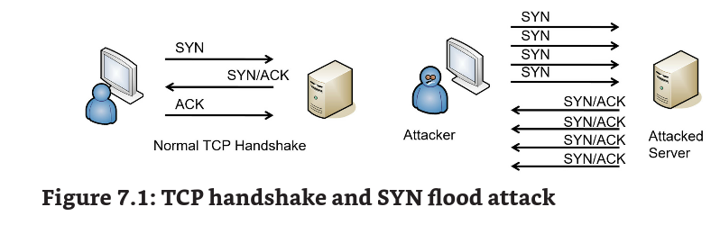
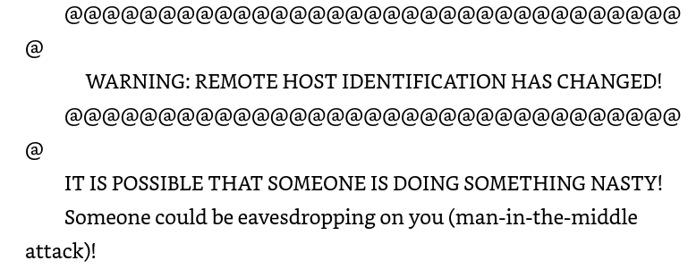
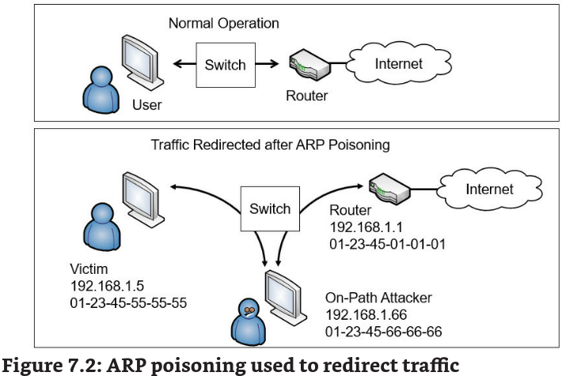
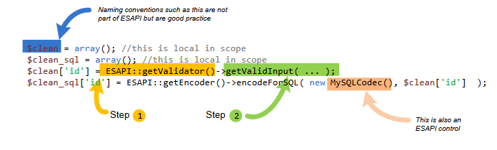
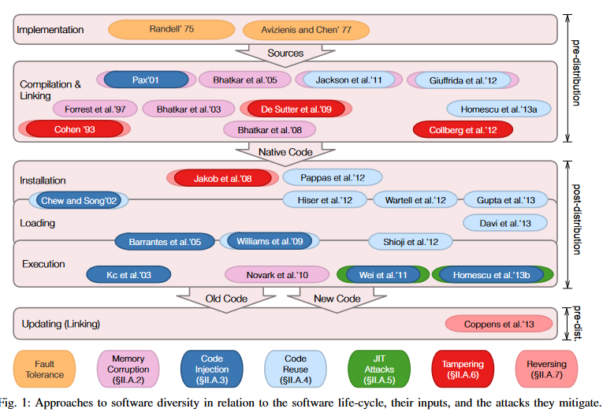
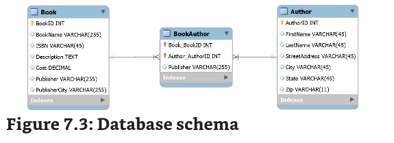
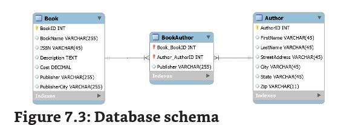

Chapter 7 - Protecting Against Advanced Attacks

# Understanding Attack Frameworks

profissionais de cyber usam diversos ataques para identificar taticas, tecnicas e procedimentos (TTPs) usados por atacantes.

Cyber Kill Chain

kill chain eh um termo militar. E começa com a identificacao do target, dispatching resources para o target, alguem decidido a atacar e dar a ordem e tudo finaliza com a destruicao do target. A desrrupcao da comunicacao eh usada para quebrar a kill chain.

Cyber kill chain eh igual.

1.  Reconnaissance -> researching, identifying, selecting targets
2.  Weaponization -> Malware, such as remote RAT, is embedded with a deliverable payload, como um microsoft office document.
3.  Delivery -> phishing
4.  Exploitation -> quando a arma eh ativada o exploit tem target como uma app ou SO com vuln
5.  Installation -> geralemnte usam algo de persistencia backdoor ou RAT
6.  Command and Control (C2) -> manda um beacon to an internet-based server. Estabilizando um canal C2.
7.  Actions on Objectives -> nesse ponto eles começam tomando acoes como instalar um ransomware ou coletar data.

Diamond Model of Intrusion Analysis

diamond model of intrusion foca em entender o mindset do atacante, analisando 4 key components de todo envento de intrusão.

- Adversary -> podem ser identificados por email, handles usados em foruns online
- Capabilities -> capacidade de se referir ao malware, exploits e outros tools usado em intrusao
- Infrastructure -> internet domain names, email addresses, e IP addresses usados
- Victim

avalisando esses componentes em diversos ataques mostra similaridades e padroes de ataque.

MITRE ATT&CK

Adversarial Tactics Techniques, and Common Knowledge. Eh uma base de ataques em matriz, usadas em real word cenario.

taticas: are initial access, execution, persistence, privilege escalation, defense evasion, credential access, discovery, lateral movement, collection and exfiltration, and command and control.

sao responsaveis por manter a CVE e CWE (common weakness enumeration). CVE virou um padrao para nomear vulns e exposures, eh usado pelo Security content automation (SCAP).

# Identifying Network Attacks

DoS vs DDoS

um vs trocentos

Syn Flood Attacks

esse ataque desrupts o TCP handshake e pode previnir que usuarios reais acessem o app.

Spoofing

email, IP, MAC etc.

On-Path Attacks

\*\*man in the middle \*\* forma de interceptacao de trafego e eavesdropping. Por isso que o SSH mostra a mensagem:

existem trojans que infectam browsers e criam proxys (man-in-the-middle)

Secure Sockets Layer Stripping

esse ataque muda o HTTPS para HTTP. Se o atacante consegue comprometer a negocioacao do TLS ele pode redirecionar a pagina para a 80

# Layer 2 Attacks

ARP Poisoning

Existem dois ataques de arp poison:

### ARP On-Path Attacks

no caso gera um ARP request -? de quem eh esse IP

ARP reply -> esse IP possui o mac tal. E quem fez o request fica com o cache do host.

no caso a vitima pega o cache do atacante pensando que ele seria o router.

### ARP DoS

se alguem da rede perguntar qual o MAC do gateway e o atacante responder com um falso. Aquele dispositivo agora nao vai ter acesso a NET....

### MAC Flooding

o atacante manda trafego o bastante para o switch funcionar como um simples HUB (fault mode)  e assim ele pode analisar qualquer trafego de qualquer porta

geral tem mac flood guard. Geralmente sao 132 tentativas, se o switch detecta mais que isso ele gera um alerta em SNMP (trap) e assim desabilita a porta ou seus updates.

### MAC Cloning

geralmente feito para enganar a ISP fazendo com ela pense que um dispositivo diferente nao eh diferente kkk

Ela sabe o MAC do router que ela te da, porem se vc troca-lo ela n vai te dar um IP nesse novo. Até vc registrar o MAC no novo. Mas se vc clonar o MAC do antigo, ai eles te dao um IP.

o padrão é 2m para fazer o update do arp, então esse ataque é bastante facil de fazer de uma perspectiva de rede.

# DNS Attacks

DNS Poisoning Attacks

tenta modificar ou corromper dados de um DNS. Redirecionando o google.com para malware.gratis.com. A galera usam DNSSEC para proteger os DNS records.

https://www.cloudflare.com/pt-br/dns/dnssec/how-dnssec-works/

Pharming Attack

aqui a resolucao de nome em si que eh manipulada, modificando o arquivo hosts do abiguinho.

C:\\Windows\\System32\\drivers\\etc\\hosts

URL Redirection

por ex se um atacante onwnar um site, ele pode fazer com que usuarios que acessem esse site sejam redirecionados ao seu.

Domain Hijacking

quando um atacante muda o registro do dominio sem permicao do dono.

Domain Reputation

ajudam ISPs a categorizar se devem dropar seus email. Use um domain reputation checker

DNS Sinkhole

eh um dns que da resultados incorretos de um ou mais dominios. Autoridades usam desse metodo para desrruptar botnets, eles fazem engenharia reversa no malware e descobrem os FQDNs dos servidores C2 e contactam a Google por ex para enviar essas requisicoes para outro lugar.

DNS Log Files

ajuda admins a encontrarem sites maliciosos requisitados pelo user.

Replay Attacks and Session Replays

onde o atacante intercepta o trafego e modifica dados, e tenta impersonificar alguem da secao. Timestamps e sequence numbers são contramedidas efetivas contra esse ataque.

# Summarizing Secure Coding Concepts

da tecnicas e padroes para programadores seguirem e manterem uma politica de codigo limpo e seguro

OWASP

so vai

Code Reuse and Dead Code

sao encorajados a reusar codigo ao invez de criar novos. Salva tempo e prevem novos bugs.

dead code sao codigos que nunca foram executados ou usados. E podem trazer erros logicos ou ate mesmo vulns

Third-Party Libraries and SDKs

reusar os dois e software development kits. JS tem diversas livrarias que servem pra qualquer proposito.

SDKs sao tipo livrarias mas ligadas a um unico vendedor. Android SDK. Mas tem mais coisas como APIs, debuggers, documentacao e tutorials.

Input Validation

pratica de checar dados para validacao antes de usa-los. Previne do atacante mandar codigo malicioso na aplicacao, usando sanitizing para remover o codigo ou rejeitando o input.

improper user handling eh um dos mais comuns problemas de seg em WEB.

- verifying proper characters -> zip code only field, faz o tratamento de dados passados aqui como por ex 15.6123.2123.1.
- Blocking HTML code -> encoding de caracteres especiais tipo <>
- Preventing the use of certain characters -> SQL Injection tipo AND, OR, ' - = etc
- Implementing boundary or range checking -> a compra do produto vai ate 3 e somente 3 tem que ser usado.

Client-Side and Server-side Input Validation

javascript pode ser desabilitado pelo user, e assim o client-side eh bypassado. Um proxy (burp) pode ser usado em POST para modificar o que vai ser passado ao server como resposta. O server-side eh mais seguro pois assim que o user manda o post -- é papel do server de validar o input, e assim o user so tem controle do primeiro input.

Other input validation techniques

encoding em ASCII tipo &gt (>). OWASP Enterprise Security API (ESAPI) eh uma livraria usada em varias linguagens para fazer input validation e outras tools

# Avoiding Race Conditions

Imagina que vc ta quer comprar um ticket aereo. O site te da os assentos diponiveis (time of check). Mas duas pessoas selecionam o mesmo ticket no site. Uma aplicacao segura iria checar outra vez ante de reservar o assento (time of use). A primeira pessoa a completar o checkout iria reservar o assento, mas a segunda ira ter ciencia de que o assento nao esta mais disponivel.

O atacante age justamente aqui (time of check to time of use (TOCTOU) ou state attack.) da pra fazer exploits de pegar o mesmo assento. Caso o codigo esteja vulneravel.

Ele tenta race com o SO para fazer algo malicioso, depois de verificar que o acesso eh permitido (time of check), antes que o SO faca alguma acao legitima com o time of use.

# Proper Error Handling

- usuarios tem que ter acesso a somente erros gerais, sem qualquer tipo de informacao detalhada
- informacao detalhada deve ser logada. Developers precisam disso para saber onde o erro foi causado e como resolver.

# Code Obfuscation and Camouflage

developers fazem para ficar mais dificil ler o codigo ou caso alguem faca engenharia reversa, descobrir metodos do codigo. Devs mudam nomes de variaveis e fazem encoding com hex por ex de numeros.

# Software Diversity

https://ieeexplore.ieee.org/stamp/stamp.jsp?tp=&arnumber=6956570

Esse paper eh otimo para um entendimento geral de vulns e a necessidade de diversidade de software.

Outsourced Code Development

- certeza que o codigo funciona como esperado
- codigo vuln
- malicioso
- sem updates

# Data Exposure

a maioria das aplicacoes trata de dados, e para isso eh necessario ter encriptacao tanto em transit como at rest e processing. Eh interessante usar flush em memoria desses processos.

HTTP Headers

https://owasp.org/www-project-secure-headers/

por exemplo: [Strict-Transport-Security](https://owasp.org/www-project-secure-headers/#strict-transport-security)

eh um header bastante seguro e utilizado

X-Frame-Options -> xframes nao sao mais usados por suceder vulnerabilidades a pagina

Secure Cookie

eh um que tem o Secure attributes set. So sao transmitidos por HTTPS, confidencialidade.

Code Signing

eh bom para verificar se o codigo nao foi modificado. Hash eh tudo

# Analysing and reviewing code

- Static code analysis -> codigo por codigo buscando vulns
- Manual code review -> static tb mas feito por outra pessoa.
- Dynamic code -> checa se o codigo ta funfando e usa tecnicas como fuzzing para criar resultados inesperados.
- Sandboxing -> parquinho para testar codigo, malware basicamente.

# Software Version Control

Git meu amigo, legal pra ver se bugs foram corrigidos e se possivel voltar e avancar versoes.

Secure Development Environment

- development -> usam ambientes isolados para codar e testar apps
- test -> descobrem bugs e erros, nao simula ambiente real
- staging -> simula o real e eh usado para late-stage testing
- production -> quando entra em producao
- QA (quality assurance) -> eh a etapa em que os bugs e melhorias sao feitas para que o software esteja sempre atualizado e em melhor performance

# Database Concepts

Normalizacao

metodo de organizar a tabela para tirar dados redundantes e melhorar a performance do DB.

### First Normal Form

1NF se tiver o seguinte:

- cada coluna dentro da tabela tem que ser unica e identificada com uma chave primaria
- Dados relacionados sao contidos em uma tabela separada
- nenhuma das colunas incluem grupos repetidos

### Second Normal Form

so se aplica a tabelas que tenham o composite primary key. Onde duas ou mais colunas fazem a full primary key. Por ex: a BookAuthor table tem a composite key que incluem o Book\_BookID column e o Author\_AuthorID column. Se compoe o seguinte:

- esta no 1NF
- non-primary key attr, sao completamente dependentes na composite primary key.

nessa DB a BookAuthor tem um erro em 2NF pois a Publisher exist na book e nao eh necessaria nessa tabela

### Third Normal Form

3NF

- contem a 2NF
- todas as colunas que nao sao primary keys so sao dependente na primary key, ou seja **todas as colunas nao sao dependentes de chaves nao primarias**

**por ex o PublisherCity nao era pra estar em book e sim numa tabela propria Publisher**

# **SQL Queries**

**sql injection**

**or '1' == '1'**

**Protecting against SQL Injection Attacks**

antes de usar os dados no formulario web, o web app verifica se o dado eh valido.

**Stored Procedures ->** usados em paginas dinamicas, eh um grupo de statements de SQL que executam como um todo. Similar a um programa minimo. Ao invez de passar a query toda do user para o SQL, esse input eh validado e ate mesmo sanatizado para querys predeterminadas.

# Provisioning and Deprovisioning

instalar ou desinstalar um app ou servicono app para o user. TIpo provisionar um gyroscopio no app

# Integrity Measurement

qualidade do codigo

# Web Server Logs

se vc acha que esta ocorrendo tentativas de ataques num servidor, eh so procurar por keywords que indicam isso tipo '1'='1' ou alert(xss) etc

# Using Scripting for Automation

comum usar script para automacao, SIEM usam diversos, para coletar e analisar logs. Após detectar um item de interesse eles dao trigger num script para responder a entrada baseada em settings preconfiguradas.

- Automated Courses of Action -> pensa em DevOps, se o dev muda algo no codigo um script verifica se ele nao breaka nenhuma outra app.
- Continuous monitoring -> continuamente monitora o codigo para verificar compliance e threats de seguranca.
- Continuous validation -> imagina que o codigo tem um modulo que recebe dois numeros e retorna um resultado. Mudancas aqui n deveriam quebrar esse modulo, porem ele quebra. Ao reavaliar a mudanca permite que o dev veja o problema assim que eles ocorrem.
- Continuous validation -> o tempo todo o codigo eh validado
- Continuous integration -> integracao com outros codigos e git na veia
- Continuous delivery -> codigo eh entregue e processado automaticamente.
- Continous deployment -> deploy automatico ansible ou puppet

# Identifying Malicious Code and Scripts

indicios de malware no SO:

1.  sem update no SO
2.  antivirus desabilitado
3.  sistema lento
4.  trafego aumenta sosinho
5.  programa starta sosinho
6.  SO randomicamente crasha e freeza
7.  pop-ups ou security warning comecam a aparecer
8.  search engine muda
9.  ransom

Powershell

o powershell tem full acces ao Microsoft Object Model (COM) e o Windows Management Instrumentation (WMI), ha tambem a possibilidade de ter um linux com WSL2. A melhor forma de detectar um powershell cmdlet eh olhando logs. cmdlets usam o par verb-noun tipo Invoke-Command cmdlet. Os mais comuns sao:

- Get
- Add
- Test
- Remove
- New
- Find
- Move

de pronomes temos

- Command
- Service
- Location
- Process
- Childitem
- WmiObject
    - https://learn.microsoft.com/en-us/powershell/module/microsoft.powershell.management/get-wmiobject?view=powershell-5.1
    - da até para parar serviços em outros hosts wtffff
- PSDrive

Bash

/bin/bash /bin/sh

se logs usam bash ou sh eh pq um potencial atacante foi detectado usando fileless virus

Python

py, ou alguns scripts compilados como pyc, .pyw -> desencorajado

Macros

MIcrosoft usa o Visual Basic for Applications (VBA) para a criação de Macros, aqui o cara pode mudar um macro de uma aplicacao para algo malicioso tipo acessa um site tal

Visual Basic for Applications (VBA)

por padrao eles sao desabilitados, mas um user pode habilitar (nao lembro se precisa de adm)

OpenSSL

SSH

# Identifying Application Attacks

a maioria dos Webservers sao prone para ataques, pq eles pegam input de user

Zero-Day Attacks

exploit sem patch, o maior indicador de um 0day eh um comportamento inesperado.

# Memory Vulnerabilities

OVERFLOWWWWWWWWWWWWWWWWW

## Memory leak

### BUFFER OVERFLOW

GET /index.php?username=ZZZZZZZZZZZZZZZZZZZZZZZZZZZZZZZZZZZZZZZ

NOP sled x90 pra dar guess e follow no codigo malicioso. Se pegar essa lista gigante numa log com string geralemnte eh um indicativo de ataque.

### Integer Overflow

eh um buffer overflow numerico, 0 a 255 (8bits).

### Pointer/object Dereference

geralmente se usa ponteiro (C -> address) para referenciar um objeto em memoria.

Java fala que dereferencing eh um ponteiro ou objeto setado em null.

C++ e C# -> read and write to a pointer. Se a variavel 5 a gente pode usar a dereferencing para pegar a variavel na memoria original. **Nessas linguagem a pointer or object dereference nao eh um problema.**

Agora se vc setar uma variavel para null causa problemas se um codigo tenta acessar essa variavell. Se vc usar em run time em C++ e C# pode causar um memory leak.

## **Other Injection Attacks**

existem outros ataques de injection sem ser SQL e XSS

### **Dynamic link library injection**

aplicacoes usam livrarias ou DLLs.

Atacantes usam DLLs proprias com funcoes maliciosas e atacham elas no processo (mem alloc) de apps legitimos.

### Lightweight Directory Access Protocol Injection

LDAP da pra fazer esse ldap com querys em Web. Mesmo principio, usa a input validation na app que usa LDAP.

### Extensible Markup Language Injection

&lt;user&gt;

​  &lt;username&gt;Homer&lt;/username&gt;

&lt;email&gt;homer@simpson.com&lt;/email&gt;

&lt;/user&gt;

ao invez dele digitar a user e email, ele cria a seguinte query:

homer@simpson.com&lt;user&gt;&lt;username&gt;Attacker&lt;/username&gt;&lt;email&gt;attacker@gcgacert.com&lt;/email&gt;&lt;/user&gt;

Aqui ele cria outro user e ate receber dados da primera (tipo indicando que a conta existe)

Input validation

## Directory Traversal

/etc/paswd na url do browser

### Cross-Site Scripting

Xss

reflected-xss

dom-based xss

stored xss

### Cross-site Request Forgery

um ataque onde o atacante engana o user a tomar uma acao no site.

https://getcertifiedgetahead.com/edit?action=set&key=email&value=you@home.com

eu crafto um link com a seguinte url:

[https://getcertifiedgetahead.com/edit?action=set&key=email&value=\*\*hacker@hackersrs.com](https://getcertifiedgetahead.com/edit?action=set&key=email&value=**hacker@hackersrs.com)\*\*

acredito que seja mais em url esse ataque e que ? apresenta um grande papel.

e eh redirecionado ao site do atacante. A melhor forma de previnir isso eh tendo o CAPTCHA (Completly Public Turing Test to Tell computers and humans apart). Isso forca o user a interagir com o site e previnir uma acao automatica. Outra forma eh fazer dual auth e forcar o user a usar auth antes de acoes.

TokenXSRF ou CSFR -> eh um token com um numero gigante randomico, aparece toda vez que o user vai preencher um form. Se o site recebe uma query com um token incorreto ele sobe um 403 (forbidden error).

### Server-Side Request Forgeries

SSRF explora como um servidor processa informacoes externas. Sites usam urls, APIs, DBs e arquivos de terceiros para a criacao do proprio, se o atacante consegue modificar uma URL externa, ele pode injectar codigo na pagina. Capital One data breach 2019

### Client-Side Request Forgeries

ocorre quando o atacante consegue injetar codigo na client-side webpage. A forma mais comum de fazer isso eh com cookies. Forca o user a tomar uma acao sem sua conciencia.

### Driver Manipulation

Para o win10 driver ser compativel com o win8 driver São usadas solucoes **Shimming.** A driver shim eh um codigo adicional que pode ser acessado ao invez do driver original. **Refactoring** eh o processo de reinstalar o codigo interno do processo, sem mudar o comportamento externo -> geralmente usado para corrigir problemas relacionados a design de software. Devs tem uma escolha quando o driver nao eh mais compativel, ele podem escrever **shim** ou reescrever o driver.

Atacantes com conhecimento foda em programacao, usam seu conhecimento para manipular drivers.

# Artificial Intelligence and Machine Learning

diferenca de AI e ML:

ML sao programas que melhoram conforme a experiencia

AI: aumenta isso exponencialmente, ela comeca com ML mas fazem o seguinte, Aprende o que funciona e continua a fazer, Aprende o que nao funciona e para, Tenta novas coisas.

## AI and ML in Cybersec

Bastante usado em NIDSs NIPs em behavior-based. Lembra das baselines. Assim como EDR e XDR tb

## Adversarial Artificial Intelligence

adversarial mls tentam enganar outros modelos dando input falso.

- colocando stickers num stop sign, o carrinho do elon musk pode pensar que eh uma placa de limite de velocidade de 50 km.
- depois de colocar uma imagem de carro, invisivel a olho humano, dentro de outra. AI identifica como um carro.
- da pra brincar com barulho tb, colocando pixel noise de um animal.

## Tainted Data for Machine Learning

o probrema da AI e ML eh que ela precisa de dados consistentes para aprender, uma mudanca de pixel aqui e ali e ela pode dar resultados inesperados.

A potential indicator of tainted data being used to confuse an AI or ML system is sudden unexpected activity. If a behavior-based NIPS previously gave at least one false positive every day but hasn’t raised any alerts for a few days, it could indicate an attack on the NIPS.

## Security of Machine Learning Algorithms

A ML eh proprietaria pq se o atacante sabe o codigo ele pode descobrir como burla-la.