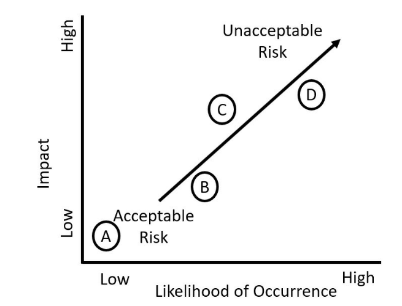
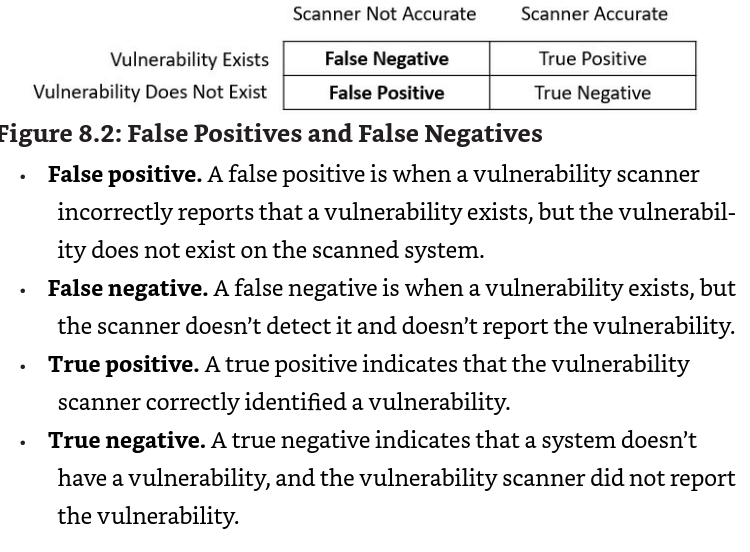
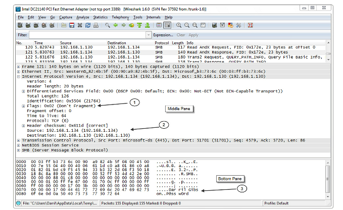

Chapter 8 - Using Risk Management Tools

ler mais:

https://ssae-16.com/soc-1/

# Understanding Risk Management

Risk eh a chance de uma threat exploitar uma vulnerabilidade. A vuln eh uma fraqueza e uma threat eh um perigo em potentcial. impacto refere-se a magnetude de dor causada por uma ameaca. O resultado eh um impacto negativo para a organizacao. Impaacto refere-se a magnetude de um harm que foi causado pela threat explorando a vuln.

## Threats

- malicious human threats: atacantes, script kiddies, APTs, crime organizado, etc
- accidental human threats: acidentes acontecem, acessos devem ser protegidos
- environmental threats: tornado man

Threat assessment: ajuda a organizacao a identificar e categorizar threats. Tenta predizer as threats assim como a likelihood de ela ocorrer.

## Risk Types

- internal
- external
- ip theft
- software compliance/licensing
- legacy systems and legacy platforms
- multiparty

## Vulnerabilities

flaw or weakness

- default configurations
- lack of malware protection or updated definitions
- improper or weak patch management
- lack of firewalls
- lack of organizational policies

nem todas as vulns sao exploradas. Um cara pode instalar um AP com defaults e ele ser vuln mas nao necessariamente alguem vai explora-lo

## Risk Management Strategies

eh a pratica de identificar, monitorar, e limitar riscos a um nivel gerenciavel. Ha diversos terminhos:

- risk awareness: reconhece que riscos existem que devem ser adressed para mitiga-los. Senior personnel precisam conhecer que riscos existem.
- inherent risk : riscos que existem antes de controles existirem
- residual risk: quantidade de risco que existe depois da tentativa de gerenciar ou mitigar um risco a nivel aceitavel
- control risk: imagina que existe um av no ambiente mas n ha um metodo confiavel de fazer update no mesmo, eh preciso ter outros controles para gerenciar esse risco adequadamente.
- risk appetite: refere-se a quantidade de riscos que a organizacao esta disposta a aceitar.

Ha diversas **estrategias** para risk management

- avoidance: uma organizacao pode nao providenciar servicos ou nao participando de atividades com risco
- mitigation: implementacao de controles Podem reduzir vulns, o impacto da ameaca.
- acceptance: famoso deixa acontecer naturalmente
- transference: insurance, outsourcing MSSP
- cybersecurity insurance: nao sabia que existia mas deve ser de MSSP tb

## Risk Assessment Types

quantifica os riscos baseados em diversos valores e julgamentos. Comeca identificando assets e assets values:

**Asset** eh qualquer produto, sistema, recurso ou processo, que a organizacao **values.** Pode ser um valor monetario especifico ou subjetivo como low, medium e high. Isso ajuda a organizacao a focar nos mais altos.

Após a identificacao dos asset values, o risk assessment identifica threats e vulns, e tenta identificar o impacto de uma ameaca em potencial -- priorizando os riscos na likelihood of occurrence and impact.

Por ultimo temos as recomendacoes em quais controles implementar.

risk control assessment (tb chamado de risk and control assessment)-> examina os riscos conhecidos e avalia a efetividade dos controles usados.

risk control self-assessmet -> o mesmo cara que implementou o control faz uma certa avaliacao, nao eh interessante

### Quantitative Risk Assessment

mede o risco em dinheiro

- single loss expectancy (SLE) -> eh o custo de uma unica perda
- Annual rate of occurrence (ARO) -> quantas x a loss vai ocorrer em um ano, se for menor que um eh representada em porcentagem
- Annual loss expectancy (ALE) -> eh o SLE x ARO

por exemplo, em uma empresa, funcionarios perdem os notebooks da empresa pelo menos 1x por mes:

SLE. The value of each laptop is $2,000, so the SLE is $2,000. • ARO. Employees lose about one laptop a month, so the ARO is 12. • ALE. You calculate the ALE as SLE × ARO, so $2,000 × 12 = $24,000.

analistas estimaram que ao comprar cadeados para os laptops irao reduzir o risco de roubo de 12 para somente 2, mudando o ALE para 4k. salvando 20k por ano. Gastando somente 1k nos cadeados.

se o custo do controle eh menor que as savings compra.

### Qualitative Risk Assessment

usa julgamento para categorizar riscos baseados na propabilidade da ocorrencia (**likelihood of occurrence**)

ex:

- web server: high prob and high impact 10 x 10 = 100
- library compute: low probability and low impact 1 x 1 = 1

a gerencia pode olhar esses numeros e facilmente determinar onde alocar recursos para proteger riscos.

### Documenting the Assessment

aqui eh onde os riscos vao ser analisados e decisoes de qual controle sera feito, ou qual risco vai ser aceito.

So galera da gerencia executiva e analistas de seguranca devem ter esse relatorio.

### Risk Analysis

- risk register: lista todos os riscos conhecidos de um sistema ou organizacao. Geralmente apresentado em uma tabela, onde as variaveis categoricas seriam: **risk**, **risk owner**, **mitigation** measures, the **impact**, the **likelihood**, and **risk score.**
- risk matrix: da plot de graficos de risco pode plotar a likelihood da ocurrence com o impacto do risco.

- heatmap -> mano o melhor grafico pra isso sinceramente

### Supply Chain Risks

inclui todos os elementos requeridos para produzir e vender um produtos. Considere Lard Lad Donus kkk eles precisam de acucar, leite, ovos, farinha etc.

Precisam de refrigeradores, espaco e fritadeiras, e cozinheiros para fazer os donuts. Se algum desses itens falham a compania n pode vender donuts.

A suppy chain pode ser compremetida por um atacante. Ele n precisa atacar a loja, mas alguem que providencia algum de seus suplys como leite.

## Threat Hunting

Processo de ficar procurando por threats na rede, antes que uma ferramenta automatica detecte e reporte a threat. Uma parte importante parte da threat hunting eh coletar dados da ameca usando threat intelligence. Informacao do tipo: capacidades, motivos, goals e resources. Pode vir tanto de sources internas como externas.

internal: device logs, IDS alerts, data de incidentes.

external: OSINT

Data feed providencia a subscribers, noticias de threats. Threat feeds geralmente usam a Structured Threat Information eXpression (STIX) e unstructured usam papers em pdf.

TTPs (adversary tactics, techniques and procedures)

se inscreve aqui:

[https://public.govdelivery.com/accounts/USDHSCISA/subscriber/new?topic\\\_id=USDHSCISA\\\_138](https://public.govdelivery.com/accounts/USDHSCISA/subscriber/new?topic%5C_id=USDHSCISA%5C_138)

# Comparing Scanning and Testing Tools

vuln scans, penetration testers.

## Checking for Vulnerabilities

vulnerabilities scanners fazem parte do risk management plan e risk assessment.

Eles verificam os seguintes:

- Identificam assets e capabilities
- Prioritize assets based on value
- Identify vulnerabilities and prioritize them
- recommend controls to mitigate serious vulns.

da fazer tanto internamente (funcinoarios) como externamente (MSSP)

### Password Crackers

Xhydra. Hashcat. MD5 eh uma pessima hash

- offline password cracker: tenta descobrir senhas usando offline databases or files containing passwords. Eles usam de data breachs de senhas e hash, e dai analisam para descobrir senhas. Aqui ele tem tempo ilimitado para descobrir a senha.
- online: brute force, Outros coletam trafego da rede e tentam crackear senhas passadas na rede.

### Network Scanners

usam de diversas tecnicas para pegar informacao sobre os hosts. Nmap eh uma ferramenta top. Usam as seguintes tecnicas:

- arp ping scan: IP responde com MAC
- syn stealth: syn, syn-ack. ja manda o rst para fechar.
- port scan: 443 eh um web server
- service: identifica servicos rodando por ex na 443 ele da um GET /.
- OS detection: TCP/IP fingerprinting por ex o TCP Window size do linux usa 5.840 bytes, routers da cisco 4.128 etc. Existem diversos testes para ver qual o SO

### Vulnerability Scanning

- identify vulnerabilities
- identify misconfigurations
- passively test security controls
- identify lack of security controls

### Identifying Vulnerabilities and misconfigurations

usam banco de dados de vulnerabilidades conhecidas e testam sistemas com essa DB.Por ex a MITRE com o CVE indo do CVSS 0 ate o 10.

Outros standards eh o SCAP (content Automation protocol) eles usam o NVD (National Vulnerability database) que tem uma lista de misconfigs, security flaws, impact ratings.

algumas weak configs:

- Open Ports and services
- Unsecure root accounts
- default account and passwords
- default settings
- unpatched systems
- errors
- open permissions
- unsecure protocols
- weak encryption
- weak passwords
- sensitive data

### Analyzing Vulnerability Scan Outputs

- list of hosts that it discovered and scanned
- detailed list of applicatoins running on each host
- detailed list of open port and services found on each host
- list of vulnerabilities discovered on hosts
- recomendations to resolve vulns

importante comparar com outros antigos

### Passively testing security controls

testar passivamente para nao interromper a producao.

### false positive, false negatives

### Crendialed vs non-credentialed

admin priviliges assim eles ganham um scan bem deep. Um scan credencial pode trazer software versions de programas instalados. Adicionalmente eles geralmente trazem um impacto menor no sistema assim como mais resultados em testes e menos falso positivos.

eh importante entender que o atacante comeca sem credenciais, mas atraves da priv scalation eles vao subindo de ranking. e por isso eh bom fazer os dois

### Configuration Review

esse tipo de scan performa uma configuracao no systema para verificar se eles foram corretamente configurados.

## Penetration Testing

testa tudo, em producao mesmo disrupta tudo. Usado para determinar um impacto de uma ameaca

### Rules of Engagement

tem que ter autorizacao antes de fazer isso boundaries ou scopo. Lembre-se concentimento está escrito sempre.

### Reconnaissance

existem varios metodos de reconnaissance, tb chamado footprinting. O penetration testes tenta aprender o maximo sobre a rede, eh usado tanto Osint (passive) como active network reconnaissence.

### Passive and Active Reconnaissance

coleta informacoes sobre a empresa usando OSINT. Aqui n se usa tools, somente sites como whois, etc

### Network Reconnaissance and Discovery

lembre-se que quase sempre isso eh ilegal e deve ser feito com concentimento sempre.

- IP scanner
- Nmap
- Netcat
- Scanless (usa website mesmo sem o concentimento do user kkkkk)
- DNSenum
- Nessus
- hping
- Sn1per
- curl

### Footprinting vs Fingerprinting

foortprinting eh uma visao maior da rede, e finger foca num sistema individual e tambem eh ativo

### Initial Exploitation

depois do scan eles acham vuln e procuram uma que podem explorar, e assim colocar malware no sistema para ter acesso.

### Persistence

rolocar um RAT ou um backdoor no sistema, comom usar ssh

### Lateral Movement

ele acessa um sistema e ve se outros tb sao exploraveis e assim ele fica surfando na rede, mantendo persistence

### Privilege Escalation

depois de pegar um low access account eles buscam as admin ou tecnicas para ter acesso adm. Dependendo do scopo eles podem ate fazer social engineering

### Pivoting

eh o processo de usar varias tools para ganhar mais info

### known, unknown, and partially known testing env

- black box: tester n tem conhecimento nenhum da app, geralmente usam fuzzing para checar vulns no app
- white box: tem conhecimento total da rede e app, docs, e ate mesmo logon
- gray box: tem algum conhecimento

### Cleanup

limpar os rastros de que esteve ali:

- remover qualquer conta criada
- qualquer script instalado
- qualquer arquivo
- reconfigurar qualquer modificacao feita no sistema

eh sempre bom vc ter logs do que fez

## Bug bounty programs

recebem por cada vuln, algumas sao publicas outras invitation only

## Intrusive Versus Non-Intrusive Testing

testes de penetracao sao bem intrusivos e podem interromper operacoes, vuln scans sao mais lights e podem rodar num ambiente de prod

## Exercise Types

- red team: atack usando TTPs
- blue team: defend
- purple: os dois
- white: dita as regras do jogo e supervisam o teste.

# Capturing Network Traffic

diversas ferramentas estao disponiveis por profissionais e atacantes.

## Packet Capture and Replay

wireshark

atacantes podem manipular flags dependendo do ataque

## Tcpreplay and Tcpdump

esse replay eh loco da pra testar ataques reais a partir de um pcap.

## NetFlow, sFlow, and IPFIX

- Timestamps identifying the start and finish time of the flow
- Input interface identifier (on router or switch)
- Output interface identifier (will be zero if a packet is dropped)
- Source information (source IP address and port number, if used)
- Destination information (destination IP address and port, if used)
- Packet count and byte count
- Protocol (such as TCP, UDP, ICMP, or any other Layer 3 protocol)

RFC 3954, Cisco Systems NetFlow Services Export Version 9

RFC 5101 Specification of the IP Flow Information Export

Netflow com ntopng eh top kk, flowtools tb

sflow so da info a cada 10 pacotes por ex, n consome muito trafego

IPFIX funciona da mesma forma do Netflow porme n eh proprietario

# Understanding Frameworks and Standards

eh uma estrutura que providencia uma fundacao. Frameworks de cyber providenciam guidence em varios sistemas. Por exemplo a PCI DSS eh somente para cartoes de credito.

## Key Frameworks

- ISO 27001: information security managenment system
- ISO 27002: information technology security techniques um complemento a 1
- ISO 27701: privacy information management system
- ISO 31000: risk management

Auditing Standards Board of the American Institute of Certified Public Accountants (AICPA) -> auditoria

Statement on Standards for Attestation Engagements (SSAE) -> criacao de reports

System and Organization Control (SOC) 2 -> cybersec controls

- SOC 2 Type 1: esse report descreve os sistemas da org, e pega a efetividade dos controles de seg numa data especifica. Nesse contexto design effectiveness refere-se ao quao bem os controles de seg focam no risco. Mas nao necessariamente quao bem estao mitigando riscos.
- SOC 2 Type 2: essa aqui abrange um data maior tipo 1 ano. E também valida o quao bem os controles estao mitigando os riscos. Assim dando uma garantia maior

https://learn.microsoft.com/pt-br/compliance/regulatory/offering-soc-2

## Risk Management Framework

NIST SP 800-37 (RMF), os sete passos são:

- prepare: a organizacao identifica as key roles para implementar o framework, identifica a estrategia de tolerancia de risco, cria o risk assessment ou faz o update. E um plano continuo de monitoramento.
- categorize information systems: personnel determinam o impacto adverso de operacoes, e ativos. E se ha uma falha triade de seg
- select security controls: selecionam e adaptam controles necessarios para proteger a operacao e os assets. tipicamente comecam com baselines.
- implement security controls: controles sao implementados, se mudancas sao necessarias eh tudo documentado
- assess security controls: assessment de controles para ver se eles estao sendo uteis.
- authorize information systems: um senior determina se o sistema eh autorizado a operar. Ele faz essa decisao baseado nas etapas anteriores
- monitor security controls: essa etapa eh constante. Periodic risk assessments e analise resposta a incidentes

O NIST Cybersecurity framework (CSF) alinha com o RMF, geral adota o prevent, detect and response deles.

- framework core: eh um set de atividades que a organizacao pode selecionar para um outcome desejado -- incluem 5 funcs: identify, protect, detect, responde, and recover.
- framework implentation tier: Partial (Tier 1), Risk informed (Tier 2), Repeatable (Tier 3), and Adaptive (TIer 4). Sendo o 4 o maior deles, indicando que a org tem ou deseja um risk management program maduro.
- framework profiles: providencia uma lista de outcomes que uma org precisa para seu risk assessments. Analisando o profile atual com target profiles eles podem identificar gaps do risk management program e assim ficar em constante melhoria.

# Reference Architecture

em cyber  reference architecture eh um documento ou um set de documentos que providenciam standards. Em software isso documenta procedures, functions e metodos que o projeto utiliza.

## Exploitation Frameworks

- metasploit
- beEF (browser exploitation framework)
- w3af (web application attack and audit framework): foca em web

## Benchmarks and Configuration Guides

alem dos frameworks da pra usar guias para aumentar a seg que incluem benchmarks, ou guias de configuracao segura de varias plataformas ou de terceiros. Ta usando linux usa um guia de linux, windows? guia de windows etc.