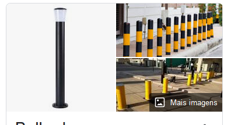
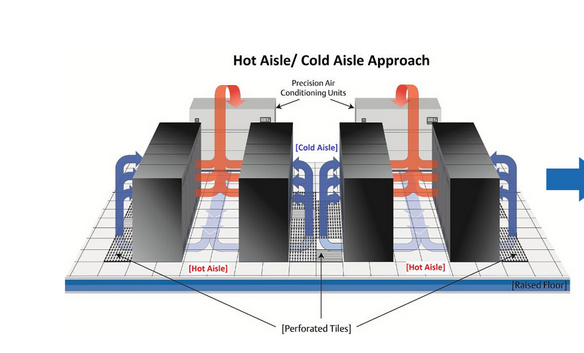
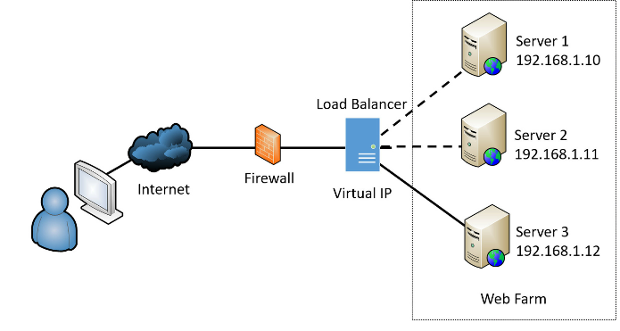
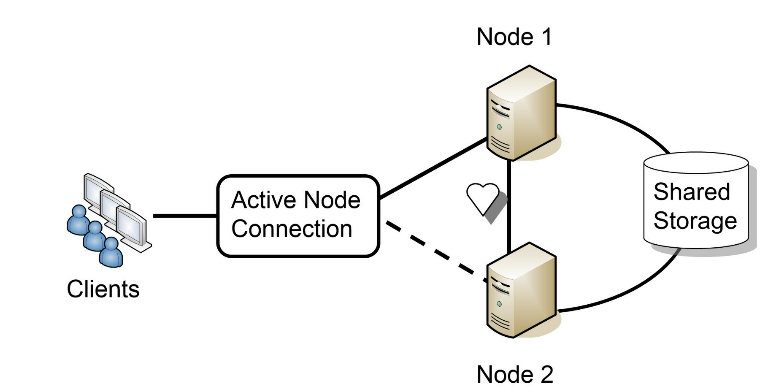

Chapter 9 - Implementing Controls To Protect Assets

nao da pra eliminar os riscos de um org. Porem podemos reduzir o impacto de muitas ameacas implementando controles de seg.

# Comparing Physical Security Controls

Algo que vc consegue tocar fisicamente. como um cadeado.

- Perimeter: militares fazem cercas ao redor do perimetro. E ate barricadas com segurancas
- Buildings: guardas e locked doors restringem pessoas nao autorizadas.
- secure work areas: algumas companhias restringem acesso a somente alguns funcionarios em algumas areas.
- server rooms: somente a TI personnel pode acessar. Esses espacos podem ser designados como server room or wiring closets.
- hardware: locking cabnetes -- para proteger servers e outros equipamentos na bay.

Muitas organizacoes fazem camouflage techniques (tb chamados de **industrial camouflage)** para esconder certas areas do predio. Por ex torres de 5G no arizona estao escondidas em plantas de cactus falsas

## SEcuring Door Access With Cards

RFID NFC. Eh bem interessante combinar isso com um PIN e um cartão de proximidade.

## Comparing Locks

Eh comum fazer locks fisicos, eletronicos, biometricos e de cabos

### Physical Locks

iguais os de casa

### Physical Cipher locks

com numeracao, pode ser eletronico ou manual, alguns codigos permitem que se precione multiplos numeros ao mesmo tempo.

### Biometric Locks

retina scanner, digital, de passo etc

### Cable Locks

tipo de bicicleta.

## Increasing Security with Personnel

guardas sao a melhor forma de protecao, ao verificar um ID podemos authenticar uma pessoa ao acesso de um local, ele eh tipo uma ACL humana. Tem ate logs de visitantes

rapaz tem ate robo na parada com laser

\*\*Two-person integrity \*\*eh um controle de seguranca que requer que pelo menos duas pessoas performem uma tarefa. O NIST referese a COMSEC keying material.

keying material refere-se a materiais usados para encriptar e decriptar communicacoes classified. E assim somente um individuo n consegue acessar o doc COMSEC.

Tipicamente chamado de nuclear command and control. lembra dos filmes, antes de lancar a DOOM kk.

## Monitoring Areas with cameras

CCTV e grava tudo. Eh uma prova da localizacao e atividade da pessoa.

## Sensors

comummente usado com CCTV, alerta de incendio, etc.

- Motion detection
- Noise detection
- temperature (HVAC)
- moisture detection: detecta eventos de inundacoes.
- proximity reader:
- cards

## Fencing, lighting and alarms

uma combinacao de um motion sense com burglary prevention systems (sistemas anti roubo). Infrared etc

## Securing Access with barricades

em algumas situacoes fencing nao eh suficiente. Tipo barricadas zig zag militares. Geralmente usam **bolards** que sao mini paredes de concreto com pinturas amarelas que param pessoas ou carros.

## Using Signage

no tresspassing ou pessoal autorizado somente. etc

## Drones

## Asset Management

eh interessante manter um acompanhamento de todas os ativos da empresa, firewalls, switches, servers, etc. Um Asset management efetivo pode ajudar a reduzir diversas vulns.

- architecture and design weaknesses: nao leva em consideracao somente o custo, mas tb se ele vai encaixar na arquitetura.
- system spraw and undocumented assets: menos eh mais kkk, documentar tudo o que a empresa compra, eh interessante manter um metodo automatizado. Por ex. empresas usam RFID para trackear o movimento dos dispositivos. -- Pode ser usado para parar a shadow IT, se todos os dispositivos possuem RFID, um indicativo de que um possivel dispositivo nao autorizado esta sem.

## Implementing Diversity

seguranca eh igual uma cebola, disse o Shrek.

- vendor diversity: pratica de ter controles de diversos vendedores, nao somente kasper ou sophos etc
- Technology diversity: limitar acesso usando biometria e monitorando com CCTV por ex a sala de servers
- control diversity: ex usar IDS, firewall, e proxys para a rede. Biometria e cadeados na sala do servers

# Creating Secure Areas

## Air Gap

literalmente produzir um vacuo de ar entre redes, para que uma nao se comunique com a outra. Geralmente organizacoes classificam uma rede como classified e unclassified, assim eles garantem que a classified nao pode ser acessada por qualquer outra rede no ambiente internamente ou via Internet.

## Vaults

tipo banco, por ex a DoD ( departamento de defesa do US) usa as Compartmented Information Facilities (SCIFs) -- salas enormes que processam informacao classificadas. Geralmente sao controlled based no indifidual clearance and a need to know access.

## Faraday Cage

Eh uma sala que previne RF (radio frequencia), ela reflete RF para a sala nao ter comunicacao com o externo.

## Safes

cofres para USB e materiais pequenos

## Hot and Cold Aisles

ajudam a regular o ar em data centers com multiplas colunas de servers. Pensa no seu PC, atras joga ar quente pra fora e na frente pega ar frio. Agora varios pcs, por isso se criam colunas de ar quente e de ar frio.

# Physical Attacks

usam dispositivos pequenos que aparentam ser normais. Alguns podem instalar malware e outros roubar cartoes. Rubber Ducky por ex

## Malicious Universal Serial Bus (USB) Cable

esse USB tem um controlador wifi capaz de receber comandos de dispositivos wireless proximos. PCs detectam isso como um Human Interface Device, como se fosse um mouse ou teclado.

Pentesters usam USB ninja cable que parece com usb normal. Esses sao programaveis

## Malicious Flash Drive

malware tb, RUBBER DUCKY.

## Card Skimming and Card Cloning

atacantes colocam skimmers em ATMs que permite que eles capturem dados de transacao, mas deixam a transacao passar. Cloning ao invez de pegar dados ele clona o cartao, porem como os chips sao encriptados acaba sendo mais dificil de clonar kkkkkkkk sei (US usa um padrao horroroso para chips de cartao)

# Fire Suppression

apaga o fogo dela:

- remove the heat: agua ou composto quimico
- remove the oxygen: colocar CO2 na area onde so tem eletronicos
- remove the fuel: geralmente n existe mas o fogo acaba quando n se tem mais material pra queimar kk.
- disrupt chain reaction: alguns quimicos impedem a reacao de fogo

# Protected Cable Distribution

atacantes podem cortar um fio e colocar um RJ45 ou fibra em um endpoint para capturar dados.

Para reduzir esse risco eh necessario criar cable through (conteiner de metal) ou wiring ducts. Muitas orgs somente passam o fio por um telhado falso ou chao elevado.

Eh interessantes manter os cabos longe de EMI (electromagnetic interference) pode interromper os sinais de cabo.

# Adding Redundancy and Fault Tolerance

- disk redundancies using RAID
- NIC com NIC teaming
- server redundancies com load balancers
- power redundancies com geradores ou um UPS
- site redundancies usando um hot, cold ou warm site.

## Single Point of Failure

da pra ter SPoF nas seguintes

- Disk
- Server
- Power
- Personnel

## Disk redundancies

### RAID-0

striping eh um misnome pq n providencia nenhuma fault tolerance ou redundancia. Incluem dois ou mais discos em raid-0 array.

O unico beneficio eh melhorar a performance de read and write. Por que os arquivos sao distribuidos em multiplos discos, os arquivos podem ser lidos ou escritos em cada um dos discos simultaneamente. **Se vc tem 3 discos de 500GB vc tem 1.5TB no raid0**

### RAID1

Mirroring usa 2 discos. O que eh escrito em um vai pra outro. Se um disco falha o outro tem todos os dados. Nesse caso se vc perder metade dos discos, vc ainda pode operar. Eh possivel adicionar um disco de controle adicional para remover o SPOF do controller -- nessa config cada um dos discos eh o proprio controlador de disco -- eh chamado de disk duplexing.

se vc tem **2 discos de 500GB vc so tem 500GB**. **RAID2,3,4 sao raramente usados**

### RAID5 e 6

eh quando 3 ou mais discos estao striped juntos. Similar ao raid0. Porem o equivalente a um drive inclui a paridade da informacao. Essa paridade eh striped entre cada um dos drives no raid5 e providencia fault tolerance. Se **um dos discos falha**, o disk subsystem pode **ler os dados dos drives remanecentes** e **recriar os dados originais**. **Se dois drives falham, todo o dado eh perdido.**

O **raid6** eh uma extensao do 5. A unica diferenca eh que ele usa um bloco de paridade adicional. E por assim vai **continuar operante** com a **falha de 2 discos**. Precisa de no minimo 4 discos.

### RAID10

combina um mirroring (raid1) com striping(raid0). O minimo de drives eh 4. quando for realizar upgrade vc precisa sempre usar multiplo de 2.

Se vc tem **4 discos de 1TB vc so tem 2T de espaco usavel**

### Disk multipath

multipath (I/O) eh outro metodo de fault tolerance. Em termos simples, ele usa outro caminho para armazenar aquivos, e se um para, outro deve continuar o caminho. Se os dois estao operacionais oferece mais performance.

Nao eh tao simples de implementar: SAN (storage area network) -> usando fiber channel, eh complexo e caro

# Server Redundancy and High Availability

alta disponibilidade refere-se a um sistema ou servico que precisa permanecer operacional com quase 0 dowtime. Eh possivel atingir 99.999 % uptime -- comummente chamdo de 5 nines, implementando redundancia e fault-tolerance methods. Isso relaciona a menos de 6 minutos de dowtime por ano: 60 m x 24h x 365d x .00001 = 5.256 minutes

caro bagarai

## Active/active load balancers

pode otimizar e distribuir dados em multiplos computadores ou redes multiplas. Por ex, se uma organizacao providencia um site popular, ele pode usar multiplos servidores hosteando o mesmo website num web farm. Load-balancing distribuem trafego igualmente ao long de todos os servers tipicamente localizado na DMZ.

Providencia escalabilidade e alta disponibilidade. SCALE UP -> adicionar mais recursos, SCALE OUT -> adiciona mais servers

## Active/passive

um ta ativo e outro inativo ate ocorrer o failover, tem heartbeat para monitorar

## NIC Teaming

agrupamento de NIC em uma adaptador virtual.

## Power Redundancies

- power distribution units (PDUs)
- dual supply
- generators
- managed power distribution union

# Protection Data with Backups

## Backup Media

- Disk
- NAS -> RealNAS linux
- SAN -> disk arrays or tape libraries, pode ser usado para real time replication of data
- Cloud

## Online Versus Offline Backups

backup offiline pode falhar ser destruido ou roubado. Melhor colcoar na nuvem

## Comparing Backup Types

- full backup: todo o dado
- differential: todo o dado diferente
- incremental:
- snapshot and image backup

pode comecar com um full backup no domingo de manha e durante a semana um diferencial por noite, ate chegar o domingo e ser feito outro full.

se der failover eles precisam de **2 tapes por ex. Um do full e outro do diferencial.**

Já no incremental, eles precisam de relizar o restore em ordem cronologica. Se tiver 4 dias passados eles precisam dos 4 discos.

como vc pode ver o full/incremental a organizacao n tem muito tempo para performar manuntencao e por isso usa esse.

ja na full/diferential eles querem ter o menor tempo de downtime possivel num failover.

eh sempre bom testar o backup pra ver se ele ta funfando antes de realmente precisar dele.

## Backups and Geographic Considerations

- Off-site storages: fora da localizacao atual
- distancia: 25 km etc
- location selection: fora do sul pra n tomar um tornado na cara
- legal: o PII PHI devem ser armazenados em um local seguro
- data sovereignty: refere-se a legal implications do estado, por ex no acre vc n pode ter PC pq la eh tudo 1000 anos atrasado

# Comparing Business Continuity Elements

business continuity planning (BCP) ajuda a organizacao a predizer e planejar o plano para potenciais perdas de servicos ou funcoes criticas.

Esse plano tem DRP (disaster recover plan), desastres podem ocorrer das seguintes formas:

- Environmental: fukushima daiichi nuclear
- Person-made:
- Internal versus external

## Business Impact Analysis Concepts

BIA (business impact analysis). Ajuda a organizacao a identificar sistemas criticos e componentes que sao essenciais para o sucesso da org. Esses sistemas criticos suportam **mission-essential functions ->** sao atividades que devem continuar ou ser restauradas rapidamente depois de um desastre. Ele tb ajuda a identificar processos vulneraveis do negocio.

- What are the critical systems and functions?
- Are there any dependencies related to these critical systems and functions?
- What is the maximum downtime limit of these critical systems and functions?
- What scenarios are most likely to impact these critical systems and functions?
- What is the potential loss from these scenarios?

## Site Risk Assessment

eh algo focado em um site especifico ou localizacao. RJ nao precisa se preocupar com terremoto por ex entedeu

## Impacto

o BIA avalia diversos cenarios como desastres naturais, fogos etc. E mostra o quanto isso pode impactar o negocio.

## Recovery Time Objective

se um site gera 10k por hora, e decide que o maximo de outage eh 5 minutos, vc tem RTO (recovery time obj) de menos de 5m olha que legal kkk

## Recovery Point Objective

RPO identifica um ponto no tempo onde data loss eh aceitavel. Por ex, a gerencia decide que algum dado perdido eh aceitavel, mas eles querem sempre poder recuperar dados de semana passada. Ou seja o **RPO eh de uma semana.**

## Comparing MTBF and MTTR

- Mean time between failures (MTBF) -> providencia o tempo medio entre quedas. Usam isso para prever quedas potenciais.
- Mean time to repair (MTTR) -> identifica o tempo medio para restaurar o sistema falho.

## Continuity of Operations Planning

COOP foca em restaurar mission-essential functions at a recovery site depois de uma queda critica.

## Site Resiliency

o quao bem o DR esta configurado na org. Os tres tipos primarios de recovery sites sao hot, cold e warm sites.

### Hot Site

tem que ficar operacional 24 horas 7 dias por semana. E deve conseguir tomar as redeas do site primario depois de uma falha. Inclui tudo do primario. Em muitos casos, o hot eh apenas outra localizacao ativa que tem a capacidade de assumir operacoes. A gente pensa que eh instantaneo mas n, leva minutos e ate horas pra a transferencia. O melhor DR mas tb o mais caro.

### Cold Site

requer energia e conectividade mas nada alem. Lembra de um campo do exercito, eles levam todos os equipamentos e se instalam la. Eh o mais barato porem o mais dificil de testar.

### Warm Site

Just right, nem frio nem quente. Hot eh muito caro e cold eh muito lento para subir.

### Site Variations

mobile-site: self contained unit com tudo, so subir.

Mirrored sites: identico ao principal e providencia 100% de disponibilidade.

### Restoration Order

Depois que o desastre já passou, vc vai querer voltar pro site principal. Como uma boa prática, organizacoes devem retornar a funcao menos critica do primeiro site. Lembre-se o site acabou de voltar e pode ter algo desconhecido ainda a tona. E assim em diante.

# Disaster Recovery

DRP (disaster recovery plan) -> identifica como se recuperar depois de um desastre. O DRP faz parte do BCP (busines continuity plan) . Prioridades sempre

- Activate the disaster recovery plan
- implement contigencies
- recover critical systems
- test recovered systems
- after action report: review what ive learned

# Testing plans with exercises

NIST SP 800-34, “Contingency Planning Guide for Federal Information Systems.” •

Ready.gov (specifically https://www.ready.gov/exercises)

Durante um tabletop exercise: um BCP coordinator vai criar uma serie de cenarios hipoteticos que possam acontecer para validar o DRP, sao usados wal-throughs, simulacoes e workshops.

Alguns testes a serem feitos:

- backups
- server restorarion
- server redundancy
- site resiliency