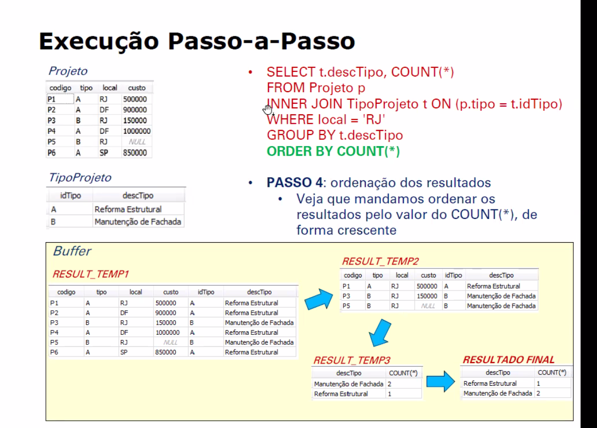

estude

.open projetos.db

.mode column

.header on

PRAGMA foreign_keys=ON; --habilita as chaves estrangeiras

CREATE TABLE TipoProjeto(idTipo CHAR(1) NOT NULL,descTipo VARCHAR(30) NOT NULL,PRIMARY KEY(idTipo));
INSERT INTO TipoProjeto VALUES('A', 'Reforma Estrutural');INSERT INTO TipoProjeto VALUES('B', 'Manutenção de Fachada');

CREATE TABLE Projeto(codigo CHAR(2) NOT NULL,tipo CHAR(1) NOT NULL,local CHAR(2) NOT NULL,custo NUM,PRIMARY KEY(codigo),FOREIGN KEY (tipo) REFERENCES TipoProjeto(idTipo));

INSERT INTO Projeto VALUES('P1','A','RJ',500000);

INSERT INTO Projeto VALUES('P2','A','DF',900000);

INSERT INTO Projeto VALUES('P3','B','RJ',150000);INSERT INTO Projeto VALUES('P4','A','DF',1000000);

INSERT INTO Projeto VALUES('P5','B','RJ',NULL);INSERT INTO Projeto VALUES('P6','A','SP',850000);

.output bkp\_bd\_etapa6.sql.dump

.output stdout

CREATE TABLE Projetos_RJ AS SELECT codigo, tipo, custo FROM Projeto WHERE local = 'RJ';

