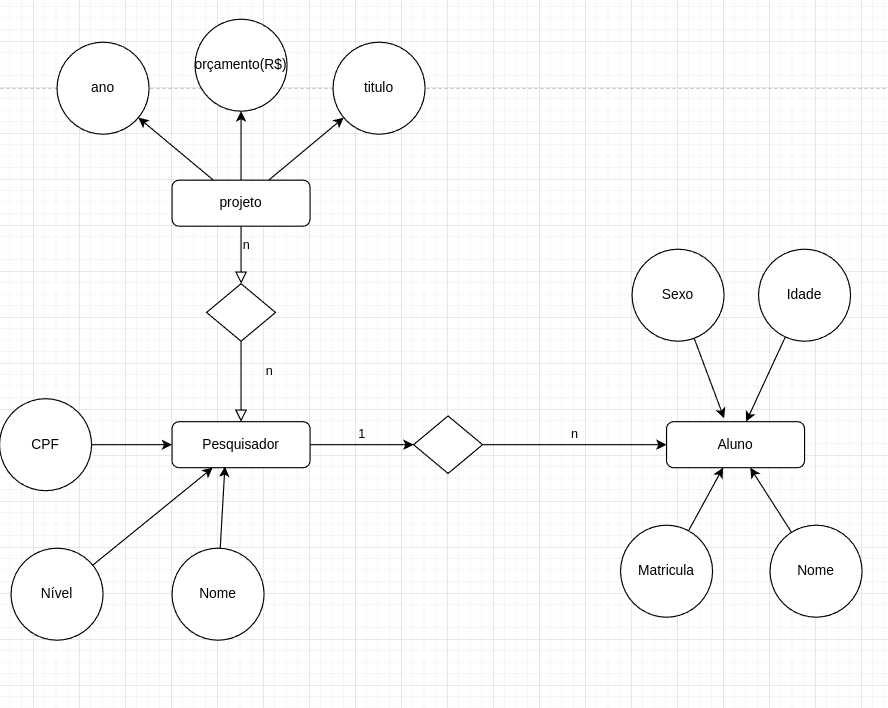

etapas de um projeto de bd

titulo, ano, um orcamento (R$), associado a um unico assunto

unico pesquisador responsavel e diversos alunos participantes

pesquisador (cpf, nome, nivel(j,p,s))

aluno(matricula,nome,sexo,idade)

