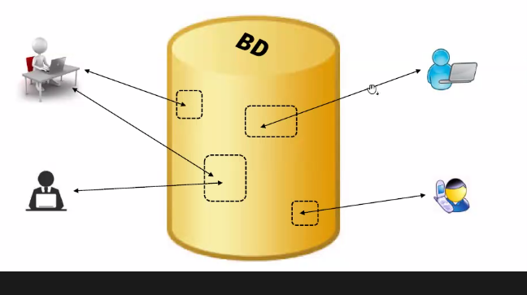
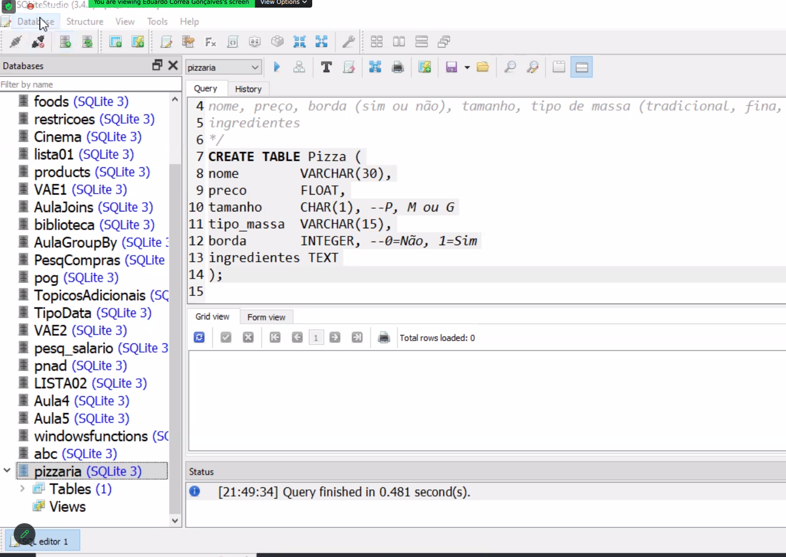
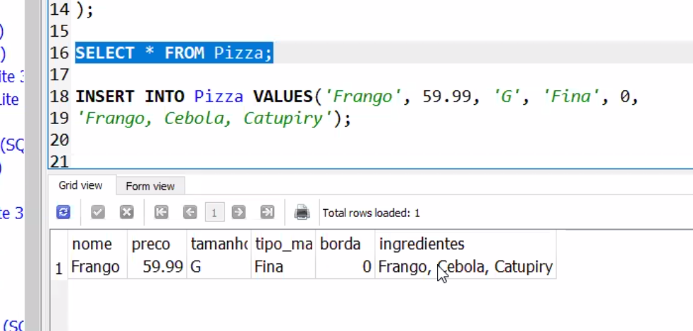

introdução

repositorio central de informações que podem ser consultadas e/ou atualizadas por diversos usuarios simultaneamente.

para ser BD precisa ter 4 propriedades:

\* foi contruido e populado com um proposito, e representam um aspecto real (minimundo), resolvendo o problema

\* armazena conteudo para diversas pessoas

\* tem um repositorio central (endereço)

\* pode ser estruturado de diversas formas ou em um Sistema Gerenciador de Bando de Dados (SGBD -- mysql, oracle, etc)

Ex: imdb.com 

bancos relacionais

NoSQL ou não relacionais

SQLite studio

