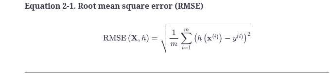

Performance measures

root mean square error

This equation introduces several very common machine learning notations that I will use throughout this book:

- *m*  is the number of instances in the dataset you are measuring the RMSE on.
    
    - For example, if you are evaluating the RMSE on a validation set of 2,000 districts, then  *m*  = 2,000.
        
- **x**(*i*)  is a vector of all the feature values (excluding the label) of the  *i*th  instance in the dataset, and  *y*(*i*)  is its label (the desired output value for that instance).
    
    - For example, if the first district in the dataset is located at longitude –118.29°, latitude 33.91°, and it has 1,416 inhabitants with a median income of $38,372, and the median house value is $156,400 (ignoring other features for now), then:
        
        �(1)=-118.2933.911,41638,372
        
        and:
        
        �(1)=156,400
        
- **X**  is a matrix containing all the feature values (excluding labels) of all instances in the dataset. There is one row per instance, and the  *i*th  row is equal to the transpose of  **x**(*i*), noted (**x**(*i*))⊺.⁠<ins>3</ins>
    
    - For example, if the first district is as just described, then the matrix  **X**  looks like this:
        
        �=(�(1))⊺(�(2))⊺⋮(�(1999))⊺(�(2000))⊺=-118.2933.911,41638,372⋮⋮⋮⋮
        
- *h*  is your system’s prediction function, also called a  *hypothesis*.  <ins></ins><ins></ins>When your system is given an instance’s feature vector  **x**(*i*), it outputs a predicted value  *ŷ*(*i*)  =  *h*(**x**(*i*)) for that instance (*ŷ*  is pronounced “y-hat”).
    
    - For example, if your system predicts that the median housing price in the first district is $158,400, then  *ŷ*(1)  =  *h*(**x**(1)) = 158,400. The prediction error for this district is  *ŷ*(1)  –  *y*(1)  = 2,000.
        
- RMSE(**X**,*h*) is the cost function measured on the set of examples using your hypothesis  *h*.<ins></ins>
    

We use lowercase italic font for scalar values (such as  *m*  or  *y*(*i*)) and function names (such as  *h*), lowercase bold font for vectors (such as  **x**(*i*)), and uppercase bold font for matrices (such as  **X**).