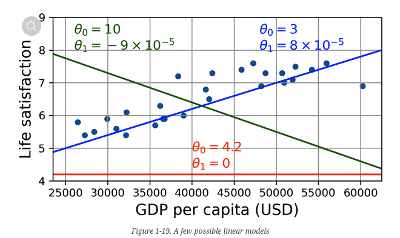
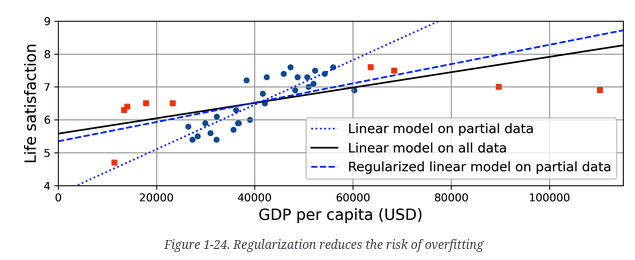
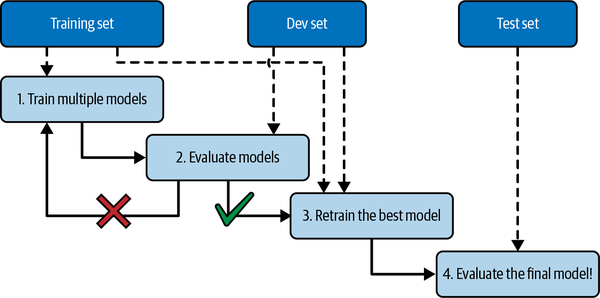
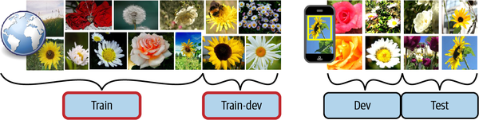

Model-based - vai tunar alguns parametros para dar FIT no Modelo em um Training Set -- faz boas predicoes no proprio training set e esperamos que ele se de bem nos outros dados tb

Instance-based - o algoritimo aprende os exemplos de cor e generaliza para novas instancias usando um medidor de similaridade para compara-lo as instancias aprendidas.

Utility function ou fitness function -> define o quão bom é o seu modelo.

  para regressão linear geralemnte usa-se uma cost funcion que mede a distancia da predicao do modelo linear e os exemples de treino. O objetivo eh diminuir a distancia

In our case, the algorithm finds that the optimal parameter values are *θ*0 = 3.75 and *θ*1 = 6.78 × 10–5.

dados incompletos o que fazer?

- Se algumas instâncias forem claramente discrepantes, pode ajudar a simplesmente descartá-las ou tentar corrigir os erros manualmente.
- Se algumas instâncias estiverem faltando alguns recursos (por exemplo,., 5% dos seus clientes não especificaram a idade deles), você deve decidir se deseja ignorar completamente esse atributo, ignorar essas instâncias, preencher os valores ausentes (por exemplo,., com a idade média) ou treine um modelo com o recurso e um modelo sem ele.

Feature engennering (garbage in gabarge out)

seu algoritimo so sera bom se o dataset usado for bom

- Seleção de recursos (selecionando os recursos mais úteis para treinar entre os recursos existentes)
- Extração de recursos (combinando os recursos existentes para produzir um mais útil) - como vimos anteriormente, os algoritmos de redução de dimensionalidade podem ajudar)
- Criando novos recursos reunindo novos dados

Overfitting (o mau do machine learning)

Pode também ser chamado de Viés (se vc colocar um lado humano no negocio kk) nesse caso o algoritimo eh treinado de um dado viciado ou pequeno.

A sobreposição (overfit) acontece quando o modelo é muito complexo em relação à quantidade e ruído dos dados de treinamento. Aqui estão possíveis soluções :

- Seleção de recursos (selecionando os recursos mais úteis para treinar entre os recursos existentes)
- Extração de recursos (combinando os recursos existentes para produzir um mais útil) - como vimos anteriormente, os algoritmos de redução de dimensionalidade podem ajudar)
- Criando novos recursos reunindo novos dados

Regularization 

para tratar o mau, agente pode reduzir o dataset (constraining)

A Figura 1-24 mostra três modelos. A linha pontilhada representa o modelo original que foi treinado nos países representados como círculos (sem os países representados como quadrados) a linha sólida é o nosso segundo modelo treinado com todos os países (círculos e quadrados) e a linha tracejada é um modelo treinado com os mesmos dados do primeiro modelo, mas com uma restrição de regularização. Você pode ver que a regularização forçou o modelo a ter uma inclinação menor: esse modelo não se encaixa nos dados de treinamento (círculos) e no primeiro modelo, mas na verdade generaliza melhor para novos exemplos que não viu durante o treinamento (quadrados) .

A quantidade de regularização pode ser controlada por um Hyperparameter (algoritimo de aprendizado -- nao do modelo)

\* tunar hiperparametros vc vai ter que fazer isso direto

Underfitting (yup)

- Selecione um modelo mais poderoso, com mais parâmetros.
- Alimente melhores recursos ao algoritmo de aprendizado (engenharia de recursos).
- Reduza as restrições no modelo (por exemplo, reduzindo o hiperparametro de regularização).

Teste e validação

eh interessante fazer um training set e um test set, como o nome diz o training vai servir para treinar o modelo de predicao e o test set vai servir para testar o quao bom o modelo consegue prever na generalizacao.

generalization error -> mede o qual bem o modelo performa na vida real

baixo generalization error = modelo performando bem

grande = overfitting

80% training 20% teste

holdout validation, eu pego um dataset menor (training set - validation test (dev)) e fico tunando os hyperparametros

Cross validation - pega varios grupos de pequenas amostras e testa os dev

Data mismatch

train-dev set

