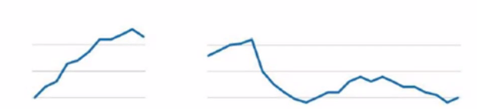
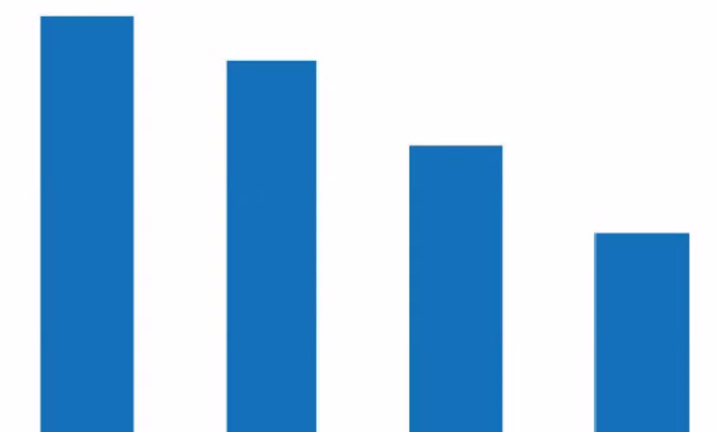
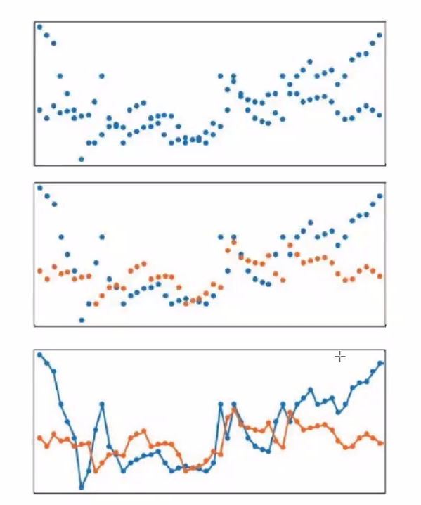
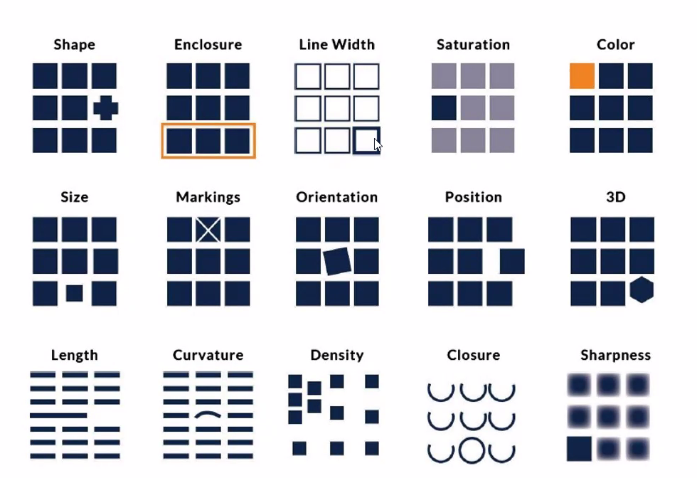
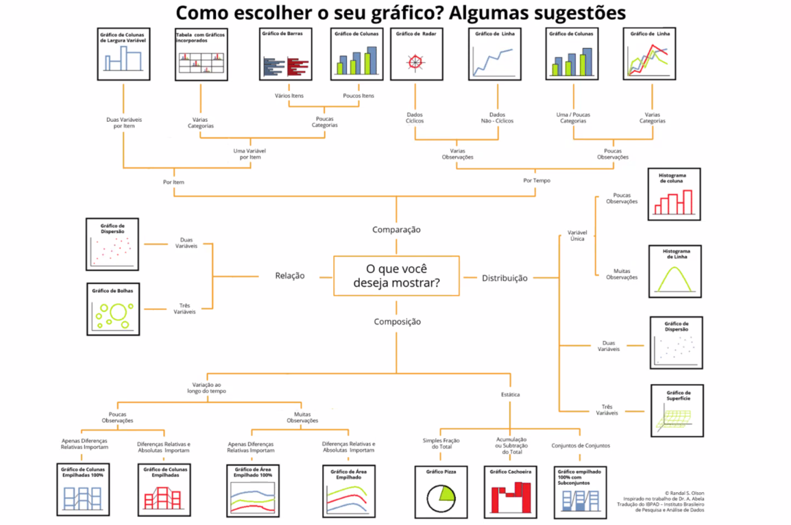

aula 3

o que é um grafico

principios gerstalt

proximidade - quanto mais proximos = formam grupos

similaridade - objetos da mesma cor, formato ou direcao = formam um grupo

fronteira - objetos cercados = grupo

fechamento - spacos sem dados, acabamos fechando ele sem querer

continuidade - objetos com algum grau de continuidade = grupo

conexão - elementos conectados como parte de um mesmo grupo

como mentir em estatística - livro = como as pessoas podem manipular as outras atraves de manipulacao de graficos

como chamar atencao:

gráficos 

