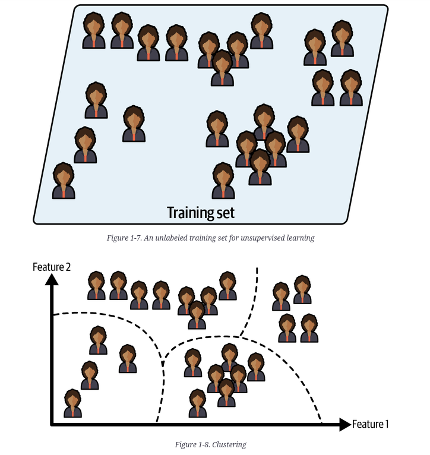

tipos de machine learning

supervised learning ---

quando vc quer que ele prediga algo, existem os labels (datasets esperados) que vc quer que o algoritimo prediga

classificacao: quer classificar um novo email (se eh span ou n)

regressao: prediser um valor numerico (preco de um carro)

porem alguns algoritimos também podem ser usado para classificação e visse versa (logistic regression em classificação)

unsupervised learning ---

quero que o algoritimo pegue alguma caracteristica e começe a agrupa-los (clustering).

