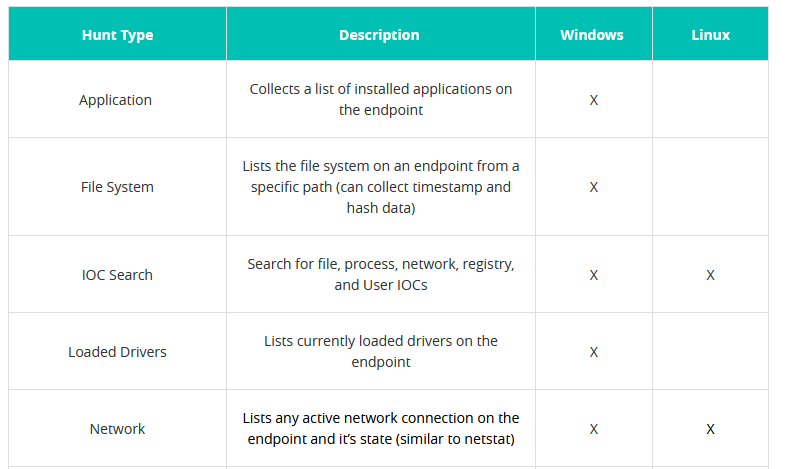
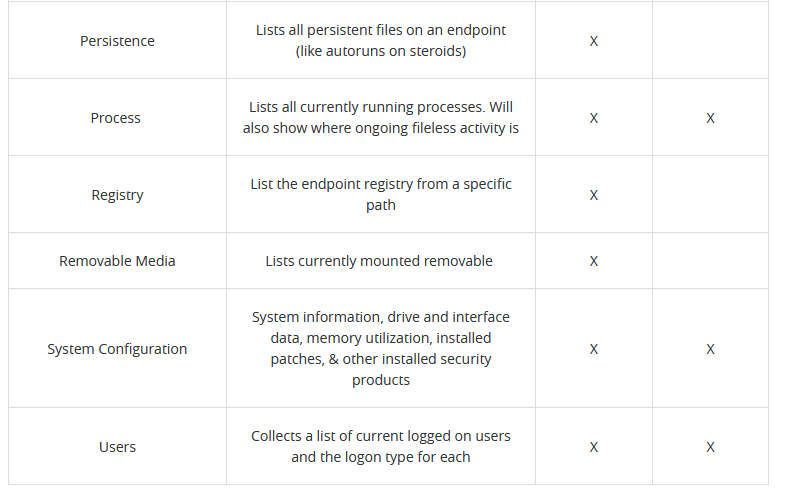

Elastic endgame (renomeado para elastic security)

Aparentemente é um deploy de endpoints security, uma instancia eh capaz de fazer deploy de 100.000 hosts endpoint sensors como em EDR

Para fazer o deploy do sensor é necessario ter o Windows Remote managenment (winRM) rodando nos endpoints

roda em linux, windows e mac.

há dois tipos de regras:

1.  Threads: ameaças em si.
2.  Adversary behaviors: eventos historicos que possuem uma resposta automatica.

o tipo de proteção contra exploits defender contra esses:

- Critical API Filtering
- Header Protection
- Macro Protection
- Return Heap
- Return Oriented Programming (ROP) Chain
- Shellcode Threats
- Stack Memory
- Stack Pivot
- UNC Path

suporta até 50 mil blacklists

https://redcanary.com/threat-detection-report/techniques/lsass-memory/

credential dumping protection protege contra roubo de credenciais via lsass (mimikatz)

Collection

gather information

Investigação:

