Produção

Artigos sobre isso:

https://medium.com/@abhidrona/elasticsearch-deployment-best-practices-d6c1323b25d7

https://www.elastic.co/pt/blog/hot-warm-architecture-in-elasticsearch-5-x

https://www.elastic.co/guide/en/cloud/current/ec-planning.html#ec-ha

https://www.elastic.co/guide/en/cloud/current/ec-configure.html

https://medium.com/@mzhaase/in-depth-guide-to-running-elasticsearch-in-production-b2ea7c8fa082
TIPOS DE NODES:
Master eligible node
o cara que vai controlar o cluster

Data node
quem possui os dados, procura e agrega operações relacionadas à CRUD (create, read, update e delete)

Injest node
vai transformar os dados, injest pipeline, logstash vai entrar aqui.

remote-eligible node
bom para casos remotos, é ativado por default

machine learning
não precisaremos

“Hot-Warm” Architecture:
Hot node
é o cara que vai ficar constantemente recebendo dados e indexando eles, requerem bastante CPU e I/O por isso somente com SSDs é recomendado ter 3 hot nodes para melhor disponibilidade, e ser a prova de failovers.

Warm node
faz read-only de dados que ja não são tão utilizados, requer 3 nodes e podem ser usados com HDDs

outra estratégia a se seguir seria colocar os dados menos utilizados em S3: https://www.elastic.co/guide/en/elasticsearch/plugins/2.2/cloud-aws-repository.html

transform node
faz transformações nos dados, acho que n será necessario aqui.

Requerimentos:

Quantidade de nodes master:
N/2+1 sendo que N = numero de maquinas elegíveis para master node.

Tentativa e erro

caso vc atribua 8 Gb de memoria pra maquina, é preciso dar 50% pro elastic heap e deixar 50% livre. A Lucene usa bastante memoria para coisas críticas e sem ela o elastic n funfa.

Por algum motivo de JVM não aloque mais que 32 Gb para um node.

Discos
SSD para termos querys mais rápidas, será interessante termos um HD para alocarmos shards frias.

CPU
não é tão utilizado assim, mas é bom ter multithreading 

Kibana
se vc utiliza bastante o kibana será necessario ter um "coordinator node"

arquitetura:
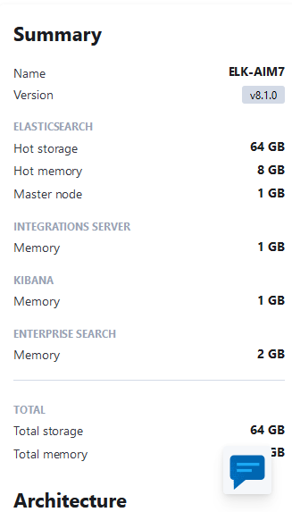

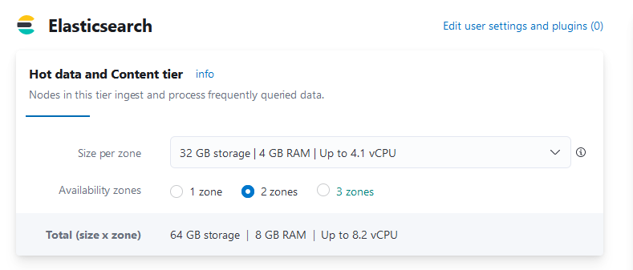

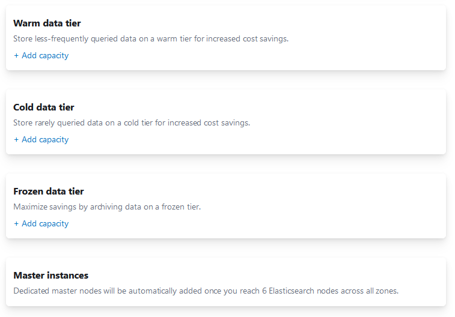

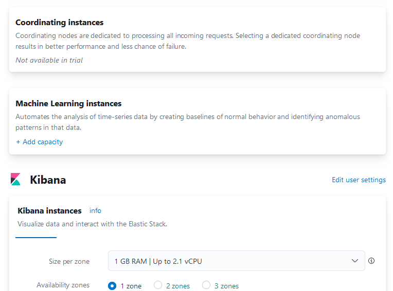

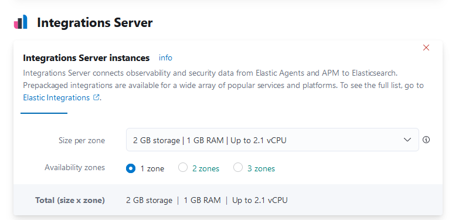

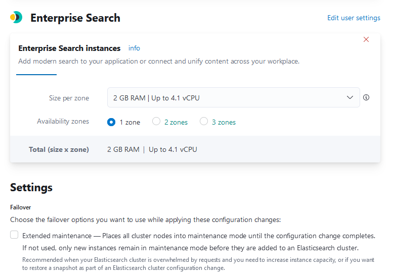

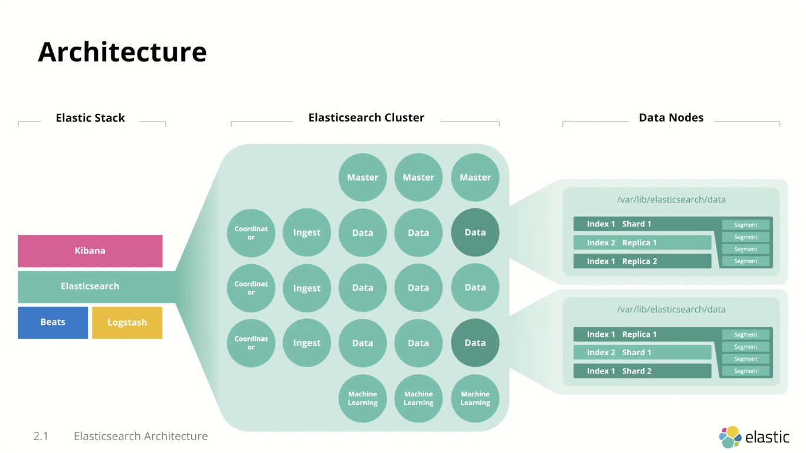

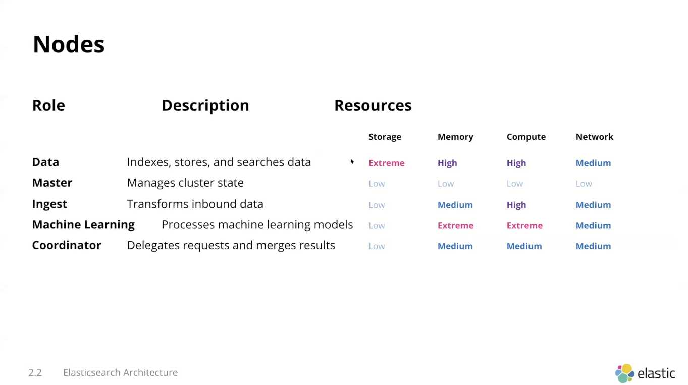

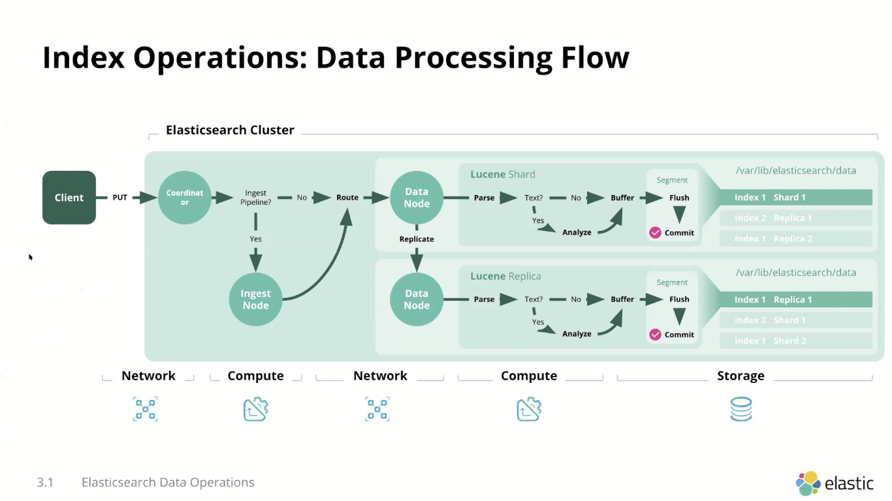

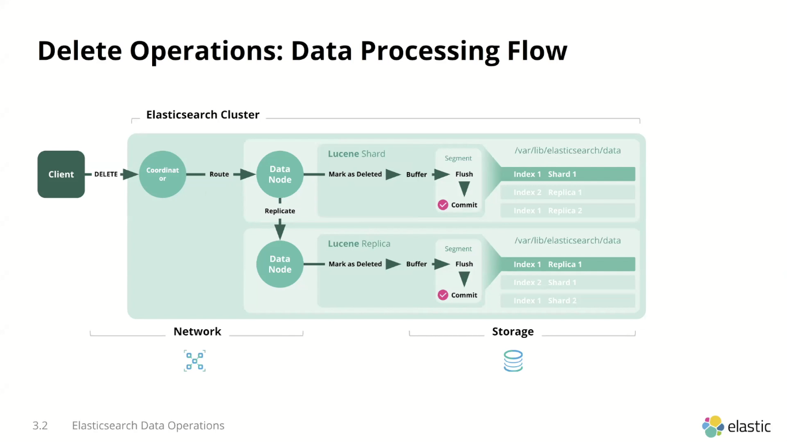

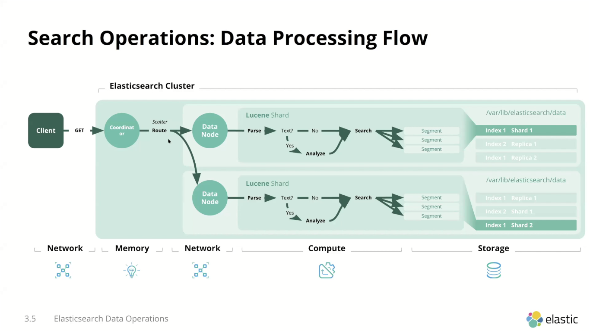

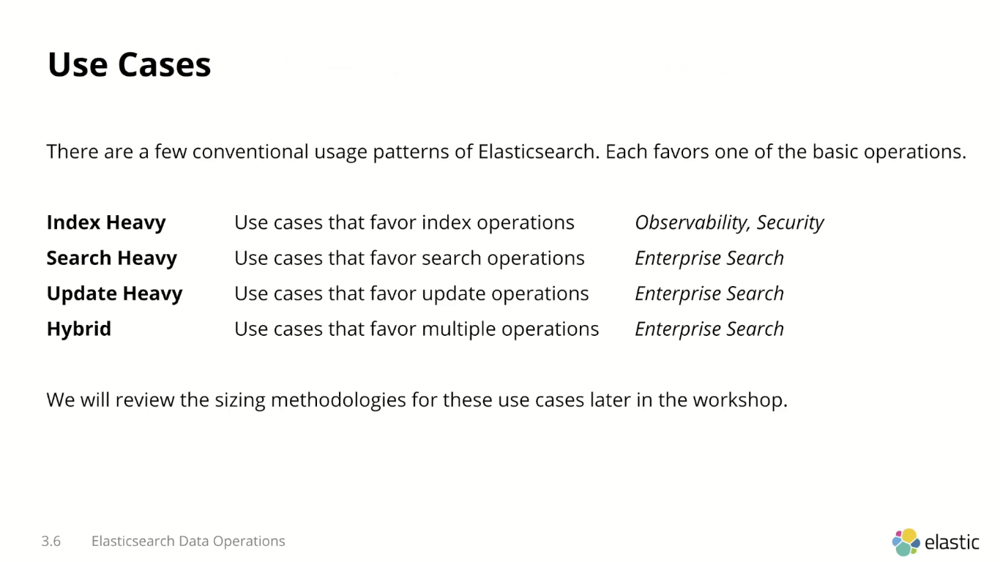

