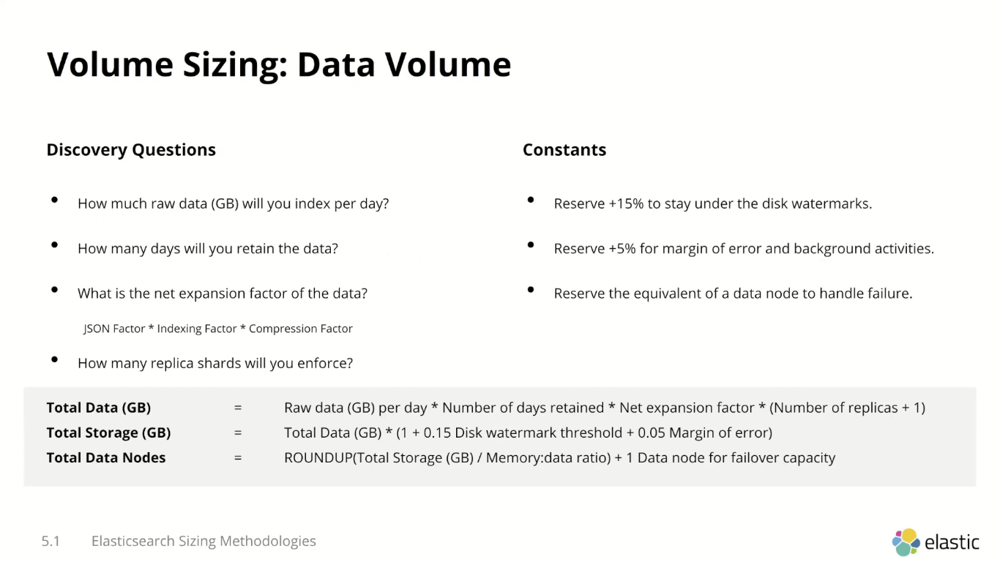
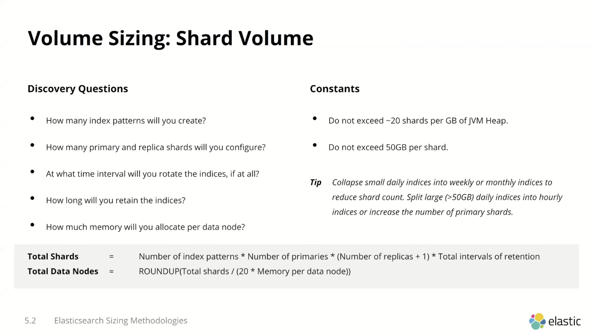
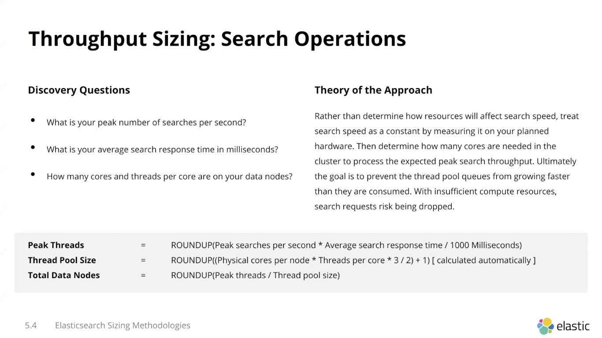
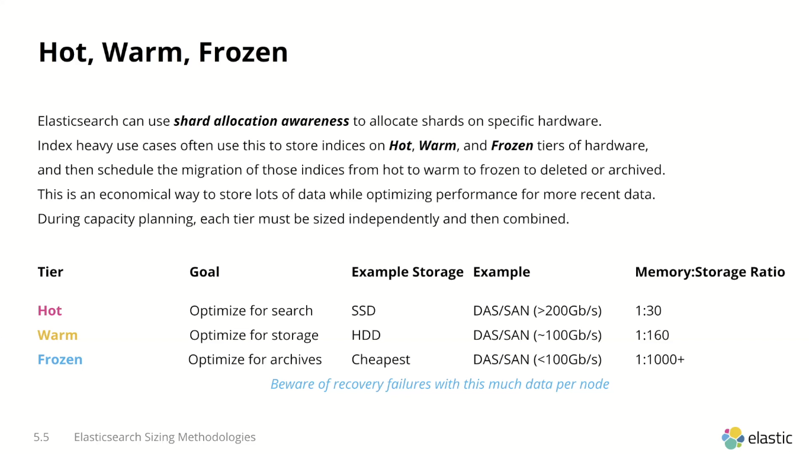
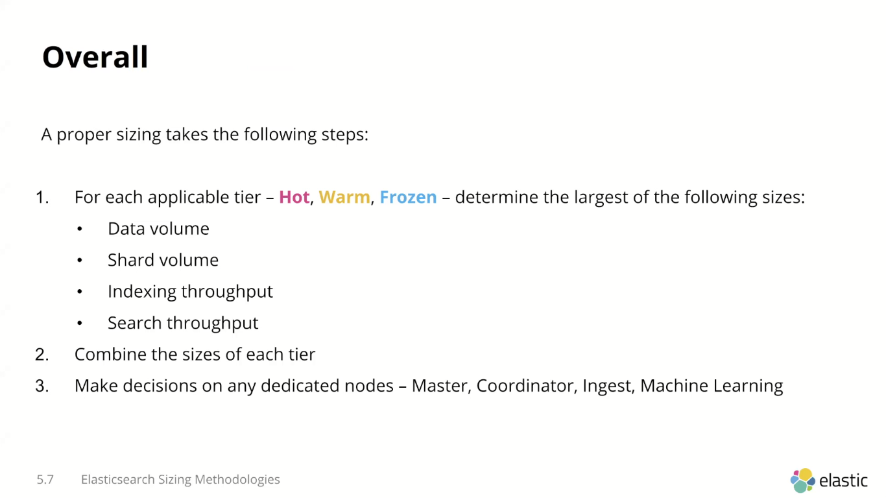

capacity planning

https://bigdataboutique.com/services/elasticsearch/capacity-planning

https://www.elastic.co/pt/blog/benchmarking-and-sizing-your-elasticsearch-cluster-for-logs-and-metrics

https://www.elastic.co/pt/blog/rally-1-0-0-released-benchmark-elasticsearch-like-we-do

https://www.elastic.co/pt/webinars/elasticsearch-sizing-and-capacity-planning

meios de fazer o calculo:

por volume:

por throughput:

master node (eligible) sempre no minimo 3
3 data nodes, pq vc sempre vai ter 1 replica, com um failover de 1, nunca vai ficar underreplicated

pro sophos:

ls -lah /log/logfilename.log veja o tamanho assim que der 9h e fazer uma subtração as 18h

The tiebreaker nodes are simply 1GB (by default) ES instances with data disabled and master-eligible enabled, added to a 3rd zone, It is intended for HA vs management-only nodes