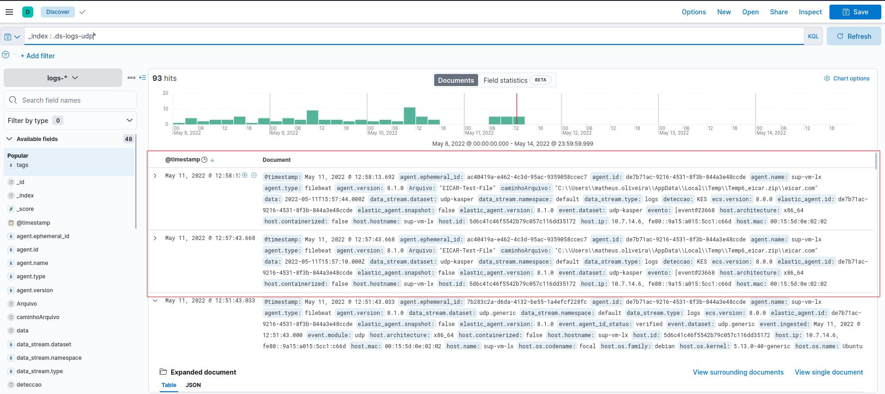

testes do grok

# KES

12:49:11.216118 IP (tos 0x0, ttl 128, id 39700, offset 0, flags \[none\], proto UDP (17), length 1048)

zangado.aim7.local.52424 > elastic.aim7.local.22514: \[udp sum ok\] UDP, length 1020

E..........S..........W....;&lt;10&gt;1 2022-02-28T15:48:55.000Z sup-01.aim7.local KES|11.0.0.0 - GNRL\_EV\_VIRUS\_FOUND \[event@23668 p1="275A021BBFB6489E54D471899F7DB9D1663FC695EC2FE2A2C4538AABF651FD0F" p2="C:\\\Users\\\matheus.oliveira\\\AppData\\\Local\\\Temp\\\Temp1\_eicar - Copy.zip\\\eicar.com" p5="EICAR-Test-File" p7="AIM7\\\matheus.oliveira" p8="60" p9="{\\"engine\\":1,\\"method\\":3,\\"edr\_ver\\":1,\\"edr\\": {\\"id\\":\\"93bd30af-5cd5-4325-bb75-31b296d7f257\\"},\\"md5\\":\\"44D88612FEA8A8F36DE82E1278ABB02F\\"}" et="GNRL\_EV\_VIRUS\_FOUND" tdn="File Threat Protection" etdn="Malicious object detected" hdn="SUP-01" hip="10.81.234.7" gn="Matheus - Teste" engine="1" method="3"\] Result description: Detected\\r\\nType: Virus\\r\\nName: EICAR-Test-File\\r\\nUser: AIM7\\matheus.oliveira (Active user)\\r\\nObject: C:\\Users\\matheus.oliveira\\AppData\\Local\\Temp\\Temp1_eicar - Copy.zip\\eicar.com\\r\\nReason: Expert analysis\\r\\nDatabase release date: 1/12/2022 9:52:00 AM\\r\\nSHA256: 275A021BBFB6489E54D471899F7DB9D1663FC695EC2FE2A2C4538AABF651FD0F\\r\\nMD5: 44D88612FEA8A8F36DE82E1278ABB02F

# WSUS

16:27:12.446928 IP (tos 0x0, ttl 127, id 17610, offset 0, flags \[none\], proto UDP (17), length 972)

192.168.0.12.63819 > sup-vm-lx.22515: \[udp sum ok\] UDP, length 944

E...D...........

....KW...7.&lt;10&gt;1 2022-05-03T19:27:00.000Z zangado.aim7.local WSEE|10.1.0.0 - GNRL\_EV\_VIRUS\_FOUND \[event@23668 p1="275a021bbfb6489e54d471899f7db9d1663fc695ec2fe2a2c4538aabf651fd0f" p2="C:\\\Users\\\Administrator\\\AppData\\\Local\\\Temp\\\3\\\Temp1\_eicar\_com.zip\\\eicar.com" p3="1" p5="EICAR-Test-File" p6="0" p7="ZANGADO\\\Administrator" p8="60" p9="{\\"engine\\":1,\\"method\\":5,\\"edr\_ver\\":1,\\"edr\\": {\\"id\\":\\"b65688f5-11d0-46fa-9fc3-7bdb89b3639e\\"}}" et="GNRL\_EV\_VIRUS\_FOUND" tdn="Real-Time File Protection" etdn="Infected or other object detected" hdn="ZANGADO" hip="127.0.0.1" gn="SERVIDORES" engine="1" method="5"\] Object detected: Virus EICAR-Test-File\\r\\nObject name: C:\\Users\\Administrator\\AppData\\Local\\Temp\\3\\Temp1\_eicar_com.zip\\eicar.com\\r\\n\\r\\nProcess name: explorer.exe\\r\\nPID: 64648\\r\\nUser: ZANGADO\\Administrator\\r\\nMD5 file hash: 44d88612fea8a8f36de82e1278abb02f\\r\\nFile SHA256 hash: 275a021bbfb6489e54d471899f7db9d1663fc695ec2fe2a2c4538aabf651fd0f

16:27:12.446961 IP (tos 0x0, ttl 127, id 17611, offset 0, flags \[none\], proto UDP (17), length 655)

192.168.0.12.63820 > sup-vm-lx.22515: \[udp sum ok\] UDP, length 627

E...D...........

....LW..{..&lt;10&gt;1 2022-05-03T19:27:02.000Z zangado.aim7.local WSEE|10.1.0.0 - GNRL\_EV\_OBJECT\_NOTCURED \[event@23668 p2="C:\\\Users\\\Administrator\\\AppData\\\Local\\\Temp\\\3\\\Temp1\_eicar\_com.zip\\\eicar.com" p6="0" p7="ZANGADO\\\Administrator" p9="{\\"engine\\":1,\\"method\\":5,\\"edr\_ver\\":1,\\"edr\\": {\\"id\\":\\"b65688f5-11d0-46fa-9fc3-7bdb89b3639e\\"}}" et="GNRL\_EV\_OBJECT\_NOTCURED" tdn="Real-Time File Protection" etdn="Object not disinfected" hdn="ZANGADO" hip="127.0.0.1" gn="SERVIDORES"\] Object not disinfected. Reason: object cannot be disinfected\\r\\nObject name: C:\\Users\\Administrator\\AppData\\Local\\Temp\\3\\Temp1\_eicar_com.zip\\eicar.com\\r\\n\\r\\n

# padrão grok

%{GREEDYDATA:timestamp}\\s*%{GREEDYDATA:inutil}\\s*%{GREEDYDATA:inutil1}\\s*%{TIMESTAMP\_ISO8601:tempo}\\s%{HOSTNAME:name} (?&lt;ANTIVIRUS&gt;(KES|WSEE))\\|(?&lt;ANTIVIRUS\_VER&gt;(\\d{1,2}\\.){3}\\d{1,2}) - (?&lt;BUSCA&gt;GNRL\_EV\_VIRUS\_FOUND) \\\[event@%{INT:event\_number} p1=%{QUOTEDSTRING:sha256\_hash} p2="%{PATH:virus\_path}" p5=%{QUOTEDSTRING:arquivo} p7=(?&lt;DOMAIN_USER&gt;\\S\\s*\\S*) p8="\\d*" p9=%{GREEDYDATA:teste}

# Padrão Onigurama

(?&lt;field_name&gt;pattern)

GROK que funfa no ingest:

%{TIMESTAMP_ISO8601:data} %{HOSTNAME:hostname} %{WORD:deteccao}%{NOTSPACE}%{NUMBER:versao}%{NOTSPACE} %{NOTSPACE} %{WORD:tipoDeteccao} %{NOTSPACE:evento} %{WORD}=%{QUOTEDSTRING:sha256Hash} %{WORD}=%{QUOTEDSTRING:caminhoArquivo} %{WORD}=%{QUOTEDSTRING:Arquivo} %{WORD}=%{QUOTEDSTRING:userDomain} %{GREEDYDATA}

# O CARALHO FOI

