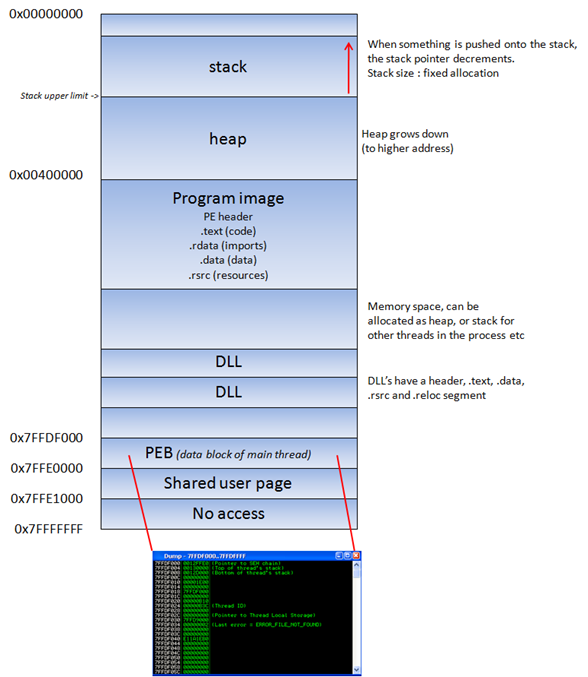

win32

memory address:

userland: 0x00000000 até 0x7FFFFFFF
kerneland: 0x80000000 até 0xFFFFFFFF

flat memory model

quando um processo é criado, o PEB (process execution block) e TEB (Thread environment block) são criados.

PEB -> userland parameters
\* endereço do executavel main
\* ponteiro pro loader data
\* ponteiro para a informação sobre o heap

TEB -> estado da thread
\* endereço da PEB na memoria
\* endereço da stack na thread
*ponteiro da primeira entrada da SEH chain

