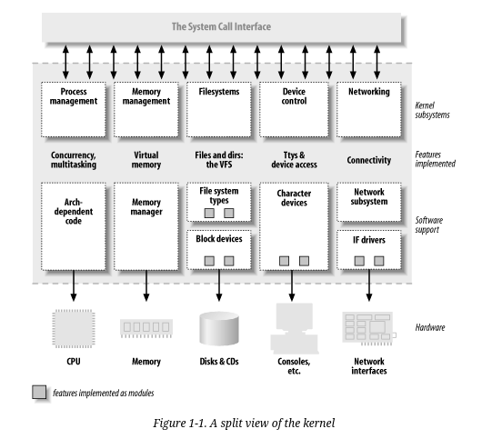

tudo no kernel é separado por funções chamadas de namespaces:

processos

divisão de ram, malloc/free

file systems, quase tudo no linux é um arquivo



No linux temos as seguintes classes de dispositivos:

Character: são dispositivos que seguem uma sequencia de caracteres assim como arquivos poderém eles não são móveis, ou seja seus bytes são acessados em sequência. Geralmente usam as syscalss read, write, open, close.

block: a unica diferença entre os char é que o kernel gerencia eles de forma diferente, mas são acessados por filesystem nodes em /dev

network interfaces: são as que fazem a comunicação com o kernel para transmitir e receber pacotes, eles não mapeiam as conexões feitas. Porém são diferentes em termos de comunicação com o kernel já que eles não possuem filesystem mas sim um nome único.

No linux existem os módulos que são nada mais nada menos que bibliotecas em runtime.

não use politicas de segurança nas rules mas utilize as do kernel.

lembre-se que para se alterar o kernel, somente o superuser ou um infiltrado.

insmod -> instala o driver no kernel, ou da load

rmmod -> remove o mod

current in &lt;asm/current.h&gt;, struct tast_struct &lt;linux/sched.h&gt;

printk(KERN_INFO "The process is \\"%s\\" (pid %i)\\n",
current->comm, current->pid);
printa o processo do modulo.

funções que começam com __ são aquelas que vc tem que ter certeza do que faz, são low level

checar:

Documentation/kbuild

Documentation/Changes

o

obj-m := module.o

é a unica coisa de que o Makefile precisa, o make vai fazer todo o trabalho para complicar o arquivo module.o e transforma-lo em .ko

module-objs := file1.o file2.o
seria pra compilar dois arquivos source file em .ko

make -C ~/kernel-2.6 M=\`pwd\` modules

para compilar o kernel que está em outro diretório.

kernel/module.c. -> insmod

sys_ -> as syscalls começam assim, bom pra grepar

modproble -> precisa de requerimentos, checa no kernel ou em modulos já instalados

insmod -> instala, resolvendo simbolos não definidos de acordo com a tabela do kernel

lsmod -> /proc/modules ou /sys/module

*linux/version.h -> define macros*

*vermagic.o*

se precisar exportar simbolos de outro modulo:

EXPORT_SYMBOL(name);
EXPORT\_SYMBOL\_GPL(name);
veja os detalhes de *&lt;linux/module.h&gt;
*

todos os modulos precisam de

#include &lt;linux/module.h&gt;
#include &lt;linux/init.h&gt;

passa os parametros em load time moduleparam.h

inicialização do modulo:

static int _ \_init initialization\_function(void)
{
/\* Initialization code here */
}
module\_init(initialization\_function);

You may also encounter _ \_devinit and \_ \_devinitdata in the kernel source; these translate to \_ \_init and \_ _initdata only if the kernel has not been configured for hotpluggable devices.

grep EXPORT\_SYMBOL ou register\_ para saber entry points de diversos drivers.

cleanup function:

static void _ \_exit cleanup\_function(void)
{
    /\* Cleanup code here */
}

module\_exit(cleanup\_function);

lembre-se de usar o "goto" para ter um codigo a prova de falhas register e deregister 

&lt;linux/errno.h&gt; in order to use symbolic values such as -ENODEV, -ENOMEM

cool cleanup code:

```c
struct something *item1;
struct somethingelse *item2;
int stuff_ok;

void my_cleanup(void)
{
    if (item1)
        release_thing(item1);
    if (item2)
        release_thing2(item2);
    if (stuff_ok)
        unregister_stuff(  );
    return;
 }

int _ _init my_init(void)
{
    int err = -ENOMEM;

    item1 = allocate_thing(arguments);
    item2 = allocate_thing2(arguments2);
    if (!item2 || !item2)
        goto fail;
    err = register_stuff(item1, item2);
    if (!err)
        stuff_ok = 1;
    else
        goto fail;
    return 0; /* success */ 
   
  fail:
    my_cleanup(  );
    return err;
}
```