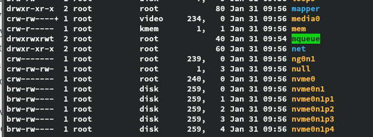

ls -l em /dev/ onde ficam os dispositivos especiais do systema:

b para bloco e c para char

Their major numbers are 1, 4, 7, and 10, while the minors are 1, 3, 5, 64, 65, and 129.

mas acho que foi trocado

o numero maior é usado para identificar o driver associado ao dispositivo.

o menor é usado para referenciar qual dispositivo está sendo usado. O kernel faz isso automaticamente criando links ou vc pode usar os numeros menores.