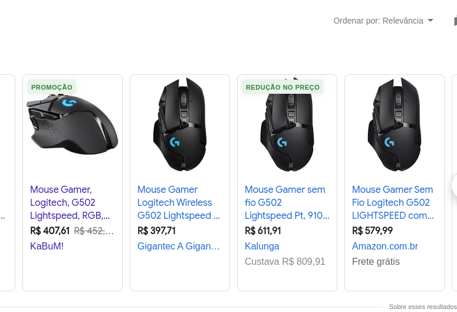
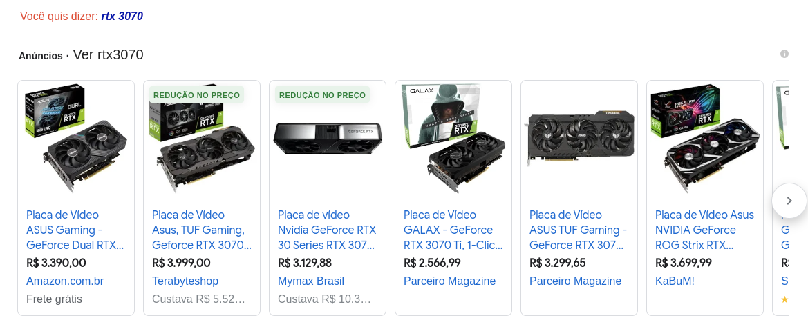
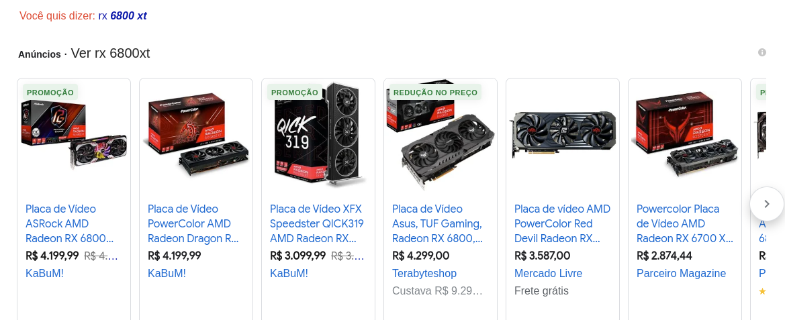

processador com tdp de 105 W é interessante escolher uma placa mãe com uma central de nergia mais eficiente fazers do VRM

gabinetes legais

https://www.pichau.com.br/gabinete-gamer-redragon-wheeljack-preto-gc-606bk

https://www.pichau.com.br/gabinete-gamer-pichau-valerian-rgb-mid-tower-lateral-de-vidro-com-4-fans-preto-pg-vrgb-bw

O que falta pra comprar:

https://meupc.net/peca/bv7G9G/hdd-western-digital-wd-blue-wdblue2tb

https://meupc.net/peca/u4nHP4/mouse-logitech-g502 versão sem fio

https://www.kabum.com.br/produto/135048/cadeira-de-escritorio-husky-office-700-preto-encosto-de-cabeca-2d-encosto-de-braco-4d-reclinavel-com-sistema-frog-htcd011

https://meupc.net/peca/LaRH38/memoria-kingston-hyperx-fury-rgb-hx432c16fb3a8 2 memorias pra ficar 32G

https://www.kabum.com.br/produto/166105/placa-de-video-zotac-nvidia-geforce-rtx-3070-ti-trinity-lhr-19-gbps-8gb-gddr6x-ray-tracing-dlss-rgb-zt-a30710d-10p?gclid=CjwKCAjwsMGYBhAEEiwAGUXJaVoeDpbMyq-RHcThKBID4RwfIYeRl0vmyQKpqEA-LTIh3P5FN-VnJxoCAMIQAvD_BwE

não precisa ser a trinity mas se estiver me promocao compra

brincadeira, ou 3070 normal ou 6800 xt (de preferencia a xt pelo linux)

4000 ou 4800 (xt)

500 16gb

389 disco 7200 rpm seagate

405 controle ps5

450 microondas

580 g502

total

6.324 dia 18 de outubro

rtx 3070 - 4000

rx 6800xt - 4200

memoria 16gb - 540

https://www.amazon.com.br/Razer-Mouse-jogos-Basilisk-HyperSpeed/dp/B07YPBQSCK?\_\_mk\_pt\_BR=%C3%85M%C3%85%C5%BD%C3%95%C3%91&crid=25H6QPK86WO9U&keywords=razer+basilisk+x+hyperspeed&qid=1645455604&sprefix=razer+basilisk+x+hyperspeed,aps,220&sr=8-4&ufe=app\_do:amzn1.fos.25548f35-0de7-44b3-b28e-0f56f3f96147&linkCode=sl1&tag=lucasishii-20&linkId=cfb4dab1947ac81ae34b4bcf990e3501&language=pt\_BR&ref\_=as\_li\_ss_tl