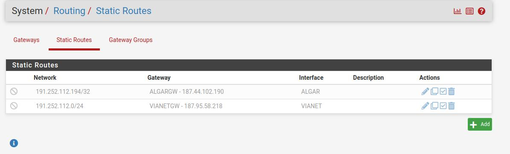
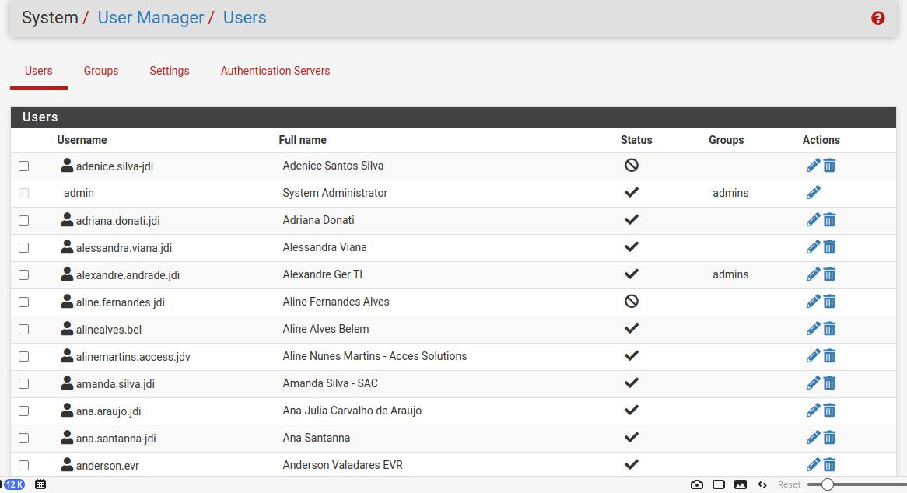

Perguntar

lembra que uma interface a OPT1 ou 11 teve que ser excluida. A LAN teve que ser configurada com outro IP, perguntar qual é o IP que é pra ser usado la.

se tem alguma rota estática ja que na topologia tem um link que não passa pelo fw

essas estão desabilitadas:

explicar o SSO, e como funciona por grupos brevemente:

eles tem webserver, perguntar se eles possuem licença para WAF

perguntar qual o fw de cada IPSEC

perguntar sobre topologia de vlan

caixa

ff3e4

porta 2022?