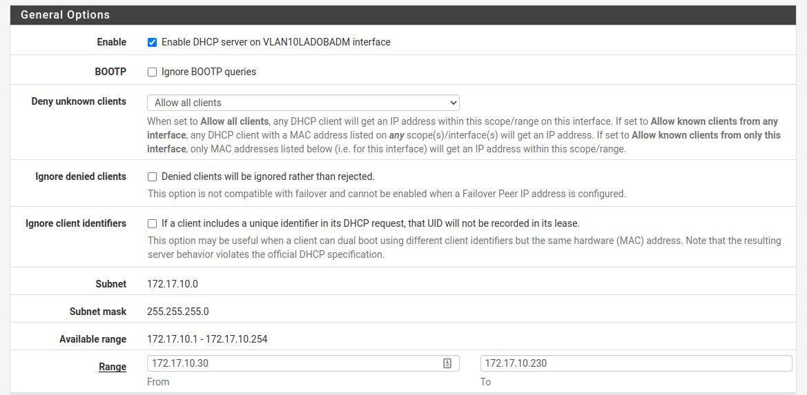
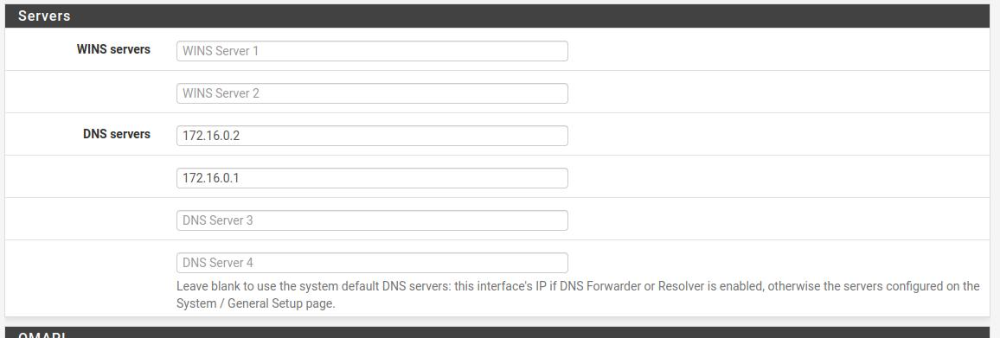
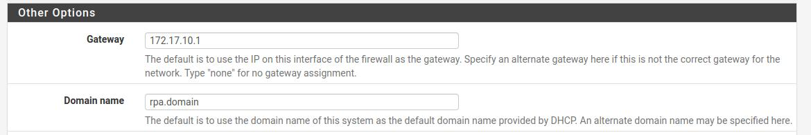
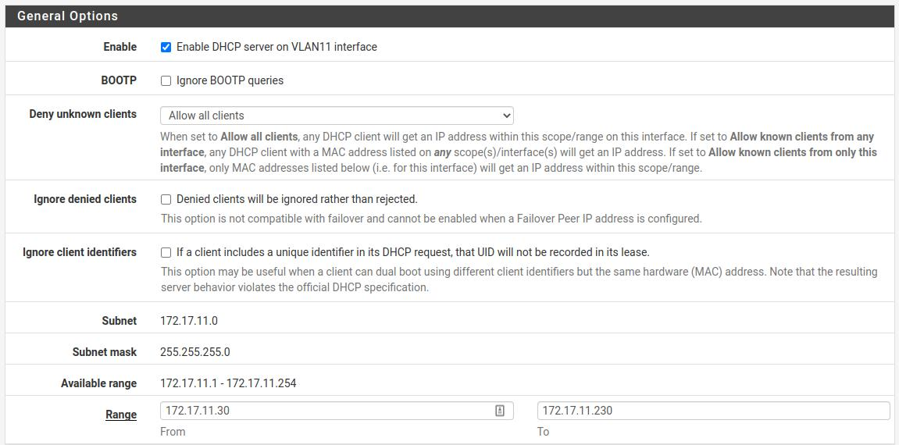
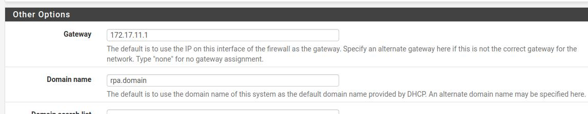
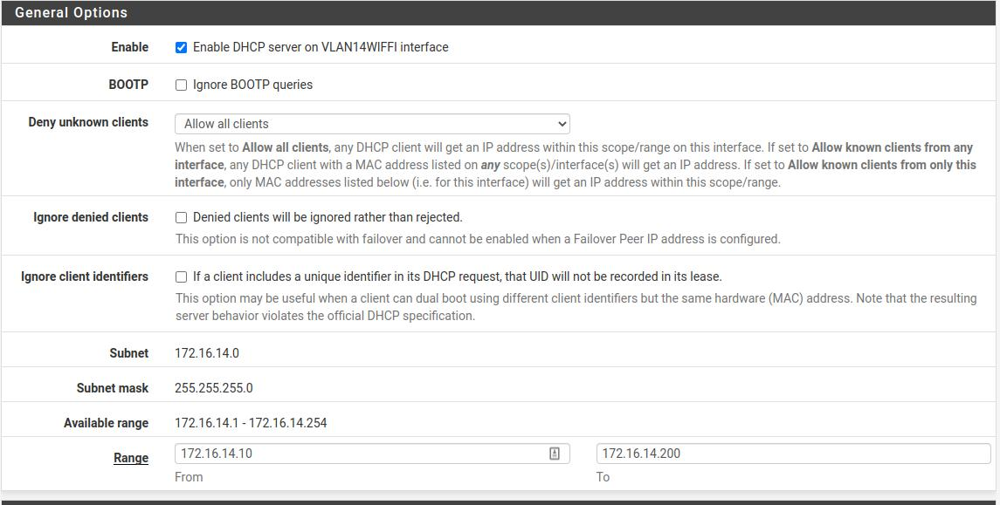
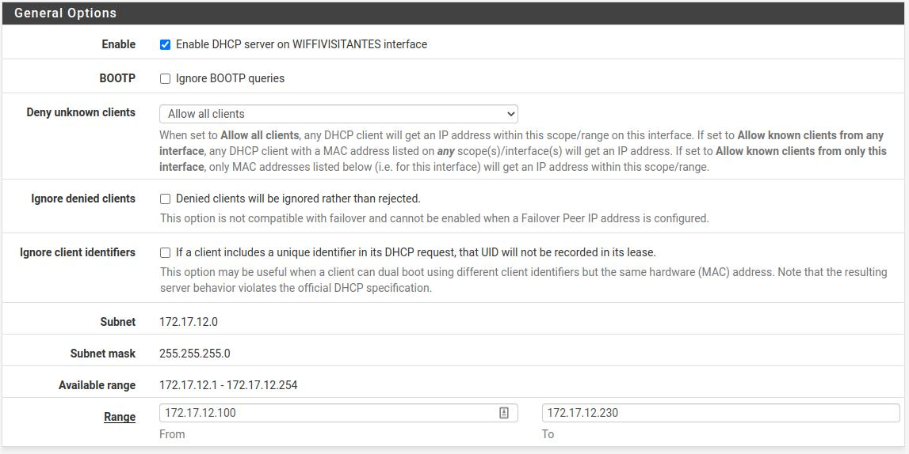
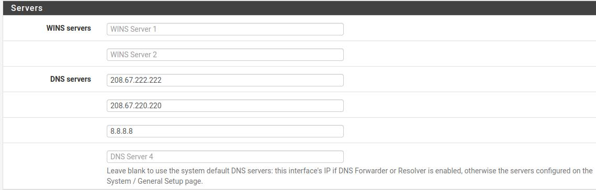
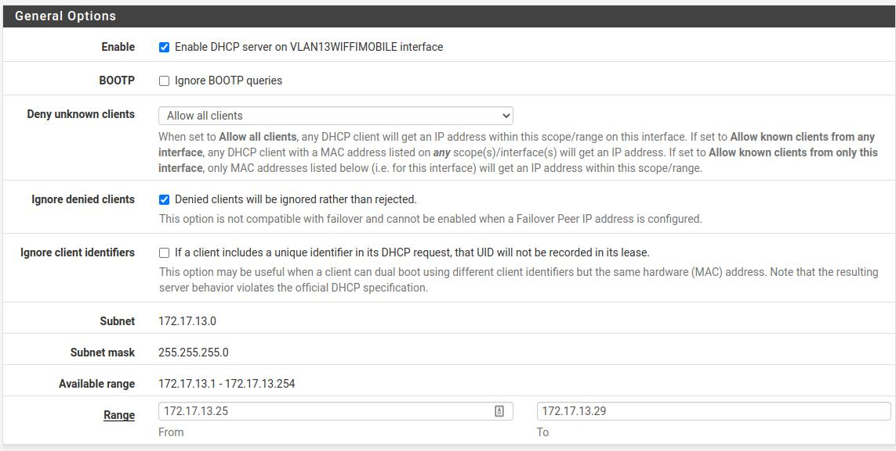
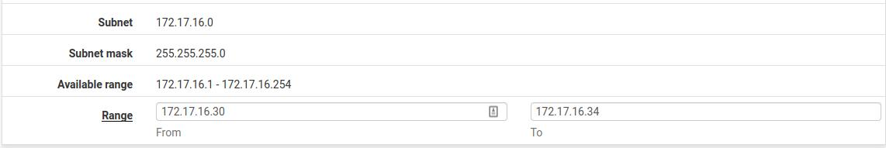

dhcp

[VLAN10LADOBADM](http://192.168.20.234:7474/services_dhcp.php?if=opt5)

WLAN 11

mesmo DNS

VLAN14wifi

mesmo dns

gateway 14.1

mesmo dominio

wifivisitantes

gateway 12.1

sem dominio

VLANwifimobile

dns google

gateway 13.1

VLAN16WIFIACCESS

DNS 172.16.0.1

GW 16.1

ALGAR ESTA COM ALGUMAS CONFIGS MAS DESABILITADA.