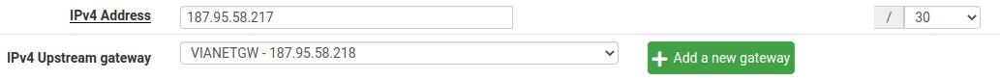
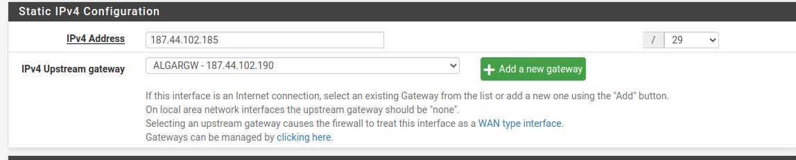

interfaces

LAN

192.168.20.234/24 ## essa lan aqui fui eu que configurei, perguntar qual é o ip da verdadeira

VIANET

ALGAR

vlan3

172.15.0.1/24

vlan2

172.17.0.1/24

VLAN7172183024

182.18.3.1/24

**o resto das interfaces possuem DHCP e la está especificado as configuração (ver dhcp)**