regras

\* essa regra 7474 é ignorada pois seria em auth que isso seria liberado, esse link vai sumir

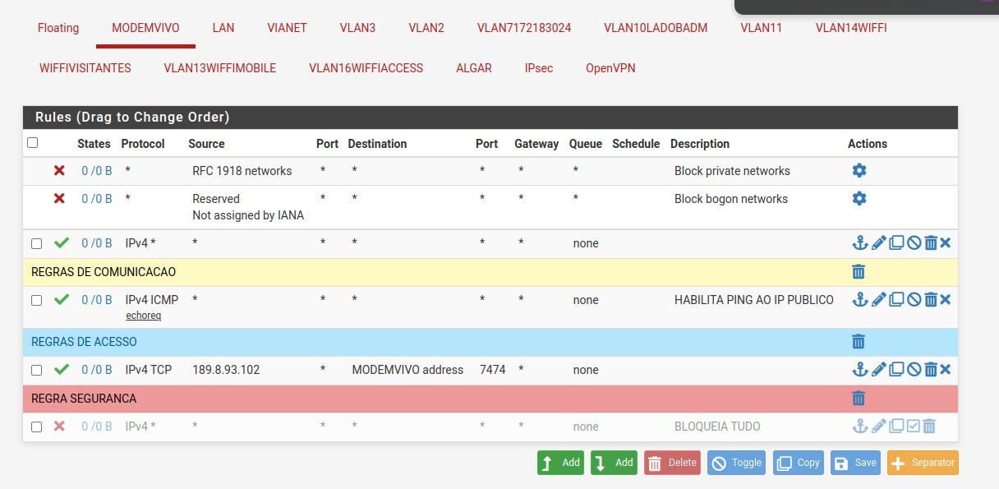

LAN

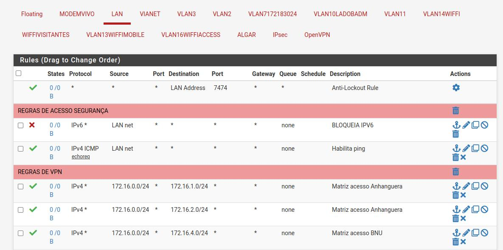

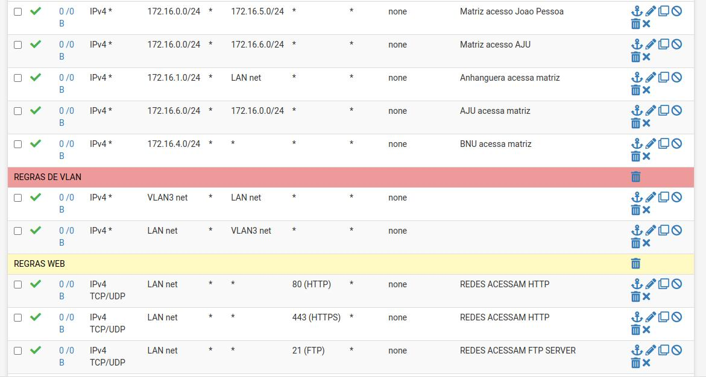

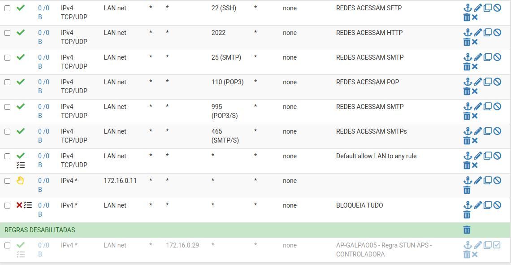

vianet

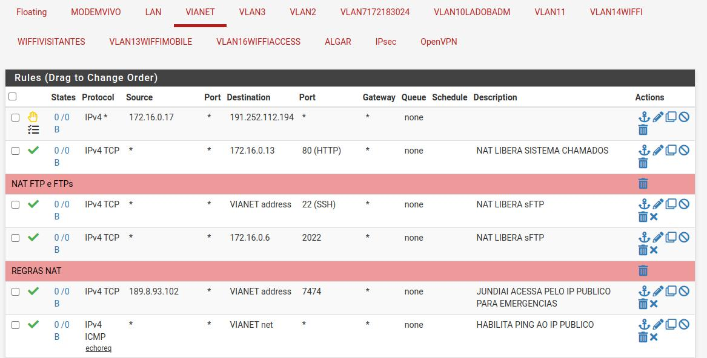

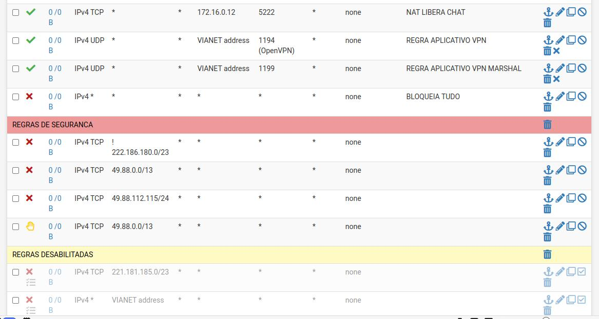

vlan3

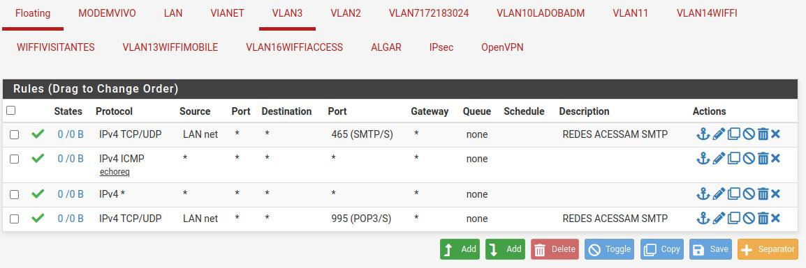

vlan2

vlan71721....

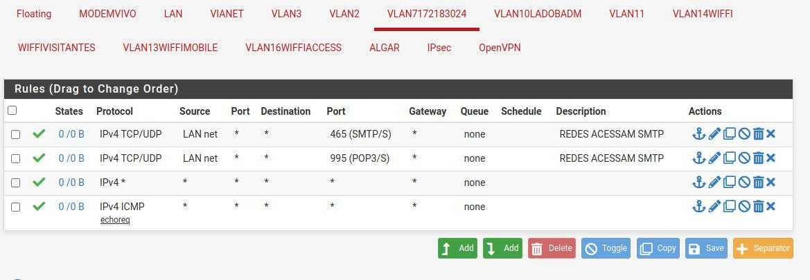

vlan10lado....

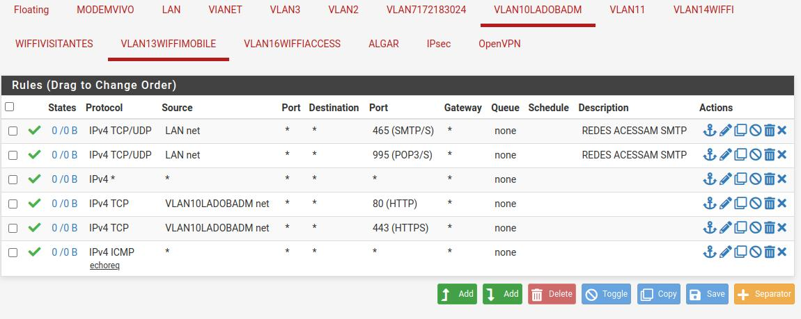

VLAN11

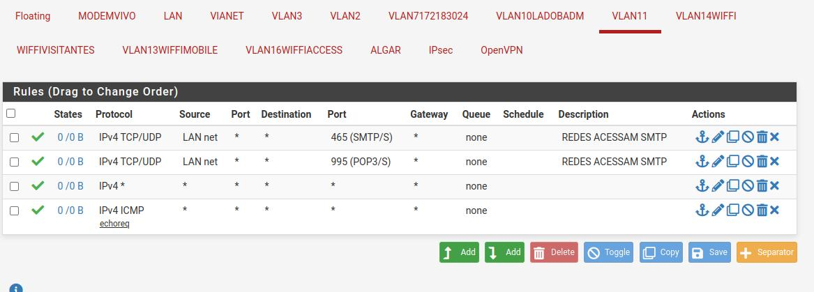

vlan14wifi

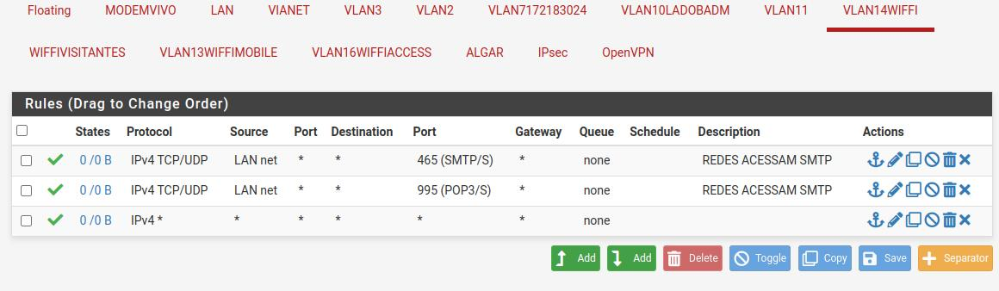

wifivisitantes

tudo liberado

vlan13wifimobile

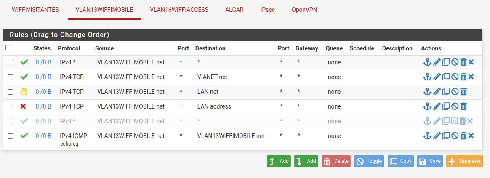

vlan16wifiaccess **?????

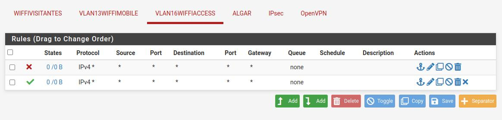

ALGAR

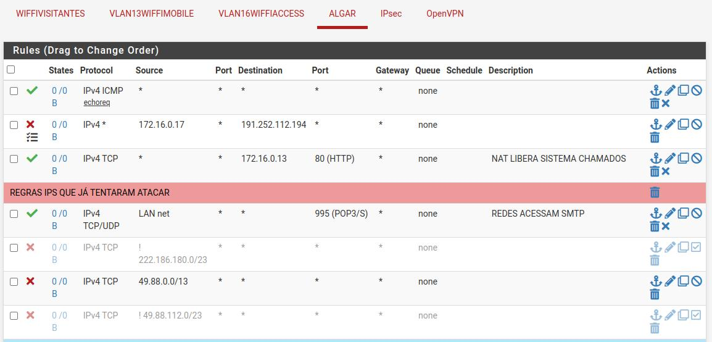

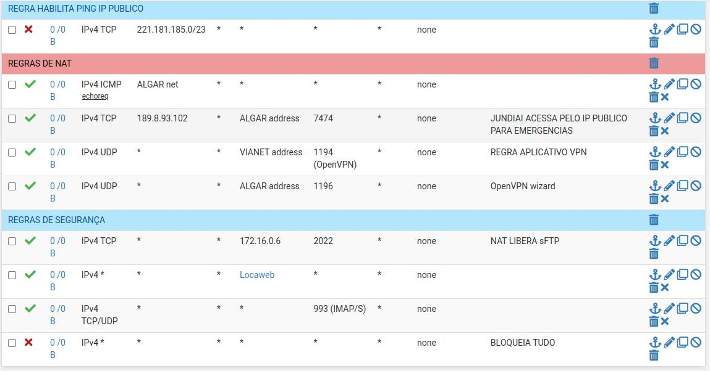

IPSEC

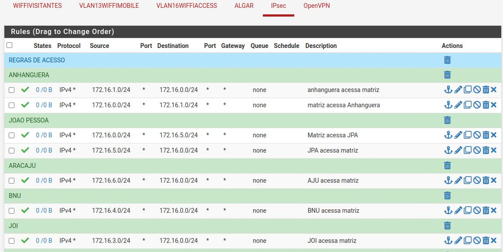

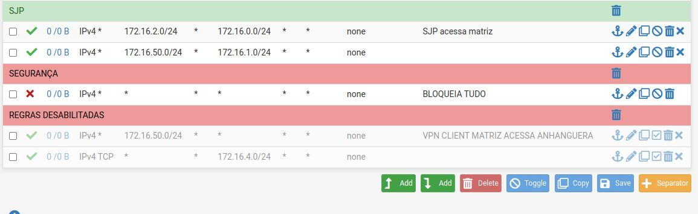

VPN SSL

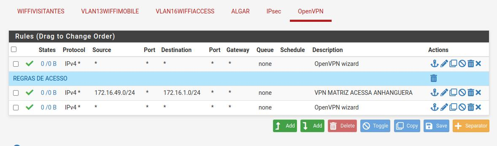